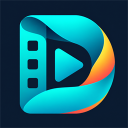
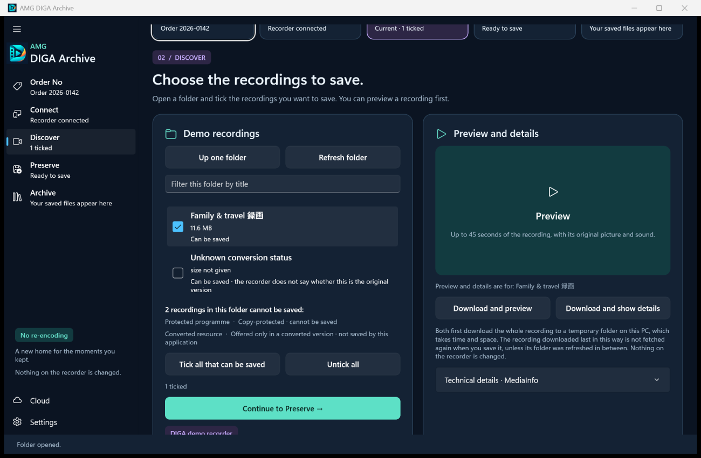

# AMG DIGA Archive



**Save the recordings on your Panasonic DIGA recorder to your PC, exactly as the recorder delivers them, and keep a copy in OneDrive or Google Drive.**

AMG DIGA Archive is a free Windows 11 application. It finds the recorder on your home network, shows its recordings, and saves the ones you choose to a folder on your PC, without re-encoding and without changing anything on the recorder. English and Polish. Open source under the GPL.

[](https://github.com/lukasz-gratkowski/diga-archive/actions/workflows/ci.yml)

*Po polsku: [krótki opis i przewodniki](#po-polsku).*



## What it does

- **Finds your recorder** on the home network (DLNA) when you ask it to. No cables to the PC, no disk to remove.
- **Shows the recorder's folders and recordings**, each with its date, length and size, and says which ones cannot be saved and why.
- **Saves recordings without re-encoding**, in one of two ways: an exact copy, as the recorder delivers it, or the same picture and sound in an easy-to-play file (MKV, MP4 or MPEG). Picture and sound are never converted.
- **Checks what it saved.** An exact copy gets a SHA-256 fingerprint, and its size is compared with the size the recorder announced, when it announced one. An easy-to-play file is compared with the download before the download is removed: the same video, sound and subtitle streams, and a length that differs by no more than two seconds.
- **Goes on when one recording fails.** When you save several recordings, a failure does not end the whole save, and the message at the end says how many were saved and names the ones that were not, each with its reason.
- **Names the files for you.** Type an order or reference number once and every file saved in that session carries it.
- **Previews** up to 45 seconds of a recording before you save it.
- **Uploads to your own cloud**, OneDrive or Google Drive, and shows the top folder of your OneDrive or the files it uploaded to your Google Drive.
- **Never replaces an existing file**, on the PC or in the cloud, and never writes to the recorder.

## What it does not do

- It does not decrypt or copy **protected** recordings. A recording that the recorder marks as copy-protected, or offers only in a converted version, is listed with that reason and cannot be saved.
- It does not read recorder **disks**. An earlier, experimental disk reader is kept on the branch [`archive/disk-and-image-sources`](https://github.com/lukasz-gratkowski/diga-archive/tree/archive/disk-and-image-sources).
- It does not contain **FFmpeg**. The easy-to-play file and the preview need it; the installer and the application offer to download it. See [Install](#install).
- It is **not a Panasonic product**. See [Licence and trademarks](#licence-and-trademarks).

## How far it has been tested

Please read this before relying on the application for recordings you cannot replace.

- **Automated tests.** About 700 test cases run on every change. They cover the recorder protocol against simulated recorders, the cloud protocols against simulated Microsoft and Google servers, and saving and checking generated video with the real FFmpeg and MediaInfo. The window itself is not covered by automated tests. [Testing](docs/TESTING.md) says what each group covers.
- **Real hardware: one report.** The project owns no recorder. The owner of a recorder reported as a DMR-BS850 confirmed on 2 October 2026 that version 0.5.2 found the recorder, opened its folders and saved recordings both as exact copies (`.mpg`) and as MKV, and that connecting OneDrive with the built-in registration and uploading worked. The report did not say which recordings were chosen or how the saved files were checked.
- **OneDrive: the built-in registration is new.** That report was made with the earlier built-in Microsoft registration. On 5 October 2026 the application got a new one (application ID `bfd21bf0-32a9-4520-8bbb-d525e3d34aea`). Nobody has reported connecting or uploading through the new registration yet. The only thing checked for it is that Microsoft's sign-in service knows the ID and accepts the `http://localhost` redirect; this was checked without signing in. A sign-in saved with the earlier built-in ID is not used by the new one: you connect once more.
- **Versions 0.6.0 and 0.6.1** have run from start to finish only against the project's recorder emulator, not against a real recorder.
- **Not tried by the project:** other recorder models, asking a real recorder by its address, DVB subtitles from a real broadcast, Google Drive against Google's real servers, and work or school OneDrive accounts.
- **Releases are not digitally signed yet.** See [Install](#install).

Whether a recorder offers a recording for saving at all depends on the model, its firmware and the recording. If you try the application, a [recorder report](https://github.com/lukasz-gratkowski/diga-archive/issues/new/choose) helps everyone after you, whether it worked or not.

## Install

**You need** Windows 11 (64-bit) and a recorder that is switched on and connected to the same home network as the PC, with its network server (DLNA) switched on. [Recorder setup and troubleshooting](docs/RECORDER-SETUP.md) says how.

1. Open the [latest release](https://github.com/lukasz-gratkowski/diga-archive/releases/latest).
2. Download `DIGA-…-win-x64-setup.exe` and start it. It installs for your Windows account only and asks for no administrator rights. If you prefer no installer, download `DIGA-…-win-x64-portable.zip`, unpack it anywhere and start `Diga.exe`.
3. Leave the option that begins **Download FFmpeg** ticked if you want to save recordings as MKV, MP4 or MPEG, or to use the preview. FFmpeg is a separate free program. The installer fetches one specific version from its distributor and uses it only if its SHA-256 checksum is the expected one. Exact copies work without FFmpeg, and you can download it later in **Settings**.

**The Windows warning.** Releases are not digitally signed yet, so Windows shows its SmartScreen warning, “Windows protected your PC”, when you start the installer. Signing with Microsoft Azure Artifact Signing is prepared and will be switched on later; the notes of each release say whether that release is signed.

**Is the download genuine?** Every release lists SHA-256 checksums, and from version 0.6.0 on a release carries a build attestation that ties the files to this repository's source. [Verifying your download](docs/VERIFYING-DOWNLOADS.md) explains each check in a few lines.

## Five steps

The navigation shows five steps. **Cloud** and **Settings** are below them and can be opened at any time.

| | Step | What you do |
|---|---|---|
| 0 | **Order No** | Type the number that should name the saved files, or leave the field empty to keep the recordings' titles. |
| 1 | **Connect** | **Find network recorders**, choose your recorder in the list, **Connect to recorder**. A single recorder that calls itself a DIGA is connected at once. |
| 2 | **Discover** | Open a folder and tick the recordings to save. **Download and preview** plays a short clip first; **Download and show details** shows the technical details. |
| 3 | **Preserve** | Choose the folder and how to save, **Exact copy, as the recorder delivers it** or **The same picture and sound in an easy-to-play file**, and save. |
| 4 | **Archive** | See what was saved and how each file was checked, **Open the folder**, and, if you like, **Upload to OneDrive** or **Upload to Google Drive**. |

The [user guide](docs/USER-GUIDE.md) walks through each step with pictures and explains every choice. If the recorder is not found or will not open, see [Recorder setup and troubleshooting](docs/RECORDER-SETUP.md).

## Cloud upload

Uploading is optional and never starts by itself.

- **OneDrive** needs no setup: in **Settings**, choose **Connect OneDrive** and sign in with your Microsoft account. The application has a built-in Microsoft registration for this; [How far it has been tested](#how-far-it-has-been-tested) says what is known about it.
- **Google Drive** needs a one-time setup at Google of about 15 minutes, because Google's terms do not allow an open-source project to ship its own Google credentials. You create your own Google Cloud client and enter its client ID and client secret in **Settings**.
- The list **Cloud destination** decides where uploads go. You can connect both services and switch between them.

The [cloud setup guide](docs/CLOUD-SETUP.md) takes you through both, step by step, and explains the usual error messages. The **Cloud** page lists the top folder of your OneDrive, or the files this application uploaded to your Google Drive. It only looks: it never downloads or changes anything there.

## Your data stays yours

The application has no telemetry, does not look for updates and has no server of its own. It talks to your recorder; to Microsoft or Google only when you connect or disconnect an account, upload, or list your cloud files; and to FFmpeg's download addresses only when you ask for FFmpeg. Sign-ins are stored encrypted for your Windows account, and uninstalling removes them. Details: [Privacy](docs/PRIVACY.md).

## Documentation

| For users | |
|---|---|
| [User guide](docs/USER-GUIDE.md) · [po polsku](docs/USER-GUIDE.pl.md) | Installing, the five steps, settings, troubleshooting |
| [Recorder setup and troubleshooting](docs/RECORDER-SETUP.md) · [po polsku](docs/RECORDER-SETUP.pl.md) | Switching on the recorder's network server; what to do when the recorder is not found |
| [Cloud setup](docs/CLOUD-SETUP.md) · [po polsku](docs/CLOUD-SETUP.pl.md) | OneDrive and Google Drive, step by step |
| [Privacy](docs/PRIVACY.md) | What is stored and what is sent, and where |
| [How it works](docs/HOW-IT-WORKS.md) | What happens to a recording on its way from the recorder to the saved file and the cloud, in more detail |
| [Verifying your download](docs/VERIFYING-DOWNLOADS.md) | Checksums, signature, build attestation |
| [Diagnostics kit](docs/DLNA-DIAGNOSTICS.md) | A small script that reports what a recorder answers, without titles or addresses |

| For contributors | |
|---|---|
| [Architecture](docs/ARCHITECTURE.md) | How the code is organised |
| [Building](docs/BUILDING.md) | From a clone to a running development build, with or without a recorder |
| [Testing](docs/TESTING.md) | The automated tests, testing by hand, and what is not covered |
| [Releasing](docs/RELEASING.md) · [Signing](docs/SIGNING.md) | For the maintainer |
| [Changelog](CHANGELOG.md) | What changed in each version |
| [Contributing](CONTRIBUTING.md) · [Security](SECURITY.md) | How to help; how to report a security problem |
| [Branding](docs/BRANDING.md) · [Third-party notices](THIRD-PARTY-NOTICES.md) | The name and logo; what ships with the application |

## Build from source

You need Windows 11 (x64), the [.NET 10 SDK](https://dotnet.microsoft.com/download/dotnet/10.0) and PowerShell 7:

```powershell
git clone https://github.com/lukasz-gratkowski/diga-archive.git
cd diga-archive
./scripts/Build.ps1
```

This downloads and checks the pinned media tools the tests use, runs all tests and builds the application. [Building](docs/BUILDING.md) has the details, including how to run the application against a recorder emulator. The installer and the release packages are described in [Releasing](docs/RELEASING.md).

## Licence and trademarks

AMG DIGA Archive is free software under the [GNU General Public License, version 3 or later](LICENSE). It comes with no warranty; see the licence for the details.

The application contains the .NET runtime and the Windows App SDK from Microsoft and [MediaInfoLib](https://mediaarea.net/en/MediaInfo) from MediaArea (BSD-style licence), each with its licence text. [FFmpeg](https://ffmpeg.org/) (GPL) is not included; the installer or the application downloads it if you ask for it. [Third-party notices](THIRD-PARTY-NOTICES.md) has the details.

Panasonic and DIGA are trademarks of their owner. This project is independent: it is not made, endorsed or supported by Panasonic. Microsoft, OneDrive, Google and Google Drive are trademarks of their owners.

## Po polsku

AMG DIGA Archive to bezpłatna aplikacja dla systemu Windows 11. Zapisuje na komputerze nagrania z nagrywarki Panasonic DIGA podłączonej do sieci domowej, bez ponownego kodowania i bez zmieniania czegokolwiek na nagrywarce. Zapisane pliki można przesłać na własny OneDrive lub Dysk Google. Aplikacja i instalator są dostępne po polsku; język aplikacji wybiera się na stronie **Ustawienia**, na liście **Język aplikacji**.


Nawigacja pokazuje pięć kroków: **Nr zamówienia**, **Połącz**, **Nagrania**, **Zapisz** i **Archiwum**, a pod nimi strony **Chmura** i **Ustawienia**. Nagranie można zapisać na dwa sposoby: **Dokładna kopia — tak, jak udostępnia ją nagrywarka** albo **Ten sam obraz i dźwięk w pliku łatwym do odtworzenia** (MKV, MP4 lub MPEG). Drugi sposób i podgląd wymagają programu FFmpeg, który nie jest częścią aplikacji: instalator i aplikacja proponują jego pobranie i sprawdzają pobrany plik.

OneDrive nie wymaga żadnej konfiguracji, bo aplikacja ma wbudowaną rejestrację Microsoft. Dysk Google wymaga jednorazowego utworzenia własnego klienta Google Cloud: warunki Google nie pozwalają dołączać danych uwierzytelniających do otwartego oprogramowania. Aplikacja nie zbiera danych telemetrycznych, nie sprawdza aktualizacji i nie ma własnego serwera.

- [Instrukcja użytkownika](docs/USER-GUIDE.pl.md)
- [Konfiguracja nagrywarki i rozwiązywanie problemów](docs/RECORDER-SETUP.pl.md)
- [Konfiguracja chmury: OneDrive lub Dysk Google](docs/CLOUD-SETUP.pl.md)
- [Pobieranie](https://github.com/lukasz-gratkowski/diga-archive/releases/latest): plik `DIGA-…-win-x64-setup.exe`

### Na ile aplikacja została sprawdzona

- **Testy automatyczne** korzystają z symulowanych nagrywarek, z symulowanych serwerów Microsoft i Google oraz z prawdziwych programów FFmpeg i MediaInfo. Samo okno aplikacji nie jest objęte testami automatycznymi.
- **Prawdziwy sprzęt: jedno zgłoszenie.** Projekt nie ma własnej nagrywarki. Właściciel nagrywarki zgłoszonej jako DMR-BS850 potwierdził 2 października 2026 r., że wersja 0.5.2 znalazła nagrywarkę, otworzyła jej foldery i zapisała nagrania zarówno jako dokładne kopie (`.mpg`), jak i jako pliki MKV, oraz że połączenie z OneDrive przez wbudowaną rejestrację i przesyłanie plików działały. Zgłoszenie nie podaje, które nagrania wybrano ani jak sprawdzono zapisane pliki.
- **OneDrive: wbudowana rejestracja jest nowa.** Tamto zgłoszenie dotyczyło wcześniejszej wbudowanej rejestracji Microsoft. 5 października 2026 r. aplikacja otrzymała nową (identyfikator aplikacji `bfd21bf0-32a9-4520-8bbb-d525e3d34aea`). Nikt nie zgłosił jeszcze ani połączenia, ani przesłania plików przez nową rejestrację. Sprawdzono jedynie, bez logowania, że usługa logowania Microsoft zna ten identyfikator i przyjmuje adres przekierowania `http://localhost`. Logowanie zapisane z wcześniejszym wbudowanym identyfikatorem nie jest używane przez nowy: trzeba połączyć się jeszcze raz.
- **Wersje 0.6.0 i 0.6.1** uruchomiono od początku do końca wyłącznie z emulatorem nagrywarki przygotowanym w projekcie, nie z prawdziwą nagrywarką.
- **Nie sprawdzono:** innych modeli nagrywarek, pytania prawdziwej nagrywarki po adresie, napisów DVB z prawdziwej audycji, Dysku Google z prawdziwymi serwerami Google (projekt nigdy tego nie uruchomił) ani kont służbowych i szkolnych OneDrive.
- **Wydania nie są jeszcze podpisane cyfrowo**, dlatego przy uruchamianiu instalatora system Windows pokazuje ostrzeżenie filtru SmartScreen. Podpisywanie (Microsoft Azure Artifact Signing) jest przygotowane i zostanie włączone później.

Projekt jest niezależny od firmy Panasonic; Panasonic i DIGA są znakami towarowymi ich właściciela. Nagrań chronionych przed kopiowaniem aplikacja nie zapisuje.
