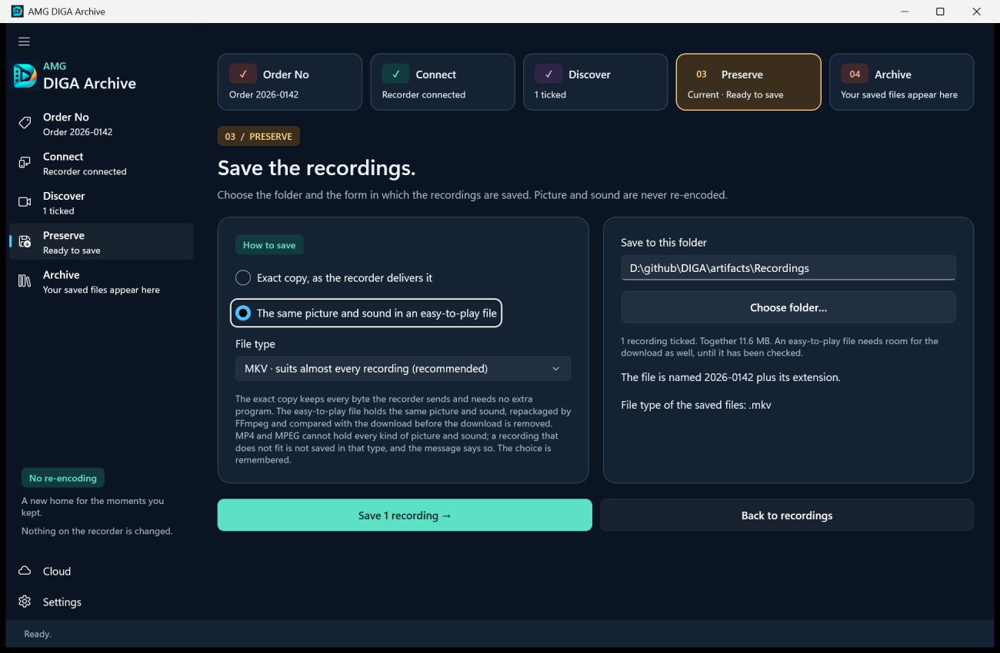
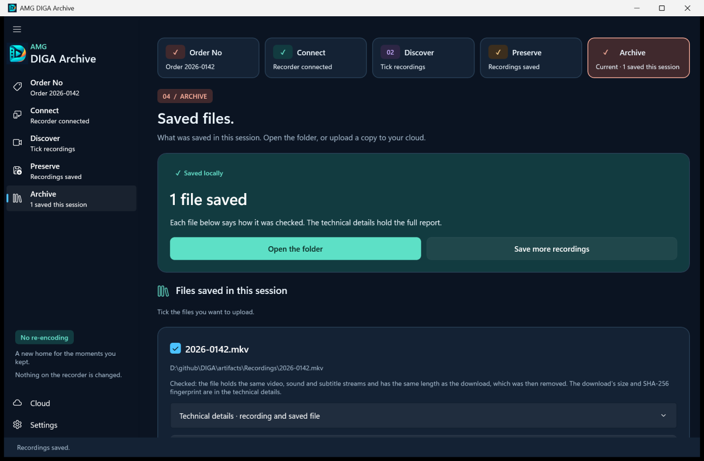

# How AMG DIGA Archive works

This document explains what happens between a click and a saved file: how the application finds a recorder, how it reads the recorder's lists, how it decides whether a recording can be saved, how a file is written and checked, and how an upload to the cloud is sent. It is written for a curious user, and for a reviewer who wants to compare the claims with the code.

It describes version 0.6.3. The statements are taken from the source code, and each section names the files it describes. Where a statement comes from Microsoft's or Google's documentation, the text says so. What has been tried on real equipment, and what has not, is in [What was tested, and what was not](#tested).

For using the application, read the [user guide](USER-GUIDE.md). For the recorder's own settings, read [Recorder setup and troubleshooting](RECORDER-SETUP.md). What the application stores and sends is listed in [Privacy](PRIVACY.md). How the code is organised is in [Architecture](ARCHITECTURE.md).

## Contents

- [The short version](#short)
- [Finding the recorder](#finding)
- [Reading the recorder's lists](#browsing)
- [What the recorder says about a recording](#deciding)
- [Downloading a recording](#download)
- [Exact copy and easy-to-play file](#two-ways)
- [The preview](#preview)
- [Media details](#mediainfo)
- [File names](#names)
- [Uploading to the cloud](#cloud)
- [Limits](#limits)
- [What was tested, and what was not](#tested)
- [Where to look in the code](#code)

<a name="short"></a>
## The short version

```text
Connect    SSDP search on the home network, then one HTTP GET for each device's description
Discover   UPnP ContentDirectory "Browse", one folder at a time
           every recording gets a line: it can be saved, or the reason why not
Preserve   one HTTP GET for each recording -> working file -> size check and SHA-256 -> final name
             exact copy          the received bytes, unchanged
             easy-to-play file   FFmpeg copies the streams into MKV, MP4 or MPEG;
                                 streams and length are compared with the download
Archive    the saved files with the result of their checks
           optional upload to OneDrive or Google Drive, in pieces of 5 MiB
```

Four rules hold in every step:

- **Nothing is written to the recorder.** The application sends it a search message, HTTP `GET` requests and the `Browse` query, and nothing else.
- **Picture and sound are never re-encoded.** Whenever FFmpeg reads a recording, it is run with `-c copy`. A recording that does not fit the chosen file type is refused, not converted.
- **An existing file is never replaced.** Every file is written under a working name and renamed at the end, and the rename fails if the name is taken.
- **The recorder is contacted only at an address of the home network.** Addresses that a device supplies are checked before any connection is made.

<a name="finding"></a>
## Finding the recorder

Code: `src/Diga.Core/Dlna/DlnaDiscoveryService.cs`, `DlnaSsdpTransport.cs`, `EndpointPolicy.cs`, `DlnaXml.cs`, `DlnaModels.cs`; started from `src/Diga.App/MainWindow.Dlna.cs`.

The search starts only when you choose **Find network recorders** on the **Connect** page. Once a device is listed, the same button reads **Search again**. Nothing is sent before that.

1. **The search message.** The application takes every network adapter of the PC that is up and supports multicast, without the loopback adapter, and uses at most 16 of their IPv4 addresses. From each address it sends two SSDP `M-SEARCH` messages by UDP to the multicast address `239.255.255.250`, port 1900. One asks for devices of the type `urn:schemas-upnp-org:device:MediaServer:1`, the other for the service `urn:schemas-upnp-org:service:ContentDirectory:1`. The messages have a time-to-live of 1, so a router does not pass them on. The search uses IPv4 only. If the PC has no such adapter, nothing is sent and the search ends with a message that begins **This PC is not connected to any network, so a recorder cannot be found.**
2. **Listening.** For three seconds the application collects the answers that arrive on the sockets it sent from. An answer longer than 16 KiB is ignored. At most 256 answers are kept.
3. **Which answers count.** An answer is used only if all of this is true:
   - its first line is `HTTP/1.1 200 OK`;
   - it has exactly one `LOCATION` header;
   - that header holds an `http` or `https` address without a user name and without a fragment, at most 8192 characters long;
   - the host of that address is an IPv4 address written in digits, and it is the address the answer came from;
   - the answer came from the network of the adapter that received it: its address lies in that adapter's subnet, or it is a link-local address (`169.254.x.x`).

   A device can therefore not point the application at another machine, and not at a host of another network the PC is on, such as a VPN. A device that names itself by a host name is left out.
4. **Device descriptions.** From one answering address the application takes at most 8 different description addresses, and at most 64 in all. It fetches each description document with an HTTP `GET`, 16 at a time, in rounds: first the first address of every device that answered, then the second address of every device that named a second, and so on. A device that answers with many addresses therefore takes neither the places nor the time of the others. One description has 3 seconds. All descriptions together have 20 seconds after the listening has ended, so a search ends after 23 seconds at most. Devices read by then are listed.
5. **Which devices are listed.** The description must be XML that names a service of the type `urn:schemas-upnp-org:service:ContentDirectory:` followed by a version from 1 to 99, with a control address. The control address is resolved against `URLBase` if the description has one, otherwise against the description's own address. It must be on the same host as the description. From the description the application also reads the device's identifier (`UDN`), name, manufacturer and model.
6. **Devices that are left out.** A device whose description cannot be read, is not such a document or does not arrive in time is left out without a message. The other devices stay in the list.

The list is sorted by name, and by address where two names are the same. Each entry shows the name, the model and the address, so that two devices with the same name can be told apart. The application preselects the first device with "DIGA" in its name; if there is none, the first with "DIGA" in its model name; otherwise the first in the list.

With **Guide me to the next step** switched on in **Settings**, which is the default, the application connects by itself when no recorder is connected yet, the search lists exactly one device, no other address answered the search, and that device has "DIGA" in its name or model. In every other case, also when you search again while a recorder is connected, you choose the device and then **Connect to recorder**.

**What the search cannot rule out.** Nothing in this protocol proves who a device is. Whoever sends a UDP answer chooses the address it seems to come from, so a device on the home network that makes up answers can still keep the recorder out of the list, and any device can call itself a DIGA. The rules above keep such a device from sending the application to another machine; they do not tell a real recorder from an imitation. The address shown with each entry is the one to compare with the address in the recorder's own network settings.

### Asking one address

Some home networks do not pass the search message between Wi-Fi and cable. For that case the section **If your recorder is not found** on the **Connect** page has the field **Recorder's address (optional)** and the button **Ask this address**.

- Only an IPv4 address written as four numbers, such as `192.168.1.40`, is accepted, and only if it lies in the private IPv4 ranges listed under the rules for every request, below. Anything else is refused before a single packet is sent, with the message **Enter the recorder's address on your home network as four numbers, for example 192.168.1.40. Addresses outside the home network are not contacted.**
- The application sends the same two search messages to that address alone, UDP port 1900, and listens for at most three seconds; once the address has answered, it listens for 1.2 seconds more and then stops. Only answers that come from the address asked count. Unlike the search, these messages are not limited to the PC's own network segment.
- What follows is the same as steps 3 to 6 above, except the last rule of step 3: an address you typed need not lie in the subnet of one of the PC's adapters. A device that answers is added to the list and selected; connecting remains your own step. If nothing answers, the message is **Nothing answered at that address**.

Asking one address has been run against simulated devices only, not against a real recorder.

### Rules for every request to the recorder's description and lists

- No proxy is used. No cookie and no sign-in is sent.
- A redirect is not followed. An answer that redirects is an error.
- A compressed answer is an error.
- The connection is made only if the address is one of these: `10.x.x.x`, `172.16.x.x` to `172.31.x.x`, `192.168.x.x`, `169.254.x.x`, the PC itself (loopback), an IPv6 link-local address, or an IPv6 unique local address (`fc00::/7`). Because of step 3, a device found by the search always has an IPv4 address.
- An answer may be at most 4 MiB long.
- XML is read with document type definitions prohibited, so it cannot pull in external entities. It may be nested at most 64 levels deep.

<a name="browsing"></a>
## Reading the recorder's lists

Code: `src/Diga.Core/Dlna/DlnaContentDirectoryClient.cs`, `DlnaXml.cs`.

The application uses one action of the UPnP ContentDirectory service, `Browse`, with the flag `BrowseDirectChildren`. In words: "list what is directly inside this folder". It uses no other action. In particular it never calls an action that creates, changes or deletes something on the recorder.

- **The request.** An HTTP `POST` to the control address, with a SOAP envelope and the header `SOAPAction: "<service type>#Browse"`. The arguments are the folder's identifier (`0` for the top), the filter `*`, a starting index, a requested count of 100 and an empty sort order.
- **The form of the request.** The action element is written with an explicit `u:` prefix and its arguments without a namespace. The comment in the code records why: some Panasonic firmware rejects the other, equivalent form with HTTP 412. The [diagnostics kit](DLNA-DIAGNOSTICS.md) describes the background.
- **Paging.** The recorder sends a folder in parts of up to 100 entries. The application asks for the next part until it has as many entries as the recorder announced (`TotalMatches`). If the recorder announces no total, the application goes on until a part comes back empty, or until the recorder answers with UPnP error 720 after at least one entry was read.
- **Consistency.** The listing is an error, and nothing of it is shown, when:
  - the number of entries in a part differs from the number the recorder states for that part (`NumberReturned`);
  - the announced total or the folder's `UpdateID` changes between two parts, which means the folder changed while it was being read;
  - an entry appears twice, more entries arrive than were announced, or the listing ends before the announced total is reached.
- **Limits.** 10 seconds for one request, of which 3 seconds to connect. 2 minutes for one folder. 200 requests and 10,000 entries for one folder. 4 MiB for one answer and 16 MiB of text for all answers of one folder. 32 offered versions for one recording. 4096 characters for an identifier or a title.
- **Errors from the recorder.** A UPnP error is shown with the recorder's error code and description. An HTTP error is shown with its status code. When the time runs out, the message is **The recorder did not answer in time. Check that it is switched on and connected, then try again.**

Every folder you open is one fresh listing. **Refresh folder** repeats it. The application does not ask the recorder anything in the background, and it keeps the lists in memory only.

<a name="deciding"></a>
## What the recorder says about a recording

Code: `src/Diga.Core/Dlna/DlnaContentDirectoryClient.cs` (`ParseDidl`), `DlnaModels.cs` (`DlnaProtocolInfo`, `DlnaResource`, `DlnaObject`); shown by `src/Diga.App/MainWindow.Dlna.cs`.


The answer to a `Browse` is a list in the DIDL-Lite format. Each entry is a folder or an item. For an item the application reads:

- the identifier (`id`) and the title (`dc:title`); an entry without a title is shown under its identifier;
- the date (`dc:date`), shown as the date and time of the recording;
- zero or more `res` elements. Each is one version in which the recorder offers the recording to network devices.

The entry's `restricted` attribute is not used. It says that the entry cannot be changed, not that the recording is protected.

From a `res` element the application reads the address and four attributes: `protocolInfo`, `size`, `duration` and `protection`. `protocolInfo` has four fields separated by colons: the protocol, the network, the media type and further details. A value has this form (the example only illustrates the form):

```text
http-get:*:video/mpeg:DLNA.ORG_PN=MPEG_PS_PAL;DLNA.ORG_CI=0
```

The application reads each version like this:

| Question | Rule |
|---|---|
| Can the address be used? | The address is resolved against the address of the recorder's description. It must be an `http` or `https` address without a user name or fragment, on the same host as the description. Otherwise this version is ignored; the entry stays in the list. The first field of `protocolInfo` must be `http-get`, or `protocolInfo` must be empty. |
| Is it protected? | Yes, if the `protection` attribute is not empty, or if `protocolInfo` contains `DTCP`, `DRM`, `PLAYREADY` or `WIDEVINE` in any spelling of upper and lower case. |
| Is it converted? | The fourth field of `protocolInfo` is searched for `DLNA.ORG_CI`. `DLNA.ORG_CI=1` means converted. `DLNA.ORG_CI=0` means not converted. Any other value, or two flags that contradict each other, count as converted. Without the flag, the recorder "does not say". |
| How big is it? | The `size` attribute, if it is a number above zero. A missing size, a size of zero or an unreadable size means "unknown". |
| How long is it? | The `duration` attribute in the form hours:minutes:seconds. |

From the versions that have a usable address, are not protected and are not converted, the application takes one that is declared not converted. If there is none, it takes one without the flag. The outcome is the line under each title on the **Discover** page:

| The line | When |
|---|---|
| **Can be saved** | A usable, unprotected version is declared not converted (`DLNA.ORG_CI=0`). |
| **Can be saved · the recorder does not say whether this is the original version** | A usable, unprotected version exists, without the conversion flag. |
| **Offered only in a converted version · not saved by this application** | Every usable, unprotected version is converted. |
| **Copy-protected · cannot be saved** | No usable, unprotected version exists, and at least one version is protected. |
| **The recorder does not offer this recording for download** | None of the above: the entry has no version that can be fetched from the recorder's own address. |

Recordings of the last three kinds cannot be ticked. They are named under the list, each with its reason.

All of this is what the recorder declares. The application cannot look behind it. The checks are repeated on the recorder's answer when a download starts; see the next section.

<a name="download"></a>
## Downloading a recording

Code: `src/Diga.Core/Dlna/DlnaDownloadService.cs`, `src/Diga.Core/Files/WorkingFiles.cs`, `src/Diga.Core/Naming/SavedFileNames.cs`; the sequence is in `src/Diga.App/MainWindow.Dlna.cs` (`ExportDlnaSelectedAsync`, `SaveDlnaPickAsync`, `FetchDeliveredAsync`).

### Before anything is fetched

- The folder must be given with its full path. It is created if it does not exist.
- **Free space.** The application adds up the sizes the recorder announced, counting an unknown size as zero. For an easy-to-play file it adds the size of the largest recording once more, because that file exists beside its download until it has been checked. It then asks for a reserve above the sum: 1 GiB when the folder is on the drive Windows runs from, because a full Windows drive stops Windows and other programs from working, and 64 MiB on any other drive or share. If less is free, nothing is downloaded. The free space is asked of the folder itself, so a network share and a user's quota count; where Windows gives no answer, as for a share that cannot be reached, the check is skipped and writing reports a full folder by itself. The Windows drive is recognised by the serial number of its volume, not by the way the folder is written; the folder itself is asked, so a folder of another drive that leads to the Windows drive through a junction counts as the Windows drive.
- **Free space, once more for each recording.** When a download starts, the same rule is applied with the size the recorder then declares; if the space is short, the recording is not downloaded and the reason begins **Not enough free space in**. For a recording of unknown size the free space is looked at again after every 64 MiB written, and the download is stopped before the reserve is used up; the reason begins **The recorder does not say how large this recording is**. The same checks apply to a download for the preview, which goes to the temporary folder.
- **Leftovers.** The folder itself, not its subfolders, is searched for working files of an earlier save that a crash or a power cut interrupted. See [Working files](#working-files).
- **FFmpeg.** If you chose an easy-to-play file and FFmpeg is not installed, the application says so now, before it downloads anything.

### The request

One HTTP/1.1 `GET` for each recording, with these headers:

```text
getcontentFeatures.dlna.org: 1
transferMode.dlna.org: Streaming
Accept-Encoding: identity
Connection: close
```

The application does not ask for a part of the file (`Range`) and does not continue a broken download. It sends no cookie and no sign-in, uses no proxy and does not decompress. It connects only to the kinds of address listed under [Finding the recorder](#finding). It follows at most three redirects, only to the same host, and never from `https` to `http`.

### What the answer must look like

The recording is refused, and no file is created, when the recorder's answer:

- has a status other than 200. A partial answer (206) is refused as well;
- has a `Content-Range` header, or a `Content-Encoding` other than `identity`;
- declares a media type that starts with `text/` or contains `xml`, `json` or `mpegurl`;
- has a header whose name contains `dtcp`, `contentprotection` or `content-protection`, or a `Content-Type` or `contentFeatures.dlna.org` header whose value contains `dtcp`, `drm`, `playready` or `widevine`;
- says `DLNA.ORG_CI=1` in `contentFeatures.dlna.org`, or carries that flag in a malformed form;
- has an invalid `Content-Length`, several different ones, or a `Content-Length` together with a `Transfer-Encoding`; or a `Transfer-Encoding` other than `chunked`;
- has a `Content-Length` that differs from the size in the recorder's list, when both are known;
- is empty;
- starts like a text document. The first 4096 bytes are read before any file is created. If they begin with `<` followed by a letter, `!`, `?` or `_`, and the first tag is readable text, the answer is taken for an HTML or XML page and refused. The comment in the code gives the reason: some recorders answer with a sign-in page and status 200.

### How the file is written

1. A working file is created in the destination folder. Its name is a full stop, the final file name, a full stop, 32 hexadecimal digits and `.partial`. It is created in a mode that fails if such a file already exists.
2. The bytes are written as they arrive, in blocks of up to 128 KiB. The SHA-256 fingerprint is calculated over the same bytes as they pass.
3. If more bytes arrive than a declared size allows, the download stops with an error.
4. At the end, the number of bytes must equal the `Content-Length`, if the recorder sent one, and the size in the recorder's list, if there was one. If not, the message is **The download ended before the entire declared recording arrived. The incomplete copy was removed.**
5. The working file is renamed to the final name in a mode that does not replace. If a file with that name appeared in the meantime, the rename fails and the existing file stays as it is.
6. After any failure, and after **Cancel**, the working file is deleted.

The final name is chosen just before the download: the first name that is not taken; see [File names](#names). The service checks once more that neither a file nor a folder has that name: **A file or folder already exists at the destination. Choose another filename; existing files are never overwritten.**

### What the checks mean

- **The size.** When the recorder announced a size, by `Content-Length` or in its list, and exactly that many bytes arrived, the file's details say **The size equals the size the recorder announced.** When it announced none, they say **The recorder announced no size to compare with.** In that case the application cannot always tell a complete transfer from one that the recorder ended early.
- **The SHA-256 fingerprint.** It describes the bytes that arrived. The recorder sends no checksum, so there is nothing to compare it with at that moment. It is shown in the technical details of the saved file, so that you can check later that the file has not changed. It is also used when a recording that was downloaded for a preview is saved; see [The preview](#preview).
- **The conversion flag.** If the recorder's list or its answer declared `DLNA.ORG_CI=0`, the details say **The recorder declares this the non-converted version.** Otherwise they say **The recorder did not say whether this is the original version.**
- **What none of this proves.** That the file equals the recording on the recorder's disk. The details of every saved file say so: **What the recorder declares cannot be checked from outside: the application cannot compare the download with the recording on the recorder's disk.**

### Time limits

| Step | Limit | Message when it runs out |
|---|---|---|
| Connecting to the recorder | 10 seconds | **The recorder did not return HTTP headers in time.** |
| Until the recorder starts its answer | 30 seconds, connecting included | **The recorder did not return HTTP headers in time.** |
| During the download | 30 seconds without a single byte | **The recorder stopped sending data. The incomplete copy was removed; retry when the recorder is available.** |
| The whole download | none | |

A time limit that runs out is reported as a failure with its reason. Only your own **Cancel**, or closing the window, counts as a cancellation.

A connection that breaks while the recording arrives, because the recorder was switched off or the network dropped, is reported in the application's own words and not in those of Windows: **The connection to the recorder was lost before the whole recording arrived. The incomplete copy was removed. Check that the recorder is switched on and connected, then save the recording again.** A failure to write to the disk, such as a full drive, keeps its own message.

### Several recordings

Recordings are fetched one after another, never side by side. A recording that fails does not stop the others. After two failures in a row of which nothing arrived, the application stops, because then the recorder or the network is probably gone. A saved recording is unticked and marked **Saved in this session · tick it only to save it again**; a recording that failed stays ticked.

While work is in progress, the application asks Windows not to go to sleep by itself. If you close the window during a download, it asks first: **Stop and close?**

<a name="working-files"></a>
### Working files

Two kinds of working file can exist in the destination folder while a save runs:

| Name | What it is |
|---|---|
| `.` + name + `.` + 32 hex digits + `.partial` | A file that is still being written: a download, or an easy-to-play file that FFmpeg is writing. It is never complete. |
| `.diga-` + 32 hex digits + `.download` + extension | A complete download that waits for its easy-to-play file. |

Every way a save can end removes them. Only a crash, a power cut or an ended task can leave them behind. At the start of the next save into the same folder, the application removes `.partial` files there that were last written more than ten minutes ago and that no program holds open. Complete downloads are not removed, because each is a whole recording: the message names how many there are and says that their names begin with “.diga-”.

### The file extension of an exact copy

The extension is taken from the address of the recording if it is one of `.ts`, `.mts`, `.m2ts`, `.m2t`, `.mpg`, `.mpeg`, `.vob`, `.vro`, `.mp4` or `.mkv`. Otherwise it follows the media type the recorder declares: `video/mp2t` gives `.ts`, `video/vnd.dlna.mpeg-tts` gives `.m2ts`, `video/mpeg` gives `.mpg`, `video/mp4` gives `.mp4`, `video/x-matroska` or `video/matroska` gives `.mkv`. Anything else gives `.bin` at first, and the **Preserve** page then shows **known after the download** as the file type.

Such a download is named by what it contains once it has arrived. The application looks at its first bytes: the Matroska signature gives `.mkv`, an MPEG programme stream pack header gives `.mpg`, `ftyp` at byte 4 gives `.mp4`, and the packet start byte `0x47` five times in a row gives `.ts` when the packets are 188 bytes apart and `.m2ts` when they are 192 bytes apart behind a four-byte time code. If the bytes begin like none of these, or the file cannot be renamed, it keeps `.bin`. The content of the file is the same either way.

<a name="two-ways"></a>
## Exact copy and easy-to-play file

Code: `src/Diga.Core/Media/RemuxService.cs`, `MediaProbeService.cs`, `MediaModels.cs`, `ProcessRunner.cs`, `MediaToolLocator.cs`, `FfmpegInstaller.cs`, `FfmpegPackage.json`; `src/Diga.Core/Files/WorkingFiles.cs` (`SettleDelivered`); the sequence is in `src/Diga.App/MainWindow.Dlna.cs` (`SaveDlnaPickAsync`).



The **Preserve** page offers two ways of saving.

### Exact copy

**Exact copy, as the recorder delivers it** saves the body of the recorder's HTTP answer byte for byte, as described in [Downloading a recording](#download). No program touches the content. FFmpeg is not needed.

After the file has its final name, MediaInfo reads it for the technical details. That reading is information only. If it fails, the file stays and the details say so.

"Exact" means: exactly what the recorder sent over the network. It does not mean: proven to be identical with the recording on the recorder's disk.

### Easy-to-play file

**The same picture and sound in an easy-to-play file** produces one MKV, MP4 or MPEG file. The compressed picture and sound are taken out of the download and put into the new file unchanged. Only the packaging differs. The steps:

1. **Download.** The recording is downloaded exactly as above, but under the working name `.diga-….download` plus its extension, in the destination folder.
2. **Reading the streams.** FFprobe lists the streams of the download:

   ```text
   ffprobe -v error -protocol_whitelist file,pipe -format_whitelist mpegts,mpeg,mov,matroska
           -show_streams -show_format -of json <download>
   ```

3. **Does it fit?** Every video, audio and subtitle stream must be of a kind that the chosen file type can hold; see [the table below](#codecs). Streams that FFprobe reports as `data` are left out; the comment in the code calls them recorder control or private data that is not a playable stream. A download without a video stream is refused.
4. **Copying.** FFmpeg writes the new file under a `.partial` working name:

   ```text
   ffmpeg -hide_banner -nostdin -v warning -n -fflags +genpts -protocol_whitelist file,pipe
          -format_whitelist mpegts,mpeg,mov,matroska -i <download> -map 0:<n> ... -map_metadata 0 -c copy -progress pipe:1 -nostats
          [-movflags +faststart] -f matroska|mpeg|mp4 <working file>
   ```

   - `-c copy` copies every stream without decoding or encoding it. No encoder is ever named.
   - There is one `-map` for each stream that is not `data`, so every video, audio and subtitle stream is carried over, not only the first.
   - `-n` forbids FFmpeg to replace a file.
   - `-protocol_whitelist file,pipe` lets FFmpeg open local files only, whatever the download contains.
   - `-format_whitelist mpegts,mpeg,mov,matroska` lets FFmpeg and FFprobe read four kinds of file only: an MPEG transport stream, an MPEG programme stream, MP4 (`mov`) and Matroska. That is what a recorder delivers and what the application writes and reads back. Without the list FFmpeg picks among several hundred readers by the first bytes of the file, and a download that is really a script for one of them could make it read other files of the same folder into the saved one.
   - `-fflags +genpts` has FFmpeg fill in missing time stamps. The comment in the code gives the reason: an MPEG programme stream can carry a picture without one, and MKV and MP4 refuse such packets.
   - `-movflags +faststart` is added for MP4 only.
5. **Did FFmpeg finish?** The run counts as failed when FFmpeg ends with an error code, when its messages contain `Error during demuxing`, or when the new file is missing or empty. The comment in the code gives the reason for the second test: FFmpeg treats an error while reading its input as the end of the input and still ends without an error code. The project's tests cover this case with a simulated FFmpeg only.
6. **Same streams?** FFprobe reads the new file. The list of its video, audio and subtitle streams, each with its kind and its codec, must equal the list of the download's. If one stream is missing, added or of another codec, the new file is discarded.
7. **Final name.** Windows is asked to write the working file through to the disk, and then it is renamed without replacing anything.
8. **Same length?** The application compares the two durations that FFprobe reports. They agree when both are known and differ by at most two seconds.
9. **The download.** It is deleted only when steps 5 to 8 all succeeded. In every other case it is kept:

| What happened | Files you have afterwards | What **Archive** says about them |
|---|---|---|
| Streams equal, lengths within two seconds | The easy-to-play file | **Checked: the file holds the same video, sound and subtitle streams and has the same length as the download, which was then removed. The download's size and SHA-256 fingerprint are in the technical details.** |
| Streams equal, but the lengths differ by more than two seconds, or one of them is unknown | The easy-to-play file and the download | **The file's length differs from this download's or could not be compared, so both files were kept.** |
| The file could not be made: the recording does not fit, FFmpeg failed, the streams differ, or you stopped the work | The download | **The easy-to-play file could not be completed, so this download was kept.** |
| The file was made and checked, but Windows did not let the download be deleted | The easy-to-play file and the download | **The file was checked, but this download could not be removed. You can delete it yourself.** |

In the first row the line belongs to the easy-to-play file. In the other rows it is the line shown with the kept download. When both files are kept, the easy-to-play file carries the line **Checked: the file holds the same video, sound and subtitle streams as the download. The download was kept as a separate file.**

A kept download gets a normal name: the name of the recording with the extension of an exact copy. If even that rename fails, it stays under its working name and **Archive** lists it under that name. A download is never lost: the only outcome without a kept download is a delete that succeeded after all checks passed.



### What the comparison covers, and what it does not

It covers: that FFmpeg finished without reporting a read error; that the new file has the same number and kinds of video, audio and subtitle streams with the same codecs; and that the total length agrees within two seconds.

It does not cover:

- **A comparison packet by packet.** The application does not compare the compressed data of the two files on your PC. The project's automated tests do make that comparison, on short generated test clips: for MKV and MPEG the SHA-256 of every packet is the same in both files, and for MP4 the decoded picture is the same (`tests/Diga.Tests/IntegrationTests.cs`, `DlnaIntegrationTests.cs`). That is evidence about FFmpeg's stream copy on those clips, not about your recording.
- **`data` streams.** They are not carried over and not compared. Once the download is removed, they are gone.
- **The packaging.** The new file is a different container. Time stamps that the download lacked are filled in.

If you need every byte the recorder sent, choose the exact copy.

<a name="codecs"></a>
### What each file type can hold

The names are the codec names FFprobe reports. A stream of any kind or codec that is not listed is refused.

| | Video | Audio | Subtitles |
|---|---|---|---|
| **MKV** (`.mkv`, FFmpeg format `matroska`) | `mpeg1video`, `mpeg2video`, `h264`, `hevc`, `mpeg4`, `vc1`, `av1`, `vp8`, `vp9` | `aac`, `ac3`, `eac3`, `mp2`, `mp3`, `dts`, `flac`, `opus`, `vorbis`, `pcm_s16le`, `pcm_s24le`, `pcm_s16be`, `pcm_bluray` | `dvb_subtitle`, `dvd_subtitle`, `hdmv_pgs_subtitle`, `subrip`, `ass`, `ssa`, `webvtt` |
| **MPEG** (`.mpg`, FFmpeg format `mpeg`) | `mpeg2video` | `mp2`, `mp3`, `ac3`, `dts`, `pcm_dvd` | `dvd_subtitle` |
| **MP4** (`.mp4`, FFmpeg format `mp4`) | `h264`, `hevc`, `mpeg4`, `av1` | `aac`, `ac3`, `eac3`, `mp3`, `alac` | `mov_text` |

In the list of file types they appear as **MKV · suits almost every recording (recommended)**, **MPEG (.mpg) · for MPEG-2 recordings** and **MP4 · not for every recording**.

### When a recording does not fit

The application stops before FFmpeg is started and names the part that does not fit, with the codec name in capital letters. Two examples of the message:

- **A file of type MP4 cannot hold this part of the recording: picture (MPEG2VIDEO). Choose MKV, which suits almost every recording, or save an exact copy.**
- **An MKV file cannot hold this part of the recording: subtitles (DVB_TELETEXT). Save an exact copy instead.**

Nothing is converted and no stream is dropped to make the recording fit. The download is kept as an exact copy, so the recording is saved all the same and is not fetched a second time.

**Subtitles as they are broadcast.** DVB subtitles (`dvb_subtitle`) are copied into an MKV file unchanged. The project's integration test does this with FFmpeg itself on a generated transport stream and compares every subtitle packet; it has not been done with a real broadcast. MPEG and MP4 stay refused for such a recording, and the same test shows why: left to itself, FFmpeg writes the MPEG file without complaint and the subtitles are then read back as DVD subtitles, which they are not, and it does not write the MP4 file at all. Teletext (`dvb_teletext`) is in none of the lists, so a recording with a teletext stream can only be saved as an exact copy. Whether a recorder delivers such streams over the network is not known to the project.

### Which FFmpeg is used

FFmpeg is not part of the application. The installer offers to download it, and so does **Settings** under **Media tools · advanced**, and so does a notice on the pages that need it.

- **The pinned build.** `src/Diga.Core/Media/FfmpegPackage.json` names one package: FFmpeg 9.0.2, the "essentials" build distributed by Gyan Doshi, with its two download addresses, its size, its SHA-256 and the SHA-256 of `ffmpeg.exe` and of `ffprobe.exe`.
- **The download in the application.** Only `https` addresses are used. An answer that announces another size is refused before it is read. Never more than the pinned size is written. The package is used only if its size and SHA-256 are the pinned ones. Four files are then taken out of it under fixed names: the two programs, the licence text and the README. The two programs are compared with their own pinned SHA-256 before they are put in place. If the server sends nothing for 60 seconds, the address is given up and the second one is tried.
- **Which copy runs.** A file you name in **Settings** for one of the two programs is used for that program. Apart from that, the application takes both programs from one folder: its own folder in your profile, or the `tools` folder beside the application, preferring the one that holds the pinned build. If neither has both programs, it takes a pair found on `PATH`.
- **Another version.** A copy the application manages that is not the pinned build is used, with the notice **FFmpeg update available**. A copy on `PATH`, or one you named yourself, is not checked.

FFmpeg and FFprobe run as separate programs without a window. Their arguments are passed as a list, not as a command line that a shell interprets. When you cancel, the program and anything it started are ended and the working file is removed. What the programs write is read as UTF-8.

Neither program is left to run without end:

| Run | Limit | Message when it runs out |
|---|---|---|
| FFprobe reading a file | 2 minutes | **FFprobe did not finish reading this recording within 120 seconds and was stopped. The recording may be damaged.** |
| FFmpeg making the preview clip | 2 minutes | **The preview was not ready within 120 seconds, so FFmpeg was stopped. Saving the recording does not need the preview.** |
| FFmpeg writing an easy-to-play file | no limit for the whole run; 5 minutes without progress | **FFmpeg made no progress for 5 minutes and was stopped. Nothing was converted. Try again, or save an exact copy.** |

Progress means that the position or the size in FFmpeg's own progress report has changed, or that FFmpeg has written at least 64 KiB to a file since the last look, which is how the rewrite at the end of an MP4 file counts. FFmpeg writes its report twice a second whether or not anything moved. When the limit for an easy-to-play file runs out, the download is kept as an exact copy, as after any other failure of that step.

The programs are also put into a Windows job object that ends them when the application ends, so that a crash or an ended task does not leave an FFmpeg running. If Windows refuses to create the job, the programs run without it.

The two programs are started in one more place. **Save & check media tools** in **Settings** starts each of them once with the single argument `-version`, to see that it runs, and waits at most 30 seconds for each. Neither is given a recording to read or a file to write.

<a name="preview"></a>
## The preview

Code: `src/Diga.Core/Media/PreviewService.cs`, `src/Diga.Core/Files/SessionCache.cs`; `src/Diga.App/MainWindow.Dlna.cs` (`InspectDlnaSelectedAsync`, `EnsureDlnaCachedAsync`), `MainWindow.Library.cs`.

**Download and preview** on the **Discover** page does four things:

1. It downloads the whole recording into this session's temporary folder, with all the checks of an ordinary download. The recorder is not asked for a part of the recording, so a preview of a long recording takes as long as its download.
2. It reads the media details with MediaInfo.
3. It has FFmpeg copy the first 45 seconds of the first video stream and the first audio stream into a small MKV file:

   ```text
   ffmpeg -hide_banner -nostdin -v error -n -protocol_whitelist file,pipe
          -format_whitelist mpegts,mpeg,mov,matroska -i <download>
          -t 45 -map 0:<first video> [-map 0:<first audio>] -c copy -f matroska <preview file>
   ```

4. It plays that clip with the media player that is part of Windows.

The clip is a stream copy, like everything else: **A 45-second preview with the original picture and sound. Whether it plays depends on the codecs Windows has; saving a recording does not need them.** If Windows cannot decode the recording's picture or sound, the message is **Windows could not play this video**. On a Windows installation without media playback components, it is **Preview unavailable**. Neither says anything about whether the recording can be saved.

**Download and show details** does steps 1 and 2 only. It needs no FFmpeg.

Only one whole recording is kept in the temporary folder at a time; downloading another for a preview or for its details removes the one before. When you then save the recording you previewed, the application does not fetch it again. It copies the temporary file into the destination folder under a working name, calculates the SHA-256 of the copy and gives it its final name only if that fingerprint equals the one taken when the recording arrived. If the copy cannot be made or does not match, the recorder is asked as usual. Reading the recording's folder again, for example with **Refresh folder**, makes the application stop using the temporary download, because a fresh list can describe a changed recording.

Where the temporary folder is and when it is emptied is described in [Privacy](PRIVACY.md#temporary).

<a name="mediainfo"></a>
## Media details

Code: `src/Diga.Core/Media/MediaInfoService.cs`, `MediaProbeService.cs`; `src/Diga.App/MainWindow.Library.cs` (`InspectMediaAsync`, `ReadableMediaInfo`).

The technical details come from MediaInfoLib, a library by MediaArea that ships with the application as `tools\MediaInfo.dll`. The application loads it for each reading, sets the options `Internet` to `No`, `Complete` to `1` and `Output` to `JSON`, opens the file and takes the report.

From the report the application shows, for each track: format, format profile, codec ID, duration, file size, overall bitrate, bitrate, width, height, frame rate, scan type, display aspect ratio, channels, channel layout, sampling rate, language and title, as far as MediaInfo reports them.

MediaInfo reads:

- a recording downloaded with **Download and show details** or **Download and preview**;
- an exact copy, after it was saved;
- for an easy-to-play file, both the download and the finished file. **Archive** shows the two reports side by side under **Technical details · recording and saved file**.

The report is information. It never decides whether a file is kept. If the library cannot be loaded, the application shows a shorter summary from FFprobe when FFmpeg is installed, and says that MediaInfo was unavailable. The library is looked for only beside the application, or where **Settings** names your own copy; it is never taken from `PATH`.

<a name="names"></a>
## File names

Code: `src/Diga.Core/Naming/SavedFileNames.cs`; `src/Diga.App/MainWindow.Order.cs`.

The first page, **Order No**, takes an optional order or reference number. It names the files saved in this session and is not kept when the application closes.

**What an order number may be.** Invisible format characters, which pasted text can carry, are removed, and spaces at both ends are cut. What remains may be at most 64 characters long. It must not contain a character that Windows forbids in file names, a control character or a line separator. It must not end with a full stop. It must not be a name that Windows reserves for devices, such as `CON`, `NUL` or `COM1`, alone or before a full stop.

**How a name is built.**

| Order number | Recordings under it in this session | File name without extension |
|---|---|---|
| none | any | the recording's title |
| set | one | the order number |
| set | more than one | order number, `_`, the recording's title |

"Recordings under it" counts the different recordings you are about to save together with those already saved under the same order number in this session.

**How a title becomes a name.** A media extension at the end of the title, such as `.mpg` or `.ts`, is cut off. Characters that Windows forbids in file names become `_`. Spaces and full stops at both ends are removed. An empty result becomes **Recording**. The name is cut to 100 characters, or to 120 characters when it starts with an order number, without splitting a character. Invisible format characters, such as zero-width characters and the marks that change the direction of text, are dropped before that, and control characters become `_`. A title that is a reserved device name gets the same word and `_` in front (`Recording_`, in Polish `Nagranie_`).

**The extension** is that of the exact copy, or `.mkv`, `.mpg` or `.mp4` for an easy-to-play file.

**A name that is taken.** If a file or a folder with the name exists, the application tries the name with ` (2)`, then ` (3)` and so on, and uses the first that is free. It never replaces a file.

An upload uses the name the file has on the PC.

<a name="cloud"></a>
## Uploading to the cloud

Code: `src/Diga.Core/Cloud/CloudUploadService.cs`, `CloudAuthService.cs`, `CloudBrowseService.cs`, `CloudErrorDetail.cs`, `ProtectedTokenStore.cs`, `CloudFolderLinkStore.cs`; `src/Diga.App/MainWindow.Cloud.cs`.

Nothing is uploaded until you tick files on the **Archive** page and choose **Upload to OneDrive** or **Upload to Google Drive**. The sign-in itself is described in [Cloud setup](CLOUD-SETUP.md), and what is stored about it in [Privacy](PRIVACY.md#sign-ins).

### Step by step

1. **Room.** Once, before the first file, the application asks the service how much space is free. If the ticked files need more, nothing is sent. If the service names no limit or the answer cannot be used, the upload goes ahead. The steps that follow are repeated for each file.
2. **The sign-in.** If the saved sign-in is valid for less than two more minutes, it is renewed first.
3. **Opening an upload session.** Both services have a way to send a large file in pieces, called a resumable upload.
   - **OneDrive:** a `POST` to Microsoft Graph, `/me/drive/root:/<file name>:/createUploadSession`, with the file name and the instruction `"@microsoft.graph.conflictBehavior": "rename"`. The answer contains an upload address. With a shared folder set, the address is `/drives/<drive>/items/<folder>:/<file name>:/createUploadSession` instead; see [A shared folder](#shared-folder).
   - **Google Drive:** a `POST` to `https://www.googleapis.com/upload/drive/v3/files?uploadType=resumable` with the file name, and with the file's media type and size in the headers `X-Upload-Content-Type` and `X-Upload-Content-Length`. The upload address comes back in the `Location` header.
4. **Checking the upload address.** See [below](#upload-address).
5. **Sending.** The file is sent in pieces of 5 MiB (5,242,880 bytes), each with a `PUT` and a `Content-Range` header that names the bytes and the total size. The pieces go one at a time and in order.
6. **Acknowledgement.** The next piece is sent only after the service has said how far it has got: OneDrive in the field `nextExpectedRanges`, Google Drive with status 308 and a `Range` header. The position the service names must lie within what was sent. A position before the piece or beyond its end is an error.
7. **Completion.** The upload counts as done only when the service answers the last piece with status 200 or 201 and the identifier of the stored file. A "done" before the last piece, or an answer without an identifier, is an error.

The piece size is a multiple of 320 KiB and of 256 KiB. Microsoft's documentation of upload sessions requires pieces in multiples of 320 KiB, and Google's documentation of resumable uploads asks for multiples of 256 KB. Microsoft's documentation also says not to send the sign-in with the pieces: it calls the upload address preauthenticated, and it warns that the sign-in header might lead to a refusal (HTTP 401). The application sends none to OneDrive's upload address. To Google's upload address it sends the sign-in with every piece, and renews it during a long upload when needed.

While the upload runs, the file on the PC is open for reading only, so that no other program can write to it.

<a name="upload-address"></a>
### What is checked about the upload address

The upload address comes from the service, and the file's bytes are sent to it. Before anything is sent, the address must:

- be an `https` address on the standard port, without a user name;
- have a host name written in plain ASCII letters;
- have a host that is one of the following names, or ends with a full stop and one of them:

| Service | Accepted hosts |
|---|---|
| OneDrive | `1drv.com`, `onedrive.com`, `microsoftpersonalcontent.com`, `sharepoint.com`, `sharepoint.cn`, `sharepoint.us`, `storage.live.com` |
| Google Drive | `googleapis.com` |

Otherwise the upload stops with **The provider returned an unexpected upload host (…). Nothing was sent to it.**, which names the host, or with **The provider returned an unsafe upload session address.** The cloud requests never follow a redirect by themselves.

### When something goes wrong

- **An answer that asks to wait.** Status 429 and the statuses from 500 up, except 507, are tried again, up to five times in a row. A piece that the service did not acknowledge counts the same.
- **No answer at all.** With no connection, or when a request runs into its time limit of five minutes, the upload keeps trying for 15 minutes, so that a router that restarts does not cost the whole file.
- **The wait between two tries** is 2, 4, 8 and 16 seconds, then 30 seconds. If the service names a wait, that is used, between 1 and 30 seconds.
- **After every failure**, before more is sent, the application asks the service how much of the file it holds, and continues from there. For OneDrive that is a `GET` to the upload address; for Google Drive an empty `PUT` with `Content-Range: bytes */<total>`. If Google answers that the file is already complete, the upload is done.
- **A piece that arrives** resets all counters.
- **A full drive** (status 507) is not tried again. It is reported at once with the service's reason.
- **A lost session.** If the service answers the question "how much do you hold" with "not found", the message is **The cloud service no longer has this upload session. Check the cloud drive before uploading again: the file may already be complete.**
- **A sign-in the service no longer accepts** ends the whole upload and takes you to **Settings** to connect again.
- **Errors from the service** are shown with the service's error code and the first line of its message. Only those two named fields are read from the answer.

One file that fails does not stop the others. Files that were not uploaded stay ticked.

### What an upload does not do

- **It does not continue after the application was closed.** The upload address is kept in memory only. A file whose upload was interrupted that way starts from the beginning. The application sends no request that cancels the unfinished session at the service.
- **It does not compare a checksum with the service.** "Uploaded" means: the service acknowledged every piece and confirmed the finished file with an identifier.
- **It does not recognise a file that is already there.** A file sent twice is stored twice. For a file uploaded earlier in the same session the application asks first: **Upload again?**
- **It does not replace, change or delete anything in the cloud.** Files go to the top folder of the OneDrive, to the shared folder when one is set, or to the top level of My Drive. If the name is taken, OneDrive is asked to rename the new file. Google Drive is asked to create a new file, and the application's note on the page says that Google Drive then keeps both under the same name. The application sends no request that changes or deletes a file in the cloud.

### The Cloud page

**List the files** on the **Cloud** page reads what is stored: for OneDrive the top folder, or the shared folder when one is set, for Google Drive what Google returns for the permission the application has, which the page describes as the files it uploaded with your Google client. It sends `GET` requests only and never asks for the content of a file. It reads at most five pages of 200 entries, takes at most 30 seconds for one request and 90 seconds in all, and says so when the list is incomplete. The address of the next page of a OneDrive list is requested only if it is an `https` address on `graph.microsoft.com`. Names from the service are shown with control characters and invisible format characters removed. The list is kept until you close the application.

<a name="shared-folder"></a>
### A shared folder

In **Settings** the OneDrive card takes the link to a shared OneDrive or SharePoint folder. Uploads then go into that folder instead of the top folder of the account's own OneDrive. This part has run only against simulated Microsoft servers; the requests below follow Microsoft's documentation of the Graph interface as it read on 8 October 2026.

- **The link** must be a complete `https` address of at most 2,048 characters, on the standard port and without a user name. It is stored encrypted, in a file of its own beside the sign-ins, not in the settings file.
- **Looking the folder up.** Before every upload and every listing the application sends one `GET` to `https://graph.microsoft.com/v1.0/shares/<token>/driveItem`, where the token is `u!` followed by the link in unpadded base64url, which is the form Microsoft documents. The request carries the header `Prefer: redeemSharingLink`; Microsoft documents that as granting the caller durable access to the item, the same as opening the link in a browser. The answer names the folder: its identifier, the identifier of the drive that holds it, and its name. For a folder that belongs to someone else the answer can be a pointer, and the folder is then taken from the `remoteItem` inside it.
- **What is accepted.** The answer must describe a folder. The two identifiers become part of the addresses that follow, so each must be at most 256 characters long and free of `/`, `\`, `?`, `#`, `%`, spaces and control characters, and neither may be `.` or `..`; they are percent-encoded when the address is built. Anything else is refused with the application's own message.
- **The requests that follow** address the folder by those identifiers: `POST …/drives/<drive>/items/<folder>:/<file name>:/createUploadSession` for each file, `GET …/drives/<drive>/items/<folder>/children` for the list, and `GET …/drives/<drive>?$select=quota` for the free space. If the drive refuses the question, or answers that nothing is left of a drive to which it gives no size (a library or someone else's drive can answer with zero in every field), the upload starts without that check: only a drive that has a size and no room left stops it.
- **The permission.** A sign-in made while a folder is set asks Microsoft for `Files.ReadWrite.All` in place of `Files.ReadWrite`. Microsoft describes the first as access to all files the user can access and the second as access to the user's own files, with the note that for personal accounts the second also covers files shared with the user. The application reads from Microsoft's answer which of the two was granted, keeps that with the sign-in, and asks for the same when it renews the sign-in. A sign-in made before the folder was set keeps the narrower permission until the user connects again; the messages after **Save & check the folder** and after a refused upload say so.
- **The link beside an uploaded file** is the sharing link itself, not the address OneDrive returned for the file. Who can open it follows from the kind of link, which was chosen when the folder was shared: as Microsoft describes its sharing links, one made for anyone opens in any browser, and the other kinds only in a browser signed in to an account the link was made for. The application does nothing about this except hand the link to the browser.
- **A refusal.** If OneDrive answers the opening of an upload session with 403 or 404, the message says that the connected account must be allowed to add files to the folder, or, for a sign-in that reaches only the account's own files, that this is so and to connect OneDrive again. Both messages are short enough to leave room, in the line the upload report gives a file, for what the service itself said. Such an answer is not asked again.

<a name="limits"></a>
## Limits

- **Protected recordings are not saved.** The application contains nothing that decrypts. A recording that the recorder marks as protected, in its list or in its answer to the download, is refused. This is deliberate.
- **Converted versions are not saved.** If the recorder offers a recording only in a version it converts while sending, the application does not take it.
- **Only what the recorder lists.** The application sees the folders and recordings that the recorder offers to network devices, and nothing else. No setting in the application makes a recorder list more.
- **No disk reading.** The application does not read a recorder's hard disk, a USB disk or a disk image. Versions up to 0.5.2 contained an experimental disk reader. It is no longer part of the application; its code is kept on the branch `archive/disk-and-image-sources` of the repository.
- **The recorder must answer on the home network.** The search uses IPv4 and reaches only the network segment the PC is on; a recorder on another segment can be asked by its address. The application connects only to the private address ranges listed above, so a recorder cannot be reached over the internet.
- **No resuming.** A broken download or a broken easy-to-play file starts again from the beginning. An upload resumes only while the application keeps running.
- **What "checked" means.** The checks compare what arrived with what the recorder announced, and the easy-to-play file with the download. They cannot compare anything with the recording on the recorder's disk.
- **The preview depends on Windows.** It plays only if Windows can decode the recording's picture and sound.
- **The cloud.** Uploads go to the top folder, or for OneDrive to one shared folder you set; the application does not create folders and does not sort files into them. The shared folder has run only against simulated Microsoft servers. Google Drive needs a Google Cloud client of your own; see [Cloud setup](CLOUD-SETUP.md).

<a name="tested"></a>
## What was tested, and what was not

- **Automated tests.** They run against simulated recorders, against simulated Microsoft and Google servers, and against the real FFmpeg and MediaInfo with generated test video. They never contact a real recorder, Microsoft or Google.
- **Real hardware: one report.** The owner of a recorder reported as a DMR-BS850 confirmed on 2 October 2026 that version 0.5.2 found the recorder, opened its folders and saved recordings both as exact copies (`.mpg`) and as MKV, and that connecting OneDrive with the built-in registration and uploading worked.
- **The built-in Microsoft registration changed after that report.** The report was made with the earlier built-in registration. On 5 October 2026 the application got a new one, application ID `bfd21bf0-32a9-4520-8bbb-d525e3d34aea` (the constant `AppSettings.BuiltInOneDriveClientId`). Nobody has reported connecting or uploading through the new registration yet. The only thing checked for it is that Microsoft's sign-in service knows the ID and accepts the `http://localhost` redirect. That was checked without signing in. A sign-in saved with the earlier built-in ID is not used by the new one: you connect once more.
- **Versions 0.6.0 to 0.6.3** have run from start to finish only against the project's recorder emulator (`tests/fixtures/dlna_emulator.py`), not against a real recorder.
- **Google Drive** has never been run against Google's real servers by the project.
- **Work or school OneDrive accounts** are untested.
- **Uploading into a shared OneDrive or SharePoint folder** has never been run against Microsoft's real servers by the project.
- **Other recorder models** are untested. Which recordings a recorder offers for saving is not known beyond the one report.
- **Signing.** Releases are not digitally signed yet. Signing with Microsoft Azure Artifact Signing is prepared in the release pipeline and will be switched on later. Until then Windows shows its SmartScreen warning for the installer. [Verifying your download](VERIFYING-DOWNLOADS.md) describes the checks that work today.

<a name="code"></a>
## Where to look in the code

| Subject | Files |
|---|---|
| Search for recorders | `src/Diga.Core/Dlna/DlnaDiscoveryService.cs`, `DlnaSsdpTransport.cs` |
| Address rules for the recorder | `src/Diga.Core/Dlna/EndpointPolicy.cs` (`IsLocalAddress`, `ConnectLocalAsync`); `DlnaDownloadService.cs` (`ValidateUri`) |
| Reading XML from the recorder | `src/Diga.Core/Dlna/DlnaXml.cs` |
| Folder lists | `src/Diga.Core/Dlna/DlnaContentDirectoryClient.cs` |
| Protected, converted, can be saved | `src/Diga.Core/Dlna/DlnaModels.cs` |
| Download, size check, SHA-256 | `src/Diga.Core/Dlna/DlnaDownloadService.cs` |
| Working files and leftovers | `src/Diga.Core/Files/WorkingFiles.cs` |
| Temporary folder of a session | `src/Diga.Core/Files/SessionCache.cs` |
| File names | `src/Diga.Core/Naming/SavedFileNames.cs` |
| Easy-to-play file | `src/Diga.Core/Media/RemuxService.cs`, `MediaProbeService.cs`, `MediaModels.cs` |
| Preview clip | `src/Diga.Core/Media/PreviewService.cs` |
| Media details | `src/Diga.Core/Media/MediaInfoService.cs` |
| FFmpeg: the pinned package, download, which copy runs | `src/Diga.Core/Media/FfmpegPackage.json`, `FfmpegInstaller.cs`, `MediaToolLocator.cs` |
| Running FFmpeg and FFprobe | `src/Diga.Core/Media/ProcessRunner.cs` |
| Sign-in | `src/Diga.Core/Cloud/CloudAuthService.cs`, `ProtectedTokenStore.cs` |
| Upload | `src/Diga.Core/Cloud/CloudUploadService.cs` |
| List of cloud files | `src/Diga.Core/Cloud/CloudBrowseService.cs` |
| The order in which the window calls all this | `src/Diga.App/MainWindow.Dlna.cs`, `MainWindow.Cloud.cs` |
| The tests | `tests/Diga.Tests`; [Architecture](ARCHITECTURE.md#tests) lists them by subject |
