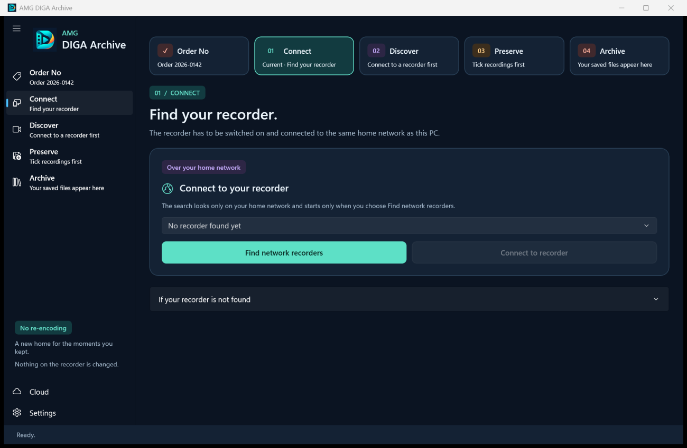

# Recorder setup and troubleshooting

*Polska wersja: [RECORDER-SETUP.pl.md](RECORDER-SETUP.pl.md)*

AMG DIGA Archive finds your recorder on the home network and saves the recordings the recorder offers. This page explains what the recorder and the network have to provide, how to switch that on, and what to do when the recorder is not found, will not open, or stops in the middle of a recording. The application opens this page from the section **If your recorder is not found** on its **Connect** page.

**How far this has been tested.** The project owns no recorder. Its automated tests run the network code against simulated recorders. On real hardware there is one report of the application: the owner of a recorder reported as a DMR-BS850 confirmed on 2 October 2026 that version 0.5.2 found the recorder, opened its folders and saved recordings, both as exact copies (`.mpg`) and as MKV. In the days before, the same owner had sent reports made with the [diagnostics kit](#diagnostics); this page mentions them where they explain something. Version 0.6.0 has run from start to finish only against the project's recorder emulator. Everything this page says about a recorder's own menus is taken from Panasonic's operating instructions as they read on 5 October 2026; the project has not tried any of those settings itself. What it says about routers, VPN software and Windows is general advice and Microsoft's documentation; the project has not tested the application in those situations either. If something here does not match what you see, please [tell us](#reporting).

**How to read this page.** Names in **bold** are shown by the application. Bold words at the start of a paragraph or of a list item are only headings. Names in "quotation marks" are shown by something else: by the recorder, as Panasonic's English operating instructions print its menus, by Windows, as Microsoft's help pages name its settings, or by the report form on GitHub. Where a message of the application contains a number or a name, this page writes "…" in its place.

## Contents

- [What the application needs](#what-is-needed)
- [Switching on the recorder's server](#recorder-settings)
- [The home network](#home-network)
- [What the recorder offers, and what it does not](#what-the-recorder-offers)
- [Slow answers and interrupted downloads](#time-limits)
- [The diagnostics kit](#diagnostics)
- [Reporting a recorder](#reporting)
- [Troubleshooting by symptom](#troubleshooting)

## What the application needs

The application talks to the recorder the way a television in another room would. It asks the recorder for its list of recordings and then fetches the recordings you ticked. The standard for this is called DLNA. Panasonic's instructions describe this function as playing recordings on other equipment; they do not describe saving them on a PC. The application uses the same function. It never writes to the recorder, and it needs no password for it.

Four things have to be true:

1. The recorder is switched on.
2. The recorder and the PC are connected to the same home network.
3. The recorder's server function is switched on. Depending on the model, Panasonic calls it "Home Network function" or "Server ( DLNA ) function".
4. The recorder lets this PC connect. Some models let every device on the home network connect; others want each device registered first.

The section **If your recorder is not found** on the **Connect** page says the same. It opens by itself after a search that found nothing.

| The application says | Read more |
|---|---|
| **Switch the recorder on. A recorder in standby does not answer.** | [Standby](#standby) |
| **Switch on its network server (DLNA) in the recorder's network settings, then leave the settings menu.** | [Switching on the recorder's server](#recorder-settings) |
| **Connect the recorder and this PC to the same router. A guest Wi-Fi network or a VPN on the PC keeps them apart.** | [The home network](#home-network) |
| **Stop other devices that are playing from the recorder, and wait until the recorder is not recording or copying.** | [When the recorder is busy](#busy) |

The application does not mention the fourth point above, the registration of the PC. It is described under [Switching on the recorder's server](#recorder-settings).

After each change, choose **Find network recorders** again. A search normally takes a few seconds and never more than 23. You can repeat it as often as you like.

When the search finds devices, the application lists each one with its name, its model and its address, and the search button now reads **Search again**. Every media server on the home network answers the search, so a television, a network disk or another PC may be listed beside the recorder. Choose the recorder and then **Connect to recorder**. If exactly one device answers the search and it calls itself a DIGA, the application connects to it straight away, as long as **Guide me to the next step** is ticked in **Settings**.

## Switching on the recorder's server

### Where this information comes from

This project has not operated the menus of any recorder. What follows is taken from Panasonic's English operating instructions for four generations of European models, read on 5 October 2026. Menu names differ between models and years, and a recorder set to another language shows translated names. Use the instructions of your own model; the page numbers below help you find the matching chapter there.

| Operating instructions | Models named on the cover | Pages used here |
|---|---|---|
| [RQT9434-L](https://tda.panasonic-europe-service.com/docs/1524838079-6011-FAEB2CDE788885D0490B6F15271A8D97AF771E13/tsn2/data/ALL/DMRBS850/OI/836579/rqt9434-l.pdf) | DMR-BS850, DMR-BS750 (EG) | 18, 79, 94 to 97, 103 |
| [SQT1119-2](https://tda.panasonic-europe-service.com/GetDoc.aspx?did=248902&lang=en&fmt=pdf) | DMR-BWT850 (EB, the UK model) | 16, 19, 20, 35, 60, 70, 76, 78, 79, 90 |
| [TQBS0024](https://tda.panasonic-europe-service.com/docs/2z660fdc4cz3z3e60bz656ez706466z25za9ef229c516e7d7feed6604376a326039e06e3bd/tsn3/data/ALL/DMRBCT765EG/OI/954751/BST_BCT765_760EG_full_eng_TQBS0024.pdf) | DMR-BCT765, DMR-BST765, DMR-BCT760, DMR-BST760 (EG) | 15, 18, 19, 74, 84, 92 to 95, 101 |
| [TQBS0033](https://tda.panasonic-europe-service.com/docs/2z68442d83z3z3e60fz656ez706466z24z91ffe9d8b044bad009dfc98681991493a8f05dab/tsn3/data/ALL/DMRUBC90EG/OI/994830/UBC_UBS90EG_full_eng_TQBS0033.pdf) | DMR-UBC90, DMR-UBS90 (EG) | 19, 22, 23, 78, 88, 98 to 101, 109 |

The links lead to Panasonic's European document server. If one has stopped working, search Panasonic's support pages for the document number in the first column.

### Recorders with a "Home Network function" setting

Panasonic's operating instructions for the DMR-BWT850, for the DMR-BCT765 family and for the DMR-UBC90 and DMR-UBS90 describe the same group of settings.

1. Press [FUNCTION MENU] on the remote control. Select "Basic Settings" in "Setup".
2. In the menu "Network", open "Home Network Settings".
3. Set "Home Network function" to "On". According to the instructions, this setting switches the recorder's DLNA server on and off.
4. Look at "Registration type for remote devices". With "Automatic", every device on the same network may connect. With "Manual", only registered devices may connect: open "Remote device list", select this PC by its device name or its MAC address, and confirm with "Yes". The instructions give 16 as the largest number of registered devices.
5. Leave the menu. The instructions list the display of the "Basic Settings" menu among the situations in which playback over the network may not work.

The same instructions add:

- With "Home Network function" set to "On", every device on the same network can reach the recorder. Panasonic asks you to make sure that your router is protected against access by strangers.
- With a wireless connection, the function cannot be set to "On" unless the connection to the router is encrypted.
- "Setting device name" changes the name under which the recorder appears on the network. The application lists every device under the name the device announces.
- "Conversion Setting for DLNA", when "On", lowers the picture quality for playback on other devices so that the picture does not break up. "Resolution Setting for DLNA" chooses the quality used then. This matters for the application: see [What the recorder offers](#what-the-recorder-offers).
- The instructions for the DMR-BWT850 and for the DMR-UBC90 say that some parts of the home network function cannot be used while "Audio Description" is set to "Automatic", and that it should then be set to "Off".

Whether a PC that is not registered is refused, or how the application then fails, is not known for these models.

### DMR-BS850 and DMR-BS750

1. Press [FUNCTION MENU]. Select "Others", then "Setup", then "Network Settings".
2. Panasonic's operating instructions for the DMR-BS850 describe two settings there. "Home Network ( DLNA ) Settings" is for other Panasonic equipment. "Server ( DLNA ) Settings" is for equipment from other makers, and a PC belongs to that group.
3. Open "Server ( DLNA ) Settings". The screen shows "Server ( DLNA ) function" and a list headed "MAC Address". The steps in the instructions are: select the MAC address of the equipment that should have access, press [OK], and confirm with "Yes". Up to four devices can be registered, and the list shows up to twelve addresses. The instructions do not spell out a step that sets "Server ( DLNA ) function" to "On"; their picture shows it as "Off". Check that it is "On" when you are done.
4. Leave the Setup menu. The instructions say that playback over the network is not possible while the Setup menu is displayed.

Things to know about this model:

- The instructions do not say when a device appears in the "MAC Address" list. If the PC is missing there, it is not known what makes it appear. A reasonable thing to try is to choose **Find network recorders** in the application once, so that the PC has sent something on the network, and then to open the recorder's list again. This is not tested.
- The instructions describe only a connection by LAN cable, and they ask that the other device be connected to the same hub or router as the recorder.
- The instructions say that "Power Save" cannot be switched on while one of the two DLNA settings is on.
- The project's notes hold one observation about registration, from the recorder reported as a DMR-BS850. A report made with the diagnostics kit on 30 September 2026 showed that the recorder was found and described itself, but refused the request for its list with HTTP 403. After the owner reported registering the PC's MAC address, the next report, of 1 October 2026, no longer showed HTTP 403. It showed another refusal, HTTP 412. A second report of the same day showed HTTP 412 again and, straight afterwards, HTTP 200 for the same request sent in another form, which is the form the application has used since version 0.4.3 (see [What has been seen on real hardware](DLNA-DIAGNOSTICS.md#what-has-been-seen-on-real-hardware)). This fits the registration having removed the HTTP 403; it does not prove it. The first report file was not kept, so the HTTP 403 rests on the notes alone. If the application shows **The recorder returned HTTP 403.**, check the registration first.

### Finding the PC's MAC address

A MAC address is the fixed number of a network adapter, written as six pairs of characters such as `00-1A-2B-3C-4D-5E`. You need it only when the recorder asks you to pick the PC from a list of addresses.

1. Press the Windows key, type `cmd` and press Enter.
2. Type `getmac /v` and press Enter. Microsoft documents this command as returning the MAC address of each network adapter ([getmac](https://learn.microsoft.com/en-us/windows-server/administration/windows-commands/getmac)).
3. Use the address in the line of the connection you really use: Wi-Fi or Ethernet.

Windows can show a different, random address to Wi-Fi networks. Microsoft describes the setting on its page about [random hardware addresses](https://support.microsoft.com/en-us/windows/how-and-why-to-use-random-hardware-addresses-in-windows-060ad2e9-526e-4f1c-9f3d-fe6a842640ed): "Settings" > "Network & internet" > "Wi-Fi" > "Random hardware addresses", and for a single network under "Manage known networks". If it is on for your home network, the recorder sees the random address and not the adapter's own. If a registration by MAC address works for a while and then stops, look at this setting first.

### Standby

The application asks you to switch the recorder on, and that is the dependable way. Panasonic's instructions say more, and it differs by model:

- **DMR-BS850, DMR-BS750.** The instructions do not say whether recordings can be played over the network while the recorder is in standby. They only say that "Power Save" cannot be on while a DLNA setting is on.
- **DMR-BWT850, DMR-BCT765 family, DMR-UBC90 and DMR-UBS90.** Setting "Home Network function" to "On" fixes "Quick Start" to "On" (in "Standby Settings", under "Others"). With both on, the instructions say, the recorder can be used as a DLNA server even when it is turned off. A separate setting, "Networked Standby", lets a network device wake the recorder with a wake-up message. The instructions tie its use as a server in standby to Panasonic's own recorders as clients, and the DMR-BWT850 instructions recommend leaving it "Off".

The application does not send a wake-up message. Whether a recorder in standby answers the application has not been tested on any model. If the recorder is not found, switch it on, wait a minute and search again.

The instructions also describe "Automatic Standby", which puts the recorder into standby after a set time without operation (on the DMR-BS850: two, four or six hours, or "Off"). They do not say whether serving recordings over the network counts as operation. If long sessions always stop after the same time, look at this setting.

### When the recorder is busy

A recorder serves the network beside its main work, and Panasonic's instructions list situations in which it does not:

- **Only one network device at a time (DMR-BS850).** The instructions say that two or more DLNA devices cannot play from the recorder at the same time. Stop playback on televisions, tablets and other players before you use the application.
- **Recording and copying.** The DMR-BS850 instructions exclude network playback while two programmes are being recorded at once. They and the DMR-BWT850 instructions name a high-speed copy that runs together with a recording. The instructions for the DMR-BCT765 family and the DMR-UBC90 name a copy in the mode "Copy (Keep Picture Quality)" that runs together with a recording.
- **Playing a disc.** The DMR-BS850 instructions name the playback of any disc, the newer ones the playback of a BD-Video.
- **Menus and internet services.** Network playback may not work while the Setup menu (newer models: the "Basic Settings" menu) is on the screen, or while the recorder is using an internet service such as "VIERA CAST" or "Network Service".
- **A recording in progress.** The DMR-BS850 instructions say that the programme being recorded cannot be played over the network.
- **Newer models.** The DMR-UBC90 instructions add that the recorder cannot act as a server while a 4K programme is watched or played. The instructions for the DMR-BCT765 family and the DMR-UBC90 describe a "DVB-via-IP Server" function that cannot be used at the same time as the other network functions; "Network Function Priority" decides which of them wins.

### Other models

Look in your model's operating instructions for the words "DLNA", "Home Network", "Server" and "Remote device". The chapter on network settings names the switch, and the chapter on playing back from other equipment lists the limits. If your model works, or needs a step that is not described here, a [recorder report](#reporting) helps the next owner of that model.

## The home network

### The same router

The recorder and the PC must get their network addresses from the same router. The search message of the application does not pass from one network into another.

It is easy to have two networks without noticing:

- a second router, or a Wi-Fi access point that works as a router, behind the internet provider's box, with the recorder plugged into one and the PC connected to the other;
- a PC that is connected to a phone's hotspot or to a neighbour's network;
- a guest network (see below).

To compare the addresses, look at the recorder's network settings ("IP Address / DNS Settings" in the instructions of all four generations) and at the PC's address. Microsoft's page [Essential network settings and tasks in Windows](https://support.microsoft.com/en-us/windows/essential-network-settings-and-tasks-in-windows-f21a9bbc-c582-55cd-35e0-73431160a1b9) shows where it is: "Settings" > "Network & internet", then the connection, then "IPv4 address". In most home networks the first three numbers are the same on every device, for example `192.168.1.20` and `192.168.1.37`. On the DMR-BS850 the same recorder menu has a "Connection Test", which tells you whether the recorder itself is connected.

### Wi-Fi or cable

- **The recorder.** The DMR-BS850 instructions describe only a LAN cable. The newer instructions describe both a cable and Wi-Fi. For weak Wi-Fi they suggest moving the router or changing to a cable, and for playback over the network they recommend a home network of at least 20 Mbps.
- **The PC.** Both work, as long as the router passes traffic between its Wi-Fi and its cable sockets. Home routers normally do.

Recordings are large files, often several gigabytes each; the application shows the size of each recording in its list. A cable is quicker and breaks off less often.

If the recorder is found when the PC is on a cable but not when the PC is on Wi-Fi, the Wi-Fi equipment is probably not passing the search message. Some access points, repeaters and mesh systems have a setting for this, usually with the word "multicast" in its name. If you cannot change it, ask the recorder directly: in the section **If your recorder is not found** on the **Connect** page, type the recorder's address into **Recorder's address (optional)**, as four numbers such as `192.168.1.40`, and choose **Ask this address**. The recorder's network settings show the address; the paragraph above says where. Only an address of a home network is accepted. If the recorder answers, it appears in the list and is selected, and you choose **Connect to recorder**. This way of asking has been tried against simulated devices only, not against a real recorder, and it helps only if the network passes ordinary traffic between the PC and the recorder; a guest network or client isolation, described next, blocks that too.

### Guest networks and client isolation

A guest Wi-Fi network gives visitors the internet and hides the devices at home from them. A PC on the guest network will not find the recorder. Connect the PC to the main network.

Some routers can do the same to every Wi-Fi device. The setting is called client isolation, AP isolation or something similar. Switch it off for the network the PC uses.

### VPN software

A VPN on the PC can send all traffic into its tunnel, including the traffic meant for devices at home, or block the home network while it is connected. Disconnect the VPN while you use the application. Some VPN programs have a setting that allows local network access instead. On a work laptop this is often decided by the employer.

### Windows: firewall and network profile

The application only starts conversations. It never waits for another device to contact it first. The answers to its search arrive within the three seconds for which it listens.

- **Firewall.** Microsoft's documentation says that Windows Firewall blocks incoming traffic unless it was asked for or a rule allows it, and that it lets outgoing traffic pass ([Windows Firewall overview](https://learn.microsoft.com/en-us/windows/security/operating-system-security/network-security/windows-firewall/)). By default it does not block the answers to a multicast message the PC has just sent (setting `DisableUnicastResponsesToMulticastBroadcast` in the [Firewall CSP](https://learn.microsoft.com/en-us/windows/client-management/mdm/firewall-csp)). On a PC whose firewall is managed by an organisation, that default may have been changed.
- **The firewall question.** Windows can ask whether an application may communicate on the network. Whether it asks for this application has not been established by the project. If it asks, allow the application. According to Microsoft's page on [firewall rules](https://learn.microsoft.com/en-us/windows/security/operating-system-security/network-security/windows-firewall/rules), answering "No" or cancelling makes Windows create blocking rules for the application, the same happens whatever you answer if your account is not an administrator, and the rules stay until someone deletes them. If you think that has happened, open the "Windows Security" app, select "Firewall & network protection" and then "Allow an app through firewall", and look for an entry for this application. Its program file is `Diga.exe`.
- **Network profile.** Windows treats every network as public or private. Microsoft's help page says that a network is public when you first connect to it, that this is the recommended setting at home as well, and that the PC is then hidden from other devices; with the private setting other devices on the network can find the PC ([Essential network settings and tasks in Windows](https://support.microsoft.com/en-us/windows/essential-network-settings-and-tasks-in-windows-f21a9bbc-c582-55cd-35e0-73431160a1b9)). The application does not need to be found: it asks, and it listens for the answers. By Microsoft's documentation the public setting should therefore not stop the search. The project has not tested either setting. If the search finds nothing although everything else is right, you can try the private setting for your home network: "Settings" > "Network & internet", the properties of the connection, "Network profile type". Microsoft's page asks you to use it only on a network whose people and devices you know and trust.
- **Other security software.** A security suite with its own firewall can block the answers to the search. Look there for a setting about the local or trusted network.

The application does not add firewall rules, and it does not change settings in Windows or in the router.

### What the application does on the network, exactly

This list is for people who configure routers or firewalls. It describes the code in `src/Diga.Core/Dlna`.

- Nothing is sent until you choose **Find network recorders**. The application says so itself: **The search looks only on your home network and starts only when you choose Find network recorders.**
- **Search.** From every active IPv4 address of the PC (adapters that are up and support multicast, without the loopback adapter, at most 16 addresses) the application sends two SSDP search messages (`M-SEARCH`) by UDP to the multicast address `239.255.255.250`, port `1900`. One asks for `urn:schemas-upnp-org:device:MediaServer:1`, the other for `urn:schemas-upnp-org:service:ContentDirectory:1`. They are sent with a time-to-live of 1, so they do not pass a router. The application then listens for three seconds on the port it sent from, which Windows picks. The search uses IPv4 only.
- **Answers.** An answer is used only if its first line is `HTTP/1.1 200 OK` and it has exactly one `LOCATION` header with an `http` or `https` address whose host is the IPv4 address the answer came from. An answer that names its sender by a host name is ignored. At most 256 answers are read.
- **Device description.** The application fetches each `LOCATION` with an HTTP `GET`, for at most 64 addresses and at most 8 from one answering address, 16 at a time. A device is listed if its description offers a UPnP ContentDirectory service whose control address is on the same host.
- **Lists.** To open the recorder or a folder, the application sends HTTP `POST` requests (SOAP action `Browse`, 100 entries per request) to that control address.
- **Recordings.** A recording is fetched with one HTTP `GET` from an address on the same host as the description; the port may be a different one. The application does not ask for parts of a file (`Range`).
- **Where the traffic goes.** All of it goes straight to the recorder's own address. No proxy is used and no sign-in or cookie is sent. Redirects are not followed for descriptions and lists; for a download, at most three redirects on the same host are followed.
- **Private addresses only.** The application connects only to `10.x.x.x`, `172.16.x.x` to `172.31.x.x`, `192.168.x.x` and `169.254.x.x`. A home network that uses other addresses, for example `100.64.x.x`, is not supported.
- **Ports.** The recorder chooses the ports of its description, its lists and its recordings and announces them in its answers. Only the search port, UDP 1900, is fixed.
- The application does not scan addresses or ports.

## What the recorder offers, and what it does not

For every recording, the recorder's list says in which versions the recorder offers it to network devices. The recorder marks each version: protected or not, converted or not. The application reads these marks and shows one line for each recording on the **Discover** page.

| The application shows | What the recorder declared | What you can do |
|---|---|---|
| **Can be saved** | It offers a version and declares that this version is not converted. | Tick it and save it. |
| **Can be saved · the recorder does not say whether this is the original version** | It offers a version without saying whether it is converted. | Tick it and save it. The technical details of the saved file record that the recorder did not say. |
| **Copy-protected · cannot be saved** | It marks the recording as protected and offers no unprotected version. | Nothing. |
| **Offered only in a converted version · not saved by this application** | The only unprotected version is one the recorder converts while it sends it. | On models that have "Conversion Setting for DLNA", check that it is "Off", then choose **Refresh folder**. This is not tested. |
| **The recorder does not offer this recording for download** | The entry has no version that can be fetched from the recorder's own address over the home network. | Try again later, for example when a running recording has finished, and choose **Refresh folder**. This is not tested either. |

Recordings that cannot be saved cannot be ticked. They are named below the list, under a line that ends with **in this folder cannot be saved:**, each with its reason. The page also says: **Copy-protected recordings, and recordings the recorder offers only in a converted version, cannot be saved.**

### Why the application cannot change this

- **The list belongs to the recorder.** The application can only ask for what is listed. No setting in the application makes the recorder list more.
- **Protected recordings.** A recorder sends a protected recording in encrypted form, for devices that are licensed to play it. The application has no such licence and contains nothing that decrypts. That is deliberate and will not change.
- **Converted versions.** A converted version is a new encoding that the recorder makes while it sends, usually at a lower quality. The application exists to keep picture and sound as they were recorded, so it does not save converted versions.
- **Panasonic's instructions say the same from the recorder's side.** The DMR-BS850 instructions say that titles which are copyright protected, with copying prohibited, cannot be played over the network. The newer instructions say that programmes which the broadcaster sent with an access restriction, such as a copy restriction, are not available to network devices, and their troubleshooting pages add titles in an incompatible format. The instructions for the DMR-BCT765 family and the DMR-UBC90 add programmes with content protection (they describe it for CI Plus broadcasts) and encrypted programmes. Whether a broadcast can be saved is therefore decided by the broadcaster's signal and by the recorder.

The DMR-BWT850 instructions list, among the symbols in the recorder's own list of recordings, one for a title that cannot be played from a DLNA device without DTCP-IP. DTCP-IP is the protection scheme for such recordings, and the application does not have it. On a model that shows such a symbol, you can see on the television which recordings the application will not get.

The application checks once more when a download starts. If the recorder's answer then says that the content is protected or converted, the recording is not saved and the message says why, for example **The recorder's HTTP headers indicate protected content. DTCP/DRM recordings cannot be downloaded by this app.**

Even **Can be saved** rests on what the recorder declares. The technical details of every saved file say so: **What the recorder declares cannot be checked from outside: the application cannot compare the download with the recording on the recorder's disk.**

### How the application reads the marks

This paragraph is for people who know DLNA. In the recorder's list every version of a recording is a `res` element with a `protocolInfo` attribute. The application counts a version as protected when the element has a non-empty `protection` attribute or its `protocolInfo` contains `DTCP`, `DRM`, `PLAYREADY` or `WIDEVINE`. It counts a version as converted when `protocolInfo` carries `DLNA.ORG_CI=1`, and as not converted when it carries `DLNA.ORG_CI=0`; a flag that is malformed or contradicts itself counts as converted. Without the flag, the recorder "does not say". Only versions offered by `http-get`, or with no `protocolInfo` at all, from an `http` or `https` address on the recorder's own host can be saved. Among those, the application takes an unprotected version that is declared not converted before one without the flag. A version whose address is on another host, or is not an `http` or `https` address, is ignored altogether. When no version can be saved and none is an unprotected converted one, a protected version makes the line read **Copy-protected · cannot be saved**, even if it is offered in another way than `http-get` or has no address.

### Recordings that are missing from the list

The application shows every entry the recorder returns for a folder. If a recording you can see on the television is missing, the recorder did not list it for network devices. Panasonic's instructions name programmes with an access restriction, and the newer ones add that files which are not on the built-in hard disk cannot be played over the network. Open the other folders as well: the recorder decides how it arranges its recordings into folders for the network.

## Slow answers and interrupted downloads

A recorder can be slow to answer: just after it was switched on, while it records, or while it is busy with something else. Panasonic's newer instructions say, for example, that starting from standby takes longer when "Quick Start" is not on. The application waits, but not for ever, so that a recorder that has gone silent does not hold up your other recordings.

| Step | How long the application waits | When the time runs out |
|---|---|---|
| Search | 3 seconds for answers. Then 3 seconds for each device's description. The whole search ends after 23 seconds at most. | The device is left out of the list without a message. If no device is left: **No recorder was found** |
| Opening the recorder or a folder | 3 seconds to connect and 10 seconds for each answer. The recorder sends a folder in parts of 100 entries; one folder may take 2 minutes in all. | **The recorder did not answer in time. Check that it is switched on and connected, then try again.** |
| Starting a download | 30 seconds in all for the recorder to accept the connection, for which it has 10 seconds, and to begin its answer. | **The recorder did not return HTTP headers in time.** |
| During a download | 30 seconds without receiving anything. | **The recorder stopped sending data. The incomplete copy was removed; retry when the recorder is available.** |

There is no limit on the time a whole download may take. A long recording takes as long as it takes.

What happens after an interruption:

- The incomplete file is removed. Nothing half-finished stays in your folder under the recording's name.
- The application does not continue a broken download. The next attempt fetches that recording from its beginning.
- When several recordings are ticked, one that fails does not stop the others. After two failures in a row the application stops, because then the recorder or the network is probably gone. The message is headed **Saved … of … recordings**. It names the first four recordings that failed, each with its reason, and gives the number of any others. It also says **Further recordings not tried: …, because two in a row failed.** and **The recordings that were not saved are still ticked: choose Save to try them again. Saved recordings are in Archive.**
- **Download and preview** and **Download and show details** fetch the whole recording first, so the same limits apply to them.

What to do: check on the television that the recorder is on and that no menu is open, wait a minute or two, choose **Refresh folder** on the **Discover** page, and save again.

While it works, the application asks Windows not to go to sleep by itself. This does not cover sleep that you start yourself, for example by closing the lid of a laptop.

## The diagnostics kit

The diagnostics kit is a small script for Windows. It asks the recorder the same first questions as the application and writes down how the recorder answered, in a form that contains nothing private. Use it when the recorder is not found although you went through the four points above, when it is found but **Connect to recorder** fails, or when you want to report how a model behaves. The full description is in [Diagnostics kit](DLNA-DIAGNOSTICS.md).

**Where to get it.** Every release has a file named `DIGA-…-dlna-diagnostics.zip` on the [releases page](https://github.com/lukasz-gratkowski/AmgDigaArchive/releases). The same script is also part of the application: in the folder `diagnostics` beside `Diga.exe` (for an installed copy this is `%LOCALAPPDATA%\Programs\DIGA\diagnostics`, unless you chose another folder).

**How to run it.**

1. Use a PC on the same home network as the recorder. If you downloaded the ZIP, unpack all of it into a new folder first.
2. Switch the recorder on and leave its menus.
3. Double-click `Run-DlnaDiagnostics.cmd`. A text window opens; its messages are in English. Windows may ask you to confirm that you want to run a downloaded file.
4. If the script finds several devices, type the number of the recorder and press Enter. If it finds exactly one device, it uses that one without asking and without showing its name. If it finds none, it asks for a `Description URL`. Do not guess one; just press Enter.
5. Wait for the line that begins with `Share this sanitized ZIP:`. It names the report file. Press a key to close the window.

**What it does.** It sends the same kind of search as the application, reads the descriptions of the devices that answer, and asks the chosen device once for the top level of its list (at most 100 entries). If that request fails, it sends it once more in an older form, for comparison. It does not open folders, does not download any recording, changes nothing on the recorder or in Windows, and sends nothing to anyone. It writes its report into a folder named `DlnaDiagnostics` beside the script.

**What the report contains.** The ZIP holds two text files, `report.json` and `README.txt`. They record the HTTP status of each request, sizes in bytes, how many elements of which kind the answers had, how long each request took, and which version of the script ran. They contain no addresses, no device names or serial numbers, no recording titles and none of the recorder's actual answers. You can open `report.json` in Notepad and read it before you send it.

**What it cannot tell.** It looks only at the top level of the list. It does not show whether recordings inside the folders are listed, whether they can be saved, or whether a download would finish. Because the report holds no names, it also cannot show which device answered. If the only device that answered was a television or a network disk, the report describes that device. Say in your report what the application listed.

A report is useful even when the script ends with an error, and even when no device was found: it then shows whether any device answered the search at all.

## Reporting a recorder

The project learns which recorders work only from reports. A report that everything worked is as useful as a report of a failure.

1. Open the [issue chooser](https://github.com/lukasz-gratkowski/AmgDigaArchive/issues/new/choose) and pick "Recorder report". You need a free GitHub account. The form is in English; you may write in Polish.
2. Fill in "Recorder model and region" (the model is printed on the back of the recorder, for example DMR-BS850EG) and "Application version".
3. Tick under "What worked?" what worked for you, and describe the rest under "Details": the kind of recordings, anything that was refused and the message shown, and how you checked the saved file.
4. If something failed, drag the ZIP that the diagnostics kit made into the field "Diagnostics". Attach the ZIP as it is.

Please do not attach recordings. Leave out programme titles if you would rather not share them.

The application also keeps an error log on your PC: **Settings** > **About AMG DIGA Archive** > **Open the log folder**. The application says of this log that it can name folders, recording titles and the recorder's address. Read it before you attach it, or copy only the lines that belong to the failure.

## Troubleshooting by symptom

### Finding the recorder

| What you see | Likely cause | What to do |
|---|---|---|
| **No recorder was found** and **Go through the checklist below, then search again.** | Nothing answered the search: the recorder is off or in standby, its server function is off, its menu is open, or the PC is on another network. | Go through [the four points](#what-is-needed), then choose **Find network recorders** again. |
| **Action needed** with a text that begins **This PC is not connected to any network, so a recorder cannot be found.** | The PC itself has no network connection. | Connect the PC to the home network, by cable or Wi-Fi, and search again. |
| The same, although the four points are done | The search message or its answers do not get through: guest Wi-Fi, client isolation, Wi-Fi equipment that does not pass multicast, a VPN, a firewall. | [The home network](#home-network). Try the PC on a cable to the same router. Then run the [diagnostics kit](#diagnostics). |
| Devices are listed, but not the recorder | The devices listed are other media servers. The recorder itself did not answer, or its answer could not be used. | Check the recorder's server setting ([Switching on the recorder's server](#recorder-settings)) and choose **Search again**. The diagnostics kit shows how many devices answered and what their descriptions returned. |
| The recorder was found before and is not found now | The recorder is in standby or busy, or a VPN is on. | [Standby](#standby), [When the recorder is busy](#busy), [VPN software](#home-network). |
| Found with the PC on a cable, not on Wi-Fi | The Wi-Fi does not pass the search. | [Wi-Fi or cable](#home-network) and [Guest networks and client isolation](#home-network). |

### Opening the recorder and its folders

When an action fails, the application shows a message headed **Action needed**.

| What you see | Likely cause | What to do |
|---|---|---|
| **The recorder did not answer in time. Check that it is switched on and connected, then try again.** | The recorder was found but then went silent: it is waking up, going to standby, showing a menu, or busy. | Wait a minute and try again. See [When the recorder is busy](#busy). |
| **The recorder returned HTTP 403.** | The recorder refuses this PC. The project knows of one case: HTTP 403 before the owner registered the PC in the recorder, and no HTTP 403 afterwards. That fits a missing registration; it does not prove it (see [DMR-BS850 and DMR-BS750](#recorder-settings)). | Register the PC in the recorder's server settings, leave the recorder's menu, and connect again. |
| Another message that begins with **The recorder returned HTTP**, or one that begins with **Recorder ContentDirectory error** or **The recorder returned an empty response** | The recorder answered and refused, or answered with nothing. The recorder may be busy, or it does not accept the way the application asks. | See [When the recorder is busy](#busy) and try again. If it stays, run the [diagnostics kit](#diagnostics) and [send the report](#reporting). |
| A message that begins with **The connection failed. Check that this PC is online and, for a recorder, that it is switched on; then try again. Technical detail:** when a connection broke during a request, or **The recorder could not be reached on the local network.**, followed by the recorder's address and port in brackets, when no connection could be made at all | The recorder refused the connection or could not be reached: it was switched off or left the network after the search, or the PC lost its connection. | Check both connections, then search again. |
| **This folder is empty, or the recorder did not return any accessible entries.** | The folder really is empty, or the recorder returned nothing for it at this moment. | Open the other folders. Choose **Refresh folder** when the recorder is idle. |
| **The recorder folder changed during browsing. Refresh the folder.** | A recording started, ended or was deleted while the list was being read. | Choose **Refresh folder**. |
| A recording is named below the list with **Copy-protected · cannot be saved** | The recorder marks it as protected. | Nothing. See [What the recorder offers](#what-the-recorder-offers). |
| A recording is named below the list with **Offered only in a converted version · not saved by this application** | The recorder offers only a converted version. | Check "Conversion Setting for DLNA" on models that have it, then choose **Refresh folder**. Not tested. |
| A recording is named below the list with **The recorder does not offer this recording for download** | The recorder gave no address from which it can be fetched. Why is not known; it may be a recording that is still running. | Try later and choose **Refresh folder**. Not tested. |
| A recording on the recorder is not in the list at all | The recorder did not list it for network devices. | See [Recordings that are missing from the list](#what-the-recorder-offers). |

### Saving

When a recording cannot be saved, the reason stands after its title in the message headed **Saved … of … recordings**. Most rows below quote such a reason. **Download and preview** and **Download and show details** show the same texts in a message headed **Action needed**.

| What you see | Likely cause | What to do |
|---|---|---|
| **The recorder did not return HTTP headers in time.** | The recorder did not begin its answer within 30 seconds. | Check that it is on and idle, then save again. |
| **The recorder stopped sending data. The incomplete copy was removed; retry when the recorder is available.** | Nothing arrived for 30 seconds: the recorder went to standby or became busy, or the connection broke. | See [Slow answers and interrupted downloads](#time-limits). Use a cable if you can. |
| **The download ended before the entire declared recording arrived. The incomplete copy was removed.** | The recorder ended the download early. | Choose **Refresh folder** and save again. |
| **The connection to the recorder was lost before the whole recording arrived. The incomplete copy was removed. Check that the recorder is switched on and connected, then save the recording again.** | The connection broke in the middle of the download: the recorder was switched off or went to standby, or the network dropped. | Check the recorder and the network, choose **Refresh folder**, and save again. |
| The reason **The recorder could not be reached on the local network.**, followed by the recorder's address and port in brackets | The recorder refused the connection or could not be reached: it was switched off or left the network after the list was read. | Check the recorder and the network, choose **Refresh folder**, and save again. |
| **The recorder did not return a recording (HTTP …). Refresh the folder and check the recorder's access settings.** | The recorder refused this recording: it is busy, serving another device, or the recording is one it does not send. | Stop other players, choose **Refresh folder**, and save again. If only certain recordings fail, [report](#reporting) which kind. |
| **The HTTP content length does not match the recording size advertised by the recorder. Refresh its recording list and retry.** | The recording changed after the list was read, for example because it was still growing. | Choose **Refresh folder** and save again. |
| **The recorder's HTTP headers indicate protected content. DTCP/DRM recordings cannot be downloaded by this app.** | The recorder listed the recording as available and then answered with protected content. | Nothing. See [What the recorder offers](#what-the-recorder-offers). |
| **Saved … of … recordings** | Some recordings failed. The message names the first four with the reason for each and gives the number of any others. | Read the reasons. The recordings that were not saved are still ticked. |
| Saving always stops after the same number of hours | The recorder's "Automatic Standby", or the PC went to sleep. | [Standby](#standby) and [Slow answers and interrupted downloads](#time-limits). |
| Saving is very slow | A weak Wi-Fi connection, or a recorder that is recording at the same time. The application has no speed setting. | Use a cable. Save when the recorder is idle. |

If nothing here helps, run the [diagnostics kit](#diagnostics) and [send a recorder report](#reporting). The [user guide](USER-GUIDE.md) describes the rest of the application.
