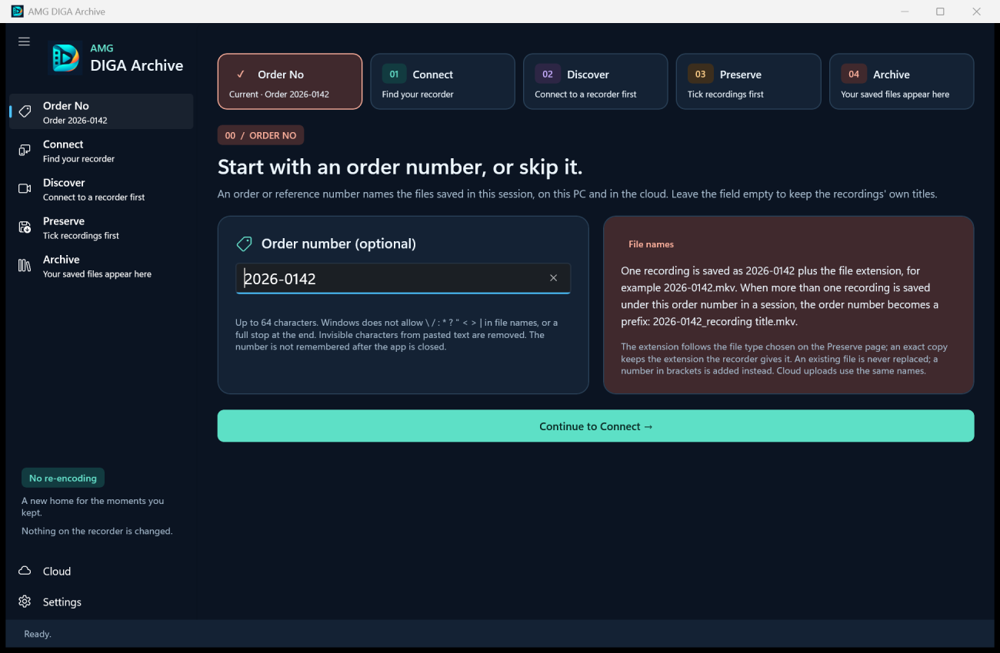
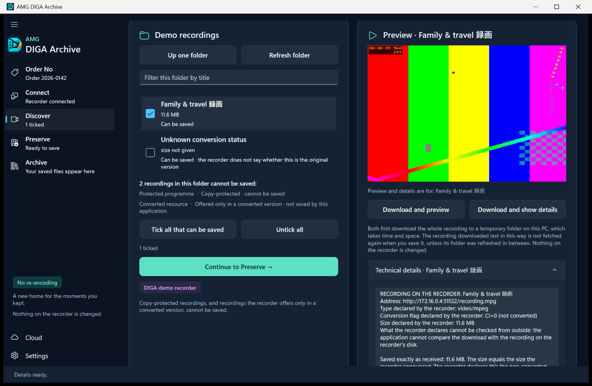
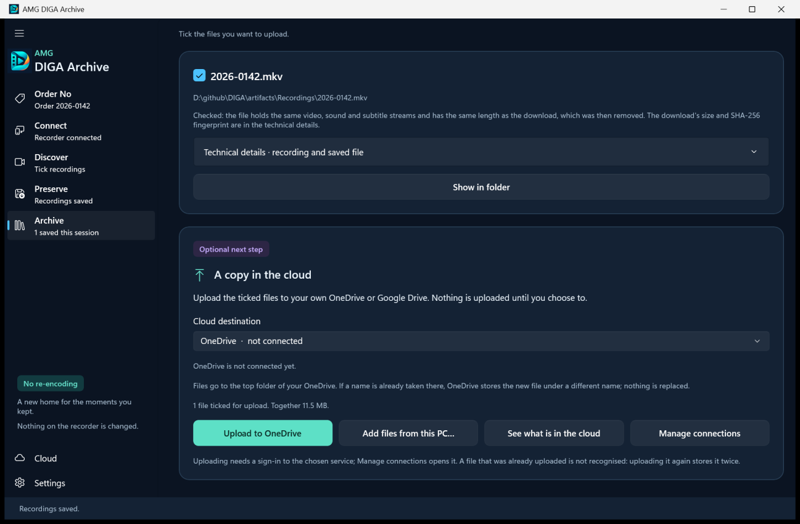
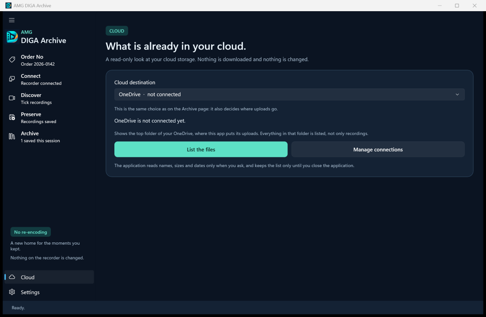
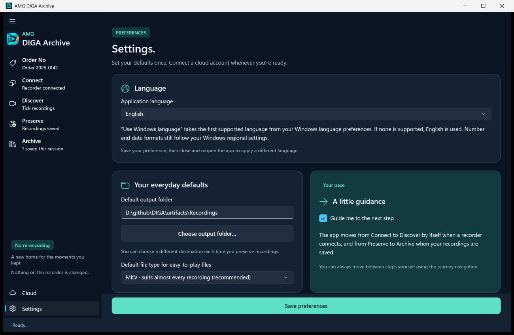
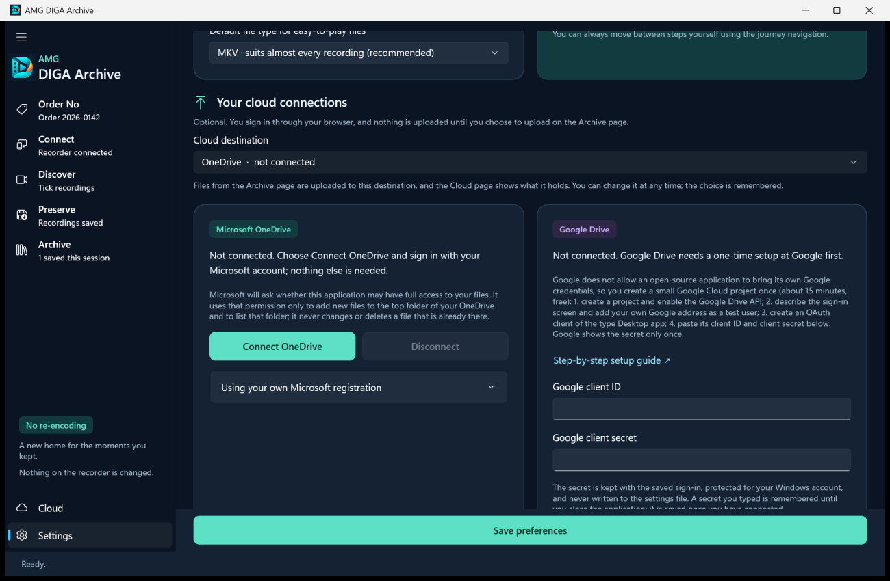

# AMG DIGA Archive: user guide

*Polska wersja: [USER-GUIDE.pl.md](USER-GUIDE.pl.md)*

AMG DIGA Archive is an application for Windows 11. It saves recordings from a Panasonic DIGA recorder to your PC over the home network, and it can upload the saved files to your own OneDrive or Google Drive. It never writes to the recorder, and it never replaces a file that already exists.

This guide describes version 0.6.3 and follows the window as you see it. Names in **bold** are shown by the application or by its installer. Names shown by Windows itself are in “quotation marks”. The project is independent of Panasonic.

## Contents

1. [What you need](#need)
2. [Installing](#install)
3. [First start and language](#first-start)
4. [Step 0: Order No](#order)
5. [Step 1: Connect](#connect)
6. [Step 2: Discover](#discover)
7. [Step 3: Preserve](#preserve)
8. [Step 4: Archive](#archive)
9. [The Cloud page](#cloud)
10. [Settings](#settings)
11. [Where the application keeps its own data](#data)
12. [Troubleshooting](#troubleshooting)
13. [Uninstalling, and what stays](#uninstall)

<a name="need"></a>
## What you need

- A PC with Windows 11, 64-bit (x64). The installer refuses older versions of Windows.
- A Panasonic DIGA recorder that is switched on and connected to the same home network as the PC, with its network server (DLNA) switched on. [Recorder setup and troubleshooting](RECORDER-SETUP.md) explains how.
- Free space on a drive. Recordings are large. The **Preserve** page shows the total size of what you ticked before anything is downloaded.
- An internet connection for three things only: downloading the application, downloading FFmpeg (optional, see [The FFmpeg option](#ffmpeg)) and uploading to the cloud (optional). Saving from the recorder uses the home network alone.
- For the cloud: a Microsoft account for OneDrive, or a Google account for Google Drive. Google Drive needs a one-time setup at Google first; see [Cloud setup](CLOUD-SETUP.md).

The application has no telemetry, does not look for updates and has no server of its own.

<a name="tested"></a>
### How far it has been tested

Please read this before you rely on the application for recordings you cannot replace.

- The project's automated tests run against simulated recorders, against simulated Microsoft and Google servers, and against the real FFmpeg and MediaInfo.
- On real hardware there is one report. The owner of a recorder reported as a DMR-BS850 confirmed on 2 October 2026 that version 0.5.2 found the recorder, opened its folders and saved recordings both as exact copies (`.mpg`) and as MKV, and that connecting OneDrive with the built-in registration and uploading worked.
- That OneDrive report was made with the earlier built-in Microsoft registration. On 5 October 2026 the application got a new built-in registration (application ID `bfd21bf0-32a9-4520-8bbb-d525e3d34aea`), and version 0.6.0 uses it. Nobody has reported connecting or uploading through the new registration yet. The only thing checked for it is that Microsoft's sign-in service knows the ID and accepts the `http://localhost` redirect, which is the address through which a sign-in comes back to the application. This was checked without signing in.
- Versions 0.6.0 to 0.6.3 have run from start to finish only against the project's recorder emulator, not against a real recorder.
- Google Drive has never been run against Google's real servers by the project. Work or school OneDrive accounts are untested, and so is uploading into a shared OneDrive or SharePoint folder.
- Releases are not digitally signed yet; see [The Windows warning](#smartscreen).

Which recorder models work, and which recordings a recorder offers for saving, is not known beyond that one report. If you try the application, a recorder report on the project's [issues page](https://github.com/lukasz-gratkowski/diga-archive/issues/new/choose) helps the people after you, whether it worked or not.

<a name="install"></a>
## Installing

<a name="installer"></a>
### The installer

1. Open the project's [latest release](https://github.com/lukasz-gratkowski/diga-archive/releases/latest) and download `DIGA-0.6.3-win-x64-setup.exe`.
2. Start the file. Windows will probably show a warning first; see [The Windows warning](#smartscreen).
3. Choose the language of the installer, English or Polish. This is the language of the installer only. The application chooses its own; see [First start and language](#first-start).
4. Accept the licence. It is the GNU General Public License, version 3, shown in English.
5. Keep the suggested folder, `%LOCALAPPDATA%\Programs\DIGA`, unless you have a reason to change it. The installer runs without administrator rights, so it cannot write to a folder that needs them.
6. Choose the extras:
   - **Create a desktop shortcut** is not ticked to begin with.
   - Under **FFmpeg is not included in this installer:** the option that begins **Download FFmpeg** is ticked to begin with. [The FFmpeg option](#ffmpeg) says what it is for.
7. Start the installation. If the FFmpeg option is ticked, the installer first shows a page whose title begins **Downloading FFmpeg**, and then installs the application.
8. On the last page, leave **Open AMG DIGA Archive** ticked to start the application at once. Later you start it from the Start menu: type `AMG DIGA Archive` there.

The installer installs for your Windows account only and asks for no administrator rights. Another Windows account on the same PC needs its own installation.

<a name="smartscreen"></a>
### The Windows warning

Releases are not digitally signed yet. Signing, with Microsoft Azure Artifact Signing, is prepared and will be switched on later. The notes of each release say whether it is signed.

For an unsigned installer Windows shows its SmartScreen warning: a window titled “Windows protected your PC”, with “Unknown publisher”. According to [Microsoft's documentation](https://learn.microsoft.com/en-us/windows/security/operating-system-security/virus-and-threat-protection/microsoft-defender-smartscreen/), Windows warns about a downloaded program that is not yet well known to it, and it looks at the digital signature as well. A new, unsigned installer is such a program. To go on, choose “More info” and then “Run anyway”. Your browser may also ask you to confirm that you want to keep the downloaded file.

The warning cannot tell you whether the file is the genuine one, so check the download yourself first. [Verifying your download](VERIFYING-DOWNLOADS.md) shows how, in a few lines: the SHA-256 checksum shows that you have the published file, and the build attestation shows that it was built from this project's source.

<a name="ffmpeg"></a>
### The FFmpeg option

FFmpeg is a separate, free program for handling video. It is not part of the application and not part of the installer. The application uses it for two things:

- to save a recording as an easy-to-play file (MKV, MP4 or MPEG);
- to make the short preview on the **Discover** page.

Exact copies, the technical details of a recording and cloud upload work without FFmpeg.

If you leave the option ticked, the installer downloads one specific FFmpeg package from the GitHub releases of its distributor, Gyan Doshi, or from gyan.dev if that fails. For version 0.6.3 this is FFmpeg 9.0.2, a download of about 110 MB. The installer uses the download only if its SHA-256 checksum equals the one recorded in the installer, and it installs only the two programs `ffmpeg.exe` and `ffprobe.exe` with their licence texts. FFmpeg is licensed under the GNU GPL version 3.

- If the download fails, the installer says why and installs the application without FFmpeg.
- If you cancel the download, the installer asks whether to install without FFmpeg.
- If this same FFmpeg is already on the PC, from an earlier installation or downloaded by the application, nothing is downloaded.

You can add FFmpeg at any time later. In the application open **Settings**, then **Media tools · advanced**, and use the button that begins **Download FFmpeg**. The same button appears on the **Discover** and **Preserve** pages while FFmpeg is missing.

<a name="portable"></a>
### The portable ZIP

If you prefer no installer, download `DIGA-0.6.3-win-x64-portable.zip`, unpack it to a folder of your choice and start `Diga.exe`. Windows may show the same warning as for the installer.

- The package holds the same application. It does not hold FFmpeg; download it in **Settings** under **Media tools · advanced**.
- “Portable” means only that nothing is installed. The application still keeps its settings, saved sign-ins, temporary files and error log in your Windows profile; see [Where the application keeps its own data](#data).
- There is no uninstaller. To remove the application, delete the unpacked folder and, if you want its data gone too, the folder `%LOCALAPPDATA%\Diga`.

<a name="update"></a>
### Installing a newer version

The application never looks for updates by itself. To see whether there is a newer version, open **Settings**, then **About AMG DIGA Archive**, and choose **Look for a newer version on the releases page**. Close the application, download the newer installer and run it. It replaces the installed version. The installer does not touch your settings or your saved cloud sign-ins.

If you come from version 0.5.2 and had connected OneDrive without an application ID of your own, connect once more:

- From version 0.6.0 on, the application has a new built-in Microsoft registration. A registration is the entry at Microsoft that identifies the application when you sign in; it is not a password. A sign-in belongs to the registration it was made with, so the sign-in saved by version 0.5.2 is not used.
- After the update OneDrive is shown as not connected. Open **Settings** and choose **Connect OneDrive**.
- The sign-in saved for the earlier registration stays on this PC, unused. It is removed with the next **Disconnect** of OneDrive, or when you uninstall. The permission you gave to the earlier registration stays at Microsoft until you remove it on your account's page; [Uninstalling, and what stays](#uninstall) gives the address.
- A OneDrive connection made with your own application ID and a Google Drive connection are saved under their own IDs. This change does not touch them. Versions before 0.5.2 had no built-in registration, so a OneDrive connection made in one of them is of this kind.

After an update the application may also say **FFmpeg update available**; see [FFmpeg is missing or of another version](#t-ffmpeg).

<a name="silent"></a>
### Silent installation

This part is for people who install without the wizard, for example from a script. The installer is made with Inno Setup and accepts its standard switches.

```bat
DIGA-0.6.3-win-x64-setup.exe /VERYSILENT /SUPPRESSMSGBOXES /NORESTART /LANG=en
```

| Switch | Effect |
|---|---|
| `/SILENT` or `/VERYSILENT` | No wizard. `/SILENT` still shows the progress window; `/VERYSILENT` shows nothing. |
| `/SUPPRESSMSGBOXES` | No message boxes. If FFmpeg cannot be downloaded, the installation continues without it. |
| `/NORESTART` | Windows is not restarted. |
| `/LANG=en` or `/LANG=pl` | The language of the installer. |
| `/DIR="D:\Apps\DIGA"` | Another folder for the application. It must be one you can write to without administrator rights. |
| `/TASKS=` | None of the extras: no FFmpeg, no desktop shortcut. |
| `/TASKS=ffmpeg` | FFmpeg, no desktop shortcut. |
| `/MERGETASKS="!ffmpeg"` | The default choices, but without FFmpeg. |
| `/MERGETASKS="desktopicon"` | The default choices, and the desktop shortcut. |
| `/LOG="C:\Temp\diga-install.log"` | Writes a log of the installation. It includes the reason if the FFmpeg download failed. |

Things to know:

- Unless you switch it off, a silent installation downloads FFmpeg from the internet, as the wizard does by default.
- The installation is for the account that runs the command. There is no installation for all users.
- The application is not started at the end of a silent installation.
- To uninstall silently: `"%LOCALAPPDATA%\Programs\DIGA\unins000.exe" /VERYSILENT /SUPPRESSMSGBOXES /NORESTART`

The project's automated installer test runs the installer with `/VERYSILENT`, `/SUPPRESSMSGBOXES`, `/NORESTART`, `/NOICONS`, `/TASKS`, `/DIR`, `/LOG` and `/LANG`, once without and once with the FFmpeg download, and the uninstaller with the three switches shown above. Other combinations have not been tried by the project. What the table says about the switches themselves comes from Inno Setup's documentation. The one exception is the empty `/TASKS=`, which that documentation does not describe: it is the form the project's test uses to install without FFmpeg.

<a name="first-start"></a>
## First start and language

The application opens in English or in Polish. On the first start it takes the first language in your Windows language preferences that it supports. If neither English nor Polish is there, it uses English. The language you chose in the installer plays no part.

To change the language:

1. Open **Settings**. Its first section is **Language**.
2. In the list **Application language** choose English, Polski, or the first entry, for example **Use Windows language · English**. That entry names the language Windows would give.
3. Choose **Save preferences** at the bottom of the window.
4. Close the application and open it again. The message **Language saved · reopen the app** reminds you; until then the window keeps its current language.

Numbers and dates follow your Windows regional settings, whatever the language.

<a name="window"></a>
### The window

- On the left is the navigation: the five steps **Order No**, **Connect**, **Discover**, **Preserve** and **Archive**, and below them **Cloud** and **Settings**. Under the name of each step a short line says where you stand, for example **Optional**, **Recorder connected** or **3 ticked**. In a narrow window the navigation shrinks to icons.
- The same five steps are repeated as a row of buttons at the top of each step's page, numbered 00 to 04. A step that is done shows a tick instead of its number. You can go to any step by clicking it.
- Messages about what has just happened appear in a bar at the top of the page.
- The line at the bottom says what the application is doing. While it works, a progress bar and the button **Cancel** appear there, and you cannot change pages until the work has finished or you have cancelled it.
- If you close the window while work is in progress, the application asks **Stop and close?** Choose **Keep working** to let it finish.

While **Guide me to the next step** is ticked in **Settings** (it is, to begin with), the application moves on by itself at two points: from **Connect** to **Discover** when a recorder connects, and from **Preserve** to **Archive** when your recordings are saved.

<a name="order"></a>
## Step 0: Order No



The first page asks for an order number. It is optional. An order or reference number is useful when the files of one job should carry the same name, for example when you save recordings for someone else. If you leave the field empty, the files keep the recordings' own titles.

1. Type the number into **Order number (optional)**, or leave the field empty.
2. Look at the card **File names** beside it. It says how the files will be named. While you type, the card and the rest of the page stay as they are; they follow the number about a second after you stop typing. A number longer than 16 characters is shown there, in the strip of steps and in the menu by its beginning and its end, with an ellipsis between them. The files get the whole number.
3. Choose **Continue to Connect**, or press Enter.

The rules for the number:

- Up to 64 characters.
- Windows does not allow `\ / : * ? " < > |` in file names, or a full stop at the end. Names that Windows reserves for devices, such as `CON`, `NUL` or `COM1`, cannot be used either. While the number cannot be used, the page says so and the button stays disabled.
- Invisible characters that come with pasted text are removed.
- The number is not remembered after the application is closed. You can change it during a session; the new number applies to the files saved from then on.

<a name="names"></a>
### How files are named

| Order number | You save | The file is named |
|---|---|---|
| none | any number of recordings | by the title of the recording: `Title.mkv` |
| `2026-0158` | one recording | by the number alone: `2026-0158.mkv` |
| `2026-0158` | several recordings | number, underscore, title: `2026-0158_Title.mkv` |

The details:

- “Several” counts the different recordings saved under one order number since the application was started. The first recording saved under a number gets the number alone. If you later save another recording under the same number, the new file gets the number as a prefix; the first file keeps the name it has.
- In a title, characters that Windows does not allow are replaced by `_`, and spaces and full stops at its ends are removed. Invisible characters, and characters that change the direction of the text, are taken out. A title of which nothing is left becomes `Recording` (`Nagranie` when the application runs in Polish). A title that ends in a video file extension, such as `.ts` or `.mpg`, loses that ending. When there is no order number, a title that is one of the names Windows reserves for devices, such as `CON` or `NUL`, gets `Recording_` in front (`Nagranie_` when the application runs in Polish).
- Long names are cut: a title after 100 characters, a name with an order number after 120.
- The extension follows the way of saving. An exact copy keeps the extension the recorder gives it, for example `.ts`, `.m2ts` or `.mpg`; if the recorder names no video type the application knows, the file gets the extension that fits its content (`.ts`, `.m2ts`, `.mpg`, `.mp4` or `.mkv`), and `.bin` only when the content is not recognised. An easy-to-play file gets `.mkv`, `.mp4` or `.mpg`.
- An existing file is never replaced. If the name is taken, a number in brackets is added: `2026-0158 (2).mkv`.
- Files uploaded to the cloud carry the same names.

The **Preserve** page says once more, just before you save, how the files will be named.

<a name="connect"></a>
## Step 1: Connect


The recorder has to be switched on and connected to the same home network as the PC.

1. Choose **Find network recorders**. The search takes a few seconds. It looks only on your home network, and only when you ask.
2. What happens next depends on what answers:
   - Only one device on your network answers the search, and it calls itself a DIGA: the application connects to it at once and opens **Discover**. This shortcut applies while **Guide me to the next step** is ticked in **Settings**.
   - Otherwise the message **Recorders found** appears and the devices are in the list, each with its name, model and network address. The list can include other devices that share video on your network, such as a network drive. It already shows a device that calls itself a DIGA, if there is one. Pick your recorder and choose **Connect to recorder**.
   - Nothing answers: the message **No recorder was found** appears and the section **If your recorder is not found** opens. See [The recorder is not found](#t-recorder).
3. When the recorder is connected, the page shows a line that begins **Connected:** and the button **Continue to Discover**.

Once devices are listed, the search button reads **Search again**. Use it, for example, after you have switched the recorder on.

Connecting reads the recorder's list of folders. Nothing is changed on the recorder, now or later.

<a name="discover"></a>
## Step 2: Discover


This page shows what the recorder offers. Until a recorder is connected it says **No recorder is connected yet** and leads you back with **Connect to a recorder**.

The left card holds the recorder's content. Its heading is the name of the open folder; at the top level it reads **Recordings**.

- The recorder presents its recordings in folders. Which folders there are depends on the recorder. A folder is opened with its button, which begins **Open folder ·**. **Up one folder** goes back, and **Refresh folder** reads the open folder from the recorder again.
- Each recording has a tick box, its title, a line with the date and time of the recording, its length and its size, and under that its status.
- Tick the recordings you want to save. Ticks are kept when you open another folder, so you can collect recordings from several folders. The line under the list counts them, for example **3 ticked · 1 in other folders or outside this filter**.
- **Tick all that can be saved** ticks every recording shown that has not been saved since the application was started. **Untick all** removes all ticks, in every folder.
- **Continue to Preserve** takes you to the next step with the ticked recordings.

Connecting to a recorder again, or to another one, removes all ticks.

<a name="status"></a>
### What the status under each title means

| Status | Meaning |
|---|---|
| **Can be saved** | The recorder offers the recording and declares that it sends it as stored, not converted. |
| **Can be saved · the recorder does not say whether this is the original version** | The recorder offers the recording but says nothing about conversion. It can be saved all the same. The application cannot tell you more than the recorder does. |
| **Saved in this session · tick it only to save it again** | You saved this recording since the application was started. It is no longer ticked, and **Tick all that can be saved** leaves it out. |

What the recorder declares cannot be checked from outside. The application cannot compare what it receives with the recording on the recorder's disk.

<a name="cannot-save"></a>
### Recordings that cannot be saved

Some recordings have no tick box. They are named under the list, after a line such as **2 recordings in this folder cannot be saved:**, each with its reason:

| Reason shown | Why |
|---|---|
| **Copy-protected · cannot be saved** | The recorder marks the recording as copy-protected. The application does not copy protected recordings and makes no attempt to get around the protection. |
| **Offered only in a converted version · not saved by this application** | The recorder would convert the recording while sending it. That is not the recording as stored, so the application does not save it. |
| **The recorder does not offer this recording for download** | The recorder lists the title but gives no address from which the recording can be fetched over the network. |

Which recordings a recorder protects or converts is decided by the recorder. The application only shows what the recorder declares. A recording can also turn out to be protected only when the download starts. It is then reported as not saved, with the reason. [Recorder setup and troubleshooting](RECORDER-SETUP.md) says more about what a recorder offers.

<a name="filter"></a>
### The filter

Type part of a title into **Filter this folder by title** to shorten the list. The filter looks only at the open folder, ignores upper and lower case, and applies to folders as well as recordings. Recordings you ticked stay ticked while the filter hides them. Empty the field to see the whole folder again; opening another folder empties it too.

<a name="preview"></a>
### Preview and details



The right card, **Preview and details**, lets you look at one recording before you save it. It works on the recording you ticked last. The line under the preview names it, beginning **Preview and details are for:**.

- **Download and preview** plays up to 45 seconds from the start of the recording, with its original picture and sound. It needs FFmpeg.
- **Download and show details** shows the technical details: what the recorder declares about the recording, the size and SHA-256 fingerprint of what was received, and a report on its picture and sound (format, resolution, length, sound channels and so on). It works without FFmpeg.

Both first download the whole recording to the temporary files folder on this PC. The application always fetches a recording whole, also for a preview of 45 seconds. So expect a wait, and make sure there is room: a recording of 8 GB needs 8 GB free on the drive of the temporary files folder, and 1 GB more while that folder is on the Windows drive, where it is to begin with (the reserve; see [The folder and free space](#folder)). The line at the bottom shows the progress, and **Cancel** stops the download.

The download is not wasted. If you save that recording afterwards, the application uses the copy it already has and does not fetch it again. Two limits apply:

- Only the recording downloaded last is kept this way. Downloading another one removes the earlier download.
- If you refresh the folder of that recording, or open it again, the recording is fetched anew when you save it.

The temporary files are removed when you close the application. You can remove them sooner in **Settings** under **Temporary files**.

About the preview itself:

- A recording you ticked for a preview is also ticked for saving. Untick it if you do not want to save it.
- It shows the first picture track and the first sound track only. Saving keeps all of them.
- It is played by Windows. Whether it plays depends on the picture and sound formats your Windows can play. Saving a recording does not depend on them. See [The preview does not play](#t-preview).

<a name="preserve"></a>
## Step 3: Preserve


Here you choose how and where the ticked recordings are saved, and start the saving. Picture and sound are never re-encoded, whichever way you choose. If nothing is ticked, the page says **Tick one or more recordings first.** and offers **Choose recordings**.

<a name="ways"></a>
### The two ways of saving

Under **How to save** there are two choices.

**Exact copy, as the recorder delivers it**

- The file holds every byte the recorder sends. Nothing is repackaged.
- No extra program is needed.
- The file has the type the recorder gives it, for example `.ts`, `.m2ts` or `.mpg`.
- This is the choice the application starts with.

**The same picture and sound in an easy-to-play file**

- The recording is downloaded first. FFmpeg then puts the same picture, sound and subtitles, unchanged, into a file of the type you choose under **File type**.
- The application compares the new file with the download. It must hold the same picture, sound and subtitle streams and have the same length, within two seconds. Only then is the download removed, so that one file per recording remains.
- If the lengths differ or cannot be compared, both files are kept. If the easy-to-play file cannot be made at all, the download is kept as an exact copy. A download is removed only after its new file has passed the check.
- Data that a broadcast carries beside picture, sound and subtitles is not copied into the easy-to-play file. An exact copy keeps everything.
- This way needs FFmpeg. Without it the page shows **FFmpeg is not installed** with a button to download it.

The way you used last is remembered for the next time.

<a name="file-types"></a>
### File types

The list **File type** can be used with the second way of saving.

| File type | Picture it can hold | Sound it can hold |
|---|---|---|
| **MKV · suits almost every recording (recommended)** | MPEG-2, H.264, HEVC (H.265) and several others | MP2, MP3, AAC, AC-3, E-AC-3, DTS and several others |
| **MPEG (.mpg) · for MPEG-2 recordings** | MPEG-2 only | MP2, MP3, AC-3, DTS |
| **MP4 · not for every recording** | H.264, HEVC (H.265), MPEG-4, AV1 | AAC, AC-3, E-AC-3, MP3 |

MP4 and MPEG cannot hold every kind of picture and sound:

- MP4 cannot hold MPEG-2 picture or MP2 sound.
- MPEG cannot hold H.264 or HEVC picture, or AAC sound.
- Subtitles in the form in which they are broadcast: MKV can hold DVB subtitles, and the application keeps them when it writes an MKV file. This was checked with FFmpeg on a generated recording, not on a real broadcast. MP4 and MPEG cannot hold them. Teletext fits none of the three types, so a recording in which the application finds teletext is kept as an exact copy.

You do not have to know in advance what a recording contains. The application looks into the recording once it is downloaded. If the recording does not fit the chosen type, no file of that type is written, the download is kept as an exact copy, and the message names the part that does not fit, for example:

> **A file of type MP4 cannot hold this part of the recording: picture (MPEG2VIDEO). Choose MKV, which suits almost every recording, or save an exact copy.**

To get an easy-to-play file after all, tick the recording again on **Discover** and save it with another file type. It is downloaded again.

To find out beforehand, use **Download and show details** on the **Discover** page. The report names the format of the picture and of the sound.

The type the list starts with is set in **Settings** under **Default file type for easy-to-play files**.

<a name="folder"></a>
### The folder and free space

- **Save to this folder** holds the destination. It starts with your default folder, which is `DIGA Exports` in your Videos folder until you change it in **Settings**. Type a full path, for example `D:\Recordings`, or use **Choose folder…**. The folder is created if it does not exist. A folder chosen here applies until you close the application.
- The line below adds up what you ticked. It begins, for example, **3 recordings ticked. Together 12.4 GB.** The sizes are the ones the recorder declares. If the recorder gives no size for a recording, the line says so and asks you to make sure there is room.
- Before anything is downloaded, the application checks the free space on the drive. It needs the total size of the ticked recordings. For easy-to-play files it also needs room for the largest recording a second time, because a download stays beside its new file until that file has been checked. If the space is short, nothing is downloaded and the message says how much is needed.
- A reserve always stays free: 1 GB on the drive Windows runs from, because a full Windows drive stops other programs from working, and 64 MB on any other drive. The amount in the message includes it.
- Each recording is checked once more when its download starts, with the size the recorder then declares. A recording whose size the recorder never gives is watched while it arrives, and its download is stopped when less than the reserve would be left; no incomplete file stays behind.
- A folder given as a network address (`\\server\share`) is checked like a drive, as far as Windows says how much room it has. Where Windows does not say, the check is skipped and writing itself reports a full folder.
- The lines after that say how the files will be named and which type they will have; the second begins **File type of the saved files:**. When you save exact copies and the recorder does not name the type of a recording, that line says **known after the download**: the file gets the extension that fits what it contains.

<a name="progress"></a>
### While the recordings are being saved

Choose the button at the bottom of the page. It reads, for example, **Save 3 recordings**. **Back to recordings** returns to **Discover** without saving.

The recordings are saved one after another. The line at the bottom of the window shows:

- which recording is being fetched and how far it is, for example **Recording 2 of 3: Evening news · 1.2 GB of 4.4 GB**;
- after a few seconds, the speed and about how long that recording will still take;
- for an easy-to-play file, a second phase that begins **Writing the file:** while FFmpeg writes the new file.

FFmpeg is not left to run without end. If it makes no progress for five minutes while it writes an easy-to-play file, it is stopped, the download is kept as an exact copy, and the message begins **FFmpeg made no progress for 5 minutes and was stopped.** FFmpeg also ends when the application is closed or crashes.

While the application saves, it asks Windows not to go to sleep by itself. A download cannot be resumed: a recording that is interrupted has to be fetched again from the beginning.

When everything is saved, the message **Recordings saved** appears and, with guidance on, the application opens **Archive**. The saved recordings are no longer ticked.

<a name="failures"></a>
### When a recording fails, or you stop

One recording that fails does not stop the others. The application goes on with the next one and tells you at the end what happened:

- The message is headed, for example, **Saved 2 of 3 recordings**, and names the recordings that were not saved as you asked, each with the reason. It names four at most and then says how many others there were.
- A recording of which nothing was saved stays ticked. When you have dealt with the cause, choose the save button again. Only the ticked recordings are fetched.
- A recording that arrived but could not be made into an easy-to-play file is kept as an exact copy. The message then adds **It was kept as an exact copy instead; that file is in Archive.** The heading counts such a recording as saved, and the recording is no longer ticked: on **Discover** its status is **Saved in this session · tick it only to save it again**. Tick it again if you want to save it in another file type.
- If two recordings in a row fail without anything arriving, the application does not try the rest. The recorder or the network is then probably gone. The message says how many recordings were not tried.

You can stop at any time with **Cancel** at the bottom of the window:

- The recording that was being fetched is not saved, and its incomplete file is removed.
- Recordings already saved stay saved and are listed in **Archive**. The others stay ticked. If at least one was saved, the message **Stopped** says how many.
- If you stop while an easy-to-play file is being written, the download, which is complete, is kept as an exact copy. It is listed in **Archive**, and the recording is no longer ticked.

If the application is ended by force, by a crash or by a power cut, working files can stay in the destination folder. Their names begin with a full stop. The next time you save into that folder, the application removes the incomplete ones and tells you. Complete downloads left under a working name (the name begins with `.diga-`) are not removed: each is a whole recording as the recorder delivered it. Rename one to keep it, or delete it.

<a name="archive"></a>
## Step 4: Archive


**Archive** lists the files saved since the application was started. It is a list for this session, not a history. When you close the application the list is emptied. The files themselves stay where they were saved.

At the top, the card marked **✓  Saved locally** says how many files were saved. **Open the folder** opens the folder of the last file in the list, and **Save more recordings** goes back to **Discover**.

Under **Files saved in this session** each file has a card with:

- a tick box with the file name, for choosing the files to upload;
- the full path of the file;
- one or two lines that say how the file was checked;
- after an upload, a line that says where and when the file was uploaded;
- **Technical details · recording and saved file**, a section you can open;
- **Show in folder**, which opens the folder that holds the file.

<a name="checks"></a>
### What the check under each file means

An exact copy says, for example:

> **Saved exactly as the recorder delivered it: 4.4 GB. The size equals the size the recorder announced. The SHA-256 fingerprint is in the technical details.**

- Every byte that arrived was written to the file unchanged.
- The number of bytes equals the size the recorder announced, so the end is not missing. If the recorder announced no size, the line says **The recorder announced no size to compare with.**
- The SHA-256 fingerprint is a value of 64 characters calculated from the content of the file as it arrived. If you calculate it again later and get the same value, the file has not changed since. In PowerShell: `Get-FileHash "D:\Recordings\Title.ts" -Algorithm SHA256`. Upper and lower case do not matter when you compare.

An easy-to-play file says:

> **Checked: the file holds the same video, sound and subtitle streams and has the same length as the download, which was then removed. The download's size and SHA-256 fingerprint are in the technical details.**

- The new file contains the same number and kinds of picture, sound and subtitle streams as the download.
- Its length equals the download's, within two seconds.
- The fingerprint in the details is that of the download, which no longer exists. It is not the fingerprint of the saved file.

When a download was kept, it is listed as well, and its card gives the reason:

- **The file's length differs from this download's or could not be compared, so both files were kept.** Both files are listed.
- **The easy-to-play file could not be completed, so this download was kept.** There is no easy-to-play file in this case; only the download is listed.
- **The file was checked, but this download could not be removed. You can delete it yourself.** Both files are listed.

When both files are listed, the card of the easy-to-play file says **Checked: the file holds the same video, sound and subtitle streams as the download. The download was kept as a separate file.**

A file you added yourself for uploading says **Added from this PC for upload. It was not checked by the application.**

What the checks do not mean:

- They do not compare the file with the recording on the recorder's disk. The application sees only what the recorder sends.
- They do not compare picture by picture, and they do not play the file. To be sure that a file plays as you expect, open it in a media player before you delete anything on the recorder.

<a name="details"></a>
### Technical details

**Technical details · recording and saved file** opens two boxes.

- The first is headed with the title of the recording, for example **Recording · Evening news**. It holds what the recorder declared (the type, whether it calls the recording converted, the size), the address the recording was fetched from, and a report on the download. For an easy-to-play file, the size and SHA-256 fingerprint of the download are here.
- The second is headed with the file name, for example **Saved file · Evening news.ts**. It holds a report on the file that was saved: format, length, size and bit rate, and for each picture and sound track its format, resolution, frame rate, channels and language. For an exact copy the SHA-256 fingerprint is here.

The reports are made by MediaInfoLib, which is part of the application. You can select and copy the text.

<a name="upload"></a>
### Uploading to the cloud



Uploading is optional, and nothing is uploaded until you ask. The card **A copy in the cloud** is at the bottom of **Archive**.

1. Choose the service in **Cloud destination**: OneDrive or Google Drive. The list also says whether each is connected.
2. Tick the files to upload in the cards above. Files just saved are ticked already. A video file saved earlier can be added with **Add files from this PC…**.
3. Choose the upload button. It reads **Upload to OneDrive** or **Upload to Google Drive**.

If the service is not connected yet, the application takes you to **Settings** with the right Connect button highlighted. Sign in, then use **Back to Archive** and choose the upload button again. Connecting is described in [Cloud setup](CLOUD-SETUP.md). In short: OneDrive needs only a sign-in with your Microsoft account; Google Drive needs a one-time setup at Google first.

What to expect:

- Files go to the top folder of your OneDrive, or to the top level of My Drive in Google Drive. If you set a shared folder for OneDrive in **Settings**, they go into that folder instead. Nothing there is replaced. If the name is taken, OneDrive stores the new file under a different name, and Google Drive keeps a second file under the same name.
- Before it starts, the application asks the service how much room is free, and stops if the ticked files do not fit.
- The line at the bottom shows the file being sent, how much of it has gone, the speed and the time left. If the connection is interrupted, the upload waits and tries again by itself, for up to 15 minutes without an answer, and then continues where it was. The line says so meanwhile.
- **Cancel** stops the upload. Files already uploaded stay in the cloud. The file that was being sent has to start again.
- An uploaded file is unticked and gets a line such as **Uploaded to OneDrive at 14:05**, with a link that begins **Open in**. With a shared folder set, the link reads **Open the shared folder** and opens that folder through the sharing link you set. Who can open it was decided when the folder was shared; [Cloud setup](CLOUD-SETUP.md#shared-folder) explains the kinds of link. Files that failed stay ticked, and the message gives the reason for each.
- The application does not recognise a file that is already in the cloud. Uploading it again stores it twice. Within one session it asks **Upload again?** first.

How far connecting and uploading have been tested is said under [How far it has been tested](#tested).

<a name="cloud"></a>
## The Cloud page



**Cloud**, below the five steps in the navigation, shows what is already stored in your cloud. It only looks: nothing is downloaded and nothing is changed. You can open it at any time, not only after an upload.

1. Choose the service in **Cloud destination**. It is the same choice as on **Archive**, so changing it here also changes where uploads go.
2. Choose **List the files**. After that the button reads **Refresh the list**. If the service is not connected yet, the application takes you to **Settings** to connect first.

What the list shows depends on the service:

- OneDrive: everything in the top folder of your OneDrive, which is where the application puts its uploads. Not only recordings. With a shared folder set, the page lists that folder instead.
- Google Drive: only the files this application uploaded with your Google client. Google does not let it see anything else in your Drive.

Each entry shows its name, its size and when it was changed, newest first. **Open in browser** opens it on the website of the service. A very long list is read only in part (about the first thousand entries), and the page says so. The application reads names, sizes and dates only when you ask, and keeps the list only until you close the application.

**Manage connections** opens the cloud part of **Settings**.

<a name="settings"></a>
## Settings



**Settings** is at the bottom of the navigation. Changes on this page take effect when you choose **Save preferences** at the bottom of the window. A note at the top reminds you while there are unsaved changes. Some things are saved without that button: the choice in **Cloud destination** is saved at once, and connecting or disconnecting a cloud account, like **Save & check media tools**, saves the rest of the page as well.

<a name="settings-language"></a>
### Language

**Application language** sets the language of the window: English, Polski, or the language Windows gives. A change applies after you save and reopen the application. See [First start and language](#first-start).

<a name="settings-defaults"></a>
### Your everyday defaults

- **Default output folder** is the folder the **Preserve** page starts with. Use **Choose output folder…** or type a full path. You can still choose another folder each time you save.
- **Default file type for easy-to-play files** is the type the list **File type** on the **Preserve** page starts with. See [File types](#file-types).

<a name="settings-guidance"></a>
### A little guidance

**Guide me to the next step** makes the application move on by itself: from **Connect** to **Discover** when a recorder connects, and from **Preserve** to **Archive** when your recordings are saved. Untick it if you prefer to move between the steps yourself.

<a name="settings-cloud"></a>
### Your cloud connections



- **Cloud destination** decides where **Archive** uploads to and what the **Cloud** page shows.
- The card for Microsoft OneDrive has the buttons **Connect OneDrive** and **Disconnect**. Nothing else is needed: a registration at Microsoft is built into the application. The section **Using your own Microsoft registration** is for the few who need their own; it also shows the built-in application ID.
- The field **Folder for uploads (optional)** on the same card takes the link to a shared OneDrive or SharePoint folder. With it, uploads go into that folder instead of the top folder of your OneDrive. **Save & check the folder** saves the link and asks OneDrive which folder it leads to. Leave the field empty to keep the top folder. [Cloud setup](CLOUD-SETUP.md#shared-folder) explains how to share a folder, which accounts can use it, and that this part has so far run only against simulated Microsoft servers.
- The card for Google Drive has the fields **Google client ID** and **Google client secret** and the buttons **Connect Google Drive** and **Disconnect**. Google Drive needs a one-time setup at Google before the first sign-in, because Google's terms do not allow an open-source application to bring its own Google credentials. The section **What Google Drive may do, and the seven-day limit** says what the application may do in your Drive.
- **See what is in the cloud** opens the **Cloud** page.

You sign in through your browser. [Cloud setup](CLOUD-SETUP.md) takes you through connecting each service, says what the application may and may not do in your cloud, and explains the usual error messages.

If you connected OneDrive in version 0.5.2 without an application ID of your own, see [Installing a newer version](#update): the built-in registration is a new one, and you connect once more.

<a name="settings-temporary"></a>
### Temporary files

This section is closed until you click it.

- **Temporary files folder** is where recordings downloaded for a preview or for their details are kept, together with the short preview clips. Saving a recording does not use this folder. It starts as `%LOCALAPPDATA%\Diga\Cache`, usually on the Windows drive. If that drive is short of room, choose another folder with **Choose temporary files folder…**. A changed folder is used from the next start of the application.
- **Remove this session's temporary files** removes them at once. They are removed anyway when you close the application. Saved recordings are not touched.

<a name="settings-tools"></a>
### Media tools · advanced

This section opens by itself when FFmpeg is missing or is not the version the application is made for.

- The first lines say that FFmpeg is not installed, or which FFmpeg is in use and where it is. In that case the line begins **FFmpeg in use:**.
- The button that begins **Download FFmpeg** downloads the FFmpeg package this version of the application is made for, checks it against the SHA-256 recorded in the application, and keeps `ffmpeg.exe` and `ffprobe.exe` in `%LOCALAPPDATA%\Diga\tools`. When that FFmpeg is already in place, the button offers to download it again.
- **Your own FFmpeg executable (optional)**, **Your own FFprobe executable (optional)** and **Your own MediaInfo x64 library (optional)** are for people who want the application to use their own copies. Leave them empty otherwise. The grey text in an empty field says what the application found by itself; it begins **Found automatically:** or reads **Not installed**.
- **Save & check media tools** saves the page, starts FFmpeg and FFprobe once to see that they run, and loads the MediaInfo library. The message **Media tools ready** confirms it.

MediaInfoLib, which produces the technical details, is part of the application and needs no download.

<a name="settings-about"></a>
### About AMG DIGA Archive

This section is closed until you click it. It shows:

- the version of the application;
- the links **AMG DIGA Archive · project and releases** and **MediaInfo · library and licence**;
- the link **Look for a newer version on the releases page**. The application never looks for updates by itself; this link is how you check;
- the versions of the components that come with the application: .NET, Windows App SDK and MediaInfoLib. Only a new version of the application updates them;
- where the error log is, with the buttons **Open the log folder** and **Delete the error log**. See [The error log](#log);
- the licence, GPL-3.0-or-later.

<a name="data"></a>
## Where the application keeps its own data

Everything the application stores for itself is in one folder of your Windows profile, `%LOCALAPPDATA%\Diga`. That is usually `C:\Users\your name\AppData\Local\Diga`. Paste `%LOCALAPPDATA%\Diga` into the address bar of File Explorer to open it.

| In that folder | What it holds |
|---|---|
| `settings.json` | Your settings: language, folders, file type, guidance, the cloud destination, the way of saving used last, the Google client ID and your own Microsoft application ID if you entered them, and the locations of your own media tools. No password, no sign-in and no client secret. |
| `Accounts` | The saved cloud sign-ins, with the Google sign-in the Google client secret, and the link to a shared folder for uploads if you set one. Windows encrypts them for your Windows account. Another account, or another PC, cannot read them. |
| `Cache` | Temporary files, unless you chose another folder in **Settings**. Emptied when the application closes. |
| `tools` | FFmpeg, if you downloaded it from inside the application. |
| `logs` | The error log. |

Elsewhere:

- The application itself is in `%LOCALAPPDATA%\Programs\DIGA`, or in the folder you chose, or where you unpacked the portable ZIP. An FFmpeg downloaded by the installer is in the `tools` folder there.
- Your saved recordings are in the folder you chose on the **Preserve** page. The application keeps no list of them.
- The order number and the lists on **Archive** and **Cloud** are kept only while the application runs.

The application stores nothing in the cloud except the files you upload. It sends nothing about you or your recordings to the project or to anyone else.

To remove the data, close the application and delete the folder `%LOCALAPPDATA%\Diga`, or only the parts you want gone:

- Deleting `settings.json` returns every setting to its starting value.
- Deleting `Accounts` removes the saved sign-ins from this PC, and the link to a shared folder for uploads; uploads then go to the top folder of your own OneDrive again until you set the link anew. It does not withdraw the permission you gave at Microsoft or Google; [Uninstalling, and what stays](#uninstall) says where to do that. The Google client secret goes with the Google sign-in.
- The error log can also be deleted with **Delete the error log** in **Settings**.

Uninstalling removes most of this by itself; see [Uninstalling, and what stays](#uninstall).

<a name="troubleshooting"></a>
## Troubleshooting

<a name="t-recorder"></a>
### The recorder is not found

After a search that finds nothing, the **Connect** page opens the section **If your recorder is not found**. It names four things to check:

- **Switch the recorder on. A recorder in standby does not answer.**
- **Switch on its network server (DLNA) in the recorder's network settings, then leave the settings menu.**
- **Connect the recorder and this PC to the same router. A guest Wi-Fi network or a VPN on the PC keeps them apart.**
- **Stop other devices that are playing from the recorder, and wait until the recorder is not recording or copying.**

Then choose **Find network recorders** again.

If the search still finds nothing although the recorder is on, your home network may not pass the search between Wi-Fi and cable. The same section has the field **Recorder's address (optional)** for that case. Type the recorder's address on your network as four numbers, for example `192.168.1.40` (the recorder shows it in its network settings), and choose **Ask this address**. Only an address of a home network is accepted. If a recorder answers, it is put in the list and selected; choose **Connect to recorder**. If none does, the message **Nothing answered at that address** appears. Asking by address has been tried against simulated devices only, not against a real recorder.

If the PC itself has no network connection, the search says so, in a message that begins **This PC is not connected to any network, so a recorder cannot be found.**

[Recorder setup and troubleshooting](RECORDER-SETUP.md) goes further: where the setting is on the recorder, what to check on the network, and what to do when the recorder is found but a folder does not open or a recording is refused. The link **Recorder setup and troubleshooting** in that section of the page opens the same document.

If a folder shows **This folder is empty, or the recorder did not return any accessible entries.**, choose **Refresh folder**, and see the same document if it stays that way.

<a name="t-preview"></a>
### The preview does not play

| What you see | What it means | What to do |
|---|---|---|
| A message that begins **The preview needs FFmpeg, which is not installed.** | FFmpeg is missing. | Use the button that begins **Download FFmpeg** on the page, then ask for the preview again. |
| A message that says there is not enough free space | The whole recording is downloaded first, and the drive of the temporary files folder has no room for it. | See [Not enough space](#t-space). |
| **Action needed**, with a text that begins **Preview is unavailable for this recording.** | FFmpeg could not cut a clip from this recording. | The recording may still be saved as an exact copy. The details are in the [error log](#log). |
| **Windows could not play this video** | The clip was made, but Windows cannot play its picture or sound format. | See below. |
| **Preview unavailable** | Windows could not start its media playback. Its media playback components or codecs may be missing. | See below. |

The preview is played by Windows itself, so it depends on the formats your Windows can play. Saving does not: a recording that will not preview can still be saved, and the saved file can be opened in a media player of your choice.

Two notes from Microsoft's own support pages. The project has not tested whether either makes a given preview play.

- [Troubleshoot Windows Media Player Errors](https://support.microsoft.com/en-us/windows/codecs-in-media-player-d5c2cdcd-83a2-4805-abb0-c6888138e456) lists additional codec packs available from the Microsoft Store, among them the MPEG-2 Video Extension (MPEG-1 and MPEG-2 video) and the HEVC Video Extension (HEVC, also called H.265).
- [Media Feature Pack for Windows N](https://support.microsoft.com/en-us/windows/experience/platform-variants/media-feature-pack-for-windows-n) says that the N editions of Windows need this pack from Microsoft to play media files, and that on Windows 11 N it is added in the Windows settings under “Apps”, “Optional features”.

<a name="t-ffmpeg"></a>
### FFmpeg is missing or of another version

| What you see | What it means | What to do |
|---|---|---|
| **FFmpeg is not installed** on the **Discover** or **Preserve** page | The application found no FFmpeg. Easy-to-play files and the preview are not available. Exact copies are. | Use the button in the notice, or the same button in **Settings** under **Media tools · advanced**. |
| **FFmpeg update available** | The FFmpeg that the installer or the application put on this PC is not the version this version of the application is made for. This can happen after the application was updated. The application goes on using the FFmpeg it has. | Use the button to download the right version. |
| A message that begins **FFmpeg could not be downloaded.** | The download server could not be reached, stopped sending, or sent a file that does not match the recorded checksum. Such a file is discarded. | Check the internet connection and try again later. If your network blocks the download, see below. |
| In **Settings**, a line that begins **FFmpeg in use:** and mentions PATH | The application uses an FFmpeg it found on the Windows PATH. It does not check which version that is. | Nothing, if it works. Otherwise download the application's own copy with the button. |

The application looks for FFmpeg in this order:

1. the files you named in **Settings** under **Your own FFmpeg executable (optional)** and **Your own FFprobe executable (optional)**;
2. the copy downloaded by the application (`%LOCALAPPDATA%\Diga\tools`) or by the installer (the `tools` folder of the application), preferring the one that is the right version;
3. an `ffmpeg.exe` and an `ffprobe.exe` that lie together in a folder on the Windows PATH.

If your network does not allow the download, get FFmpeg by other means, enter the full paths of `ffmpeg.exe` and `ffprobe.exe` in the two fields, and choose **Save & check media tools**. The application does not check the version of your own copy.

<a name="t-space"></a>
### Not enough space

| What you see | Where the space is missing | What to do |
|---|---|---|
| When saving: **There is not enough free space in D:\Recordings. At least 12.4 GB is needed for this step.** | On the drive of the folder you save to. | Free some space, choose a folder on another drive, or tick fewer recordings. For easy-to-play files the largest recording needs room twice for a while. |
| The same message naming the temporary files folder, when you ask for a preview or for details | On the drive of the temporary files folder, usually the Windows drive. | Free some space there, or choose another **Temporary files folder** in **Settings** and start the application again. |
| A reason that begins **Not enough free space in** and names what the recording needs, what must stay free and what is free | On the drive of the folder the recording is downloaded to: the folder you save to, or the temporary files folder for a preview or for details. | The same. The amount that must stay free is the reserve: 1 GB on the Windows drive, 64 MB elsewhere. |
| A reason that begins **The recorder does not say how large this recording is** | The same drive; the download was stopped before the reserve was used up. | Free some space or choose a folder on another drive, and save again. No incomplete file is kept. |
| A message that begins **The drive is full.** | The drive filled up while a file was being written, for example while FFmpeg wrote an easy-to-play file. | Free some space or choose a folder on another drive, and save again. The incomplete file is removed. |
| When uploading: a message that names the cloud service and says how much is free there | In your cloud storage. | Free some space there, or untick files, and upload again. |

<a name="t-save"></a>
### A recording was not saved

The message at the top of the page names the recordings that were not saved as you asked (four at most, then the number of others) and gives the reason for each. A recording of which nothing was saved stays ticked, so when you have dealt with the cause you only choose the save button again. A recording that was kept as an exact copy is no longer ticked: on **Discover** its status is **Saved in this session · tick it only to save it again**, and you tick it again to save it in another file type. The usual reasons:

| The reason says | What to do |
|---|---|
| **The recorder stopped sending data. The incomplete copy was removed; retry when the recorder is available.** | The recorder went into standby or started doing something else, or the network dropped. Check the recorder and save again. |
| **The connection to the recorder was lost before the whole recording arrived. The incomplete copy was removed. Check that the recorder is switched on and connected, then save the recording again.** | As it says. A recorder that is switched off, or a Wi-Fi connection that drops, ends a download in this way. |
| The recorder did not answer in time, or could not be reached | The same. **Refresh folder** on **Discover** shows whether the recorder still answers. |
| The size does not match the size the recorder advertised, or the recorder returned something that is not a recording | Choose **Refresh folder** on **Discover**, then save again. |
| The recorder's answer indicates protected content | The recording is copy-protected. It cannot be saved. |
| A file of the chosen type cannot hold part of the recording | The download was kept as an exact copy. If the type was MP4 or MPEG, tick the recording again on **Discover** and save it as **MKV · suits almost every recording (recommended)**. If it already was MKV, the exact copy is what this version can save. See [File types](#file-types). |
| A message that begins **FFmpeg made no progress for 5 minutes and was stopped.** | The download was kept as an exact copy. Save the recording again; if it happens again with the same recording, keep the exact copy. |
| A message that begins **FFmpeg could not write this file.** | The download was kept as an exact copy. If the type was MP4 or MPEG, tick the recording again on **Discover** and try the MKV file type. The details are in the [error log](#log). |
| Windows refused access to the folder, or the folder or drive is not there | Choose another folder on **Preserve**, or connect the drive again. |
| Further recordings were not tried, because two in a row failed | The recorder or the network is gone. Put that right and save again; the recordings are still ticked. |

If the reason does not help, look at the [error log](#log) and at [Recorder setup and troubleshooting](RECORDER-SETUP.md).

<a name="t-cloud"></a>
### Cloud sign-in or upload fails

[Cloud setup](CLOUD-SETUP.md) explains the usual error messages of each service. Three things to know here:

- When a saved sign-in is no longer accepted, the list **Cloud destination** shows **sign-in ended** beside the service, and the application takes you to **Settings**. Choose the Connect button for that service again. For Google Drive the usual cause is a rule of Google's: while your Google project is in the status “Testing”, Google ends the sign-in seven days after you connect. [Cloud setup](CLOUD-SETUP.md) explains this rule and says what it takes to remove the limit.
- If OneDrive is shown as not connected after an update from version 0.5.2, that is expected; see [Installing a newer version](#update).
- Files that were not uploaded stay ticked on **Archive**.

<a name="t-settings"></a>
### The settings file could not be used

If the message **The settings file could not be used** appears at the start, the file `settings.json` is damaged or was written by a later version of the application. The application sets it aside in the same folder, under a name that begins `settings.invalid-`, and runs with its default settings. Saved cloud sign-ins are not affected. Set your preferences again in **Settings**. You can delete the file that was set aside.

<a name="log"></a>
### The error log

When something goes wrong, the application writes the technical details to an error log on this PC.

- Where: `%LOCALAPPDATA%\Diga\logs\errors.log`. **Open the log folder**, in **Settings** under **About AMG DIGA Archive**, opens the folder. The two log buttons cannot be used while no log folder exists.
- What it contains: for each fault the date and time, what the application was doing, the technical description of the fault, and for a fault in FFmpeg what FFmpeg wrote. It can name folders, recording titles and the recorder's address.
- What it does not contain: passwords and sign-ins.
- Size: the log is kept small. When it passes about half a megabyte it becomes `errors.previous.log` and a new one is begun. Only these two files exist.
- It never leaves the PC unless you send it to someone yourself. **Delete the error log** removes both files.

If you report a problem on the project's [issues page](https://github.com/lukasz-gratkowski/diga-archive/issues/new/choose), the lines of the log that belong to it help. Read them first and take out anything you do not want to share, such as titles or names.

<a name="uninstall"></a>
## Uninstalling, and what stays

Close the application. Then open the Windows settings, go to “Apps”, then “Installed apps”, find AMG DIGA Archive and choose “Uninstall”.

If you connected Google Drive, choose **Disconnect** in the application before you uninstall. Only then does the application ask Google to end the sign-in.

The uninstaller removes:

- the application and its folder, including an FFmpeg downloaded by the installer;
- an FFmpeg downloaded by the application (`%LOCALAPPDATA%\Diga\tools`);
- the saved cloud sign-ins (`%LOCALAPPDATA%\Diga\Accounts`), and with them the Google client secret and the link to a shared folder for uploads;
- temporary files in the default folder (`%LOCALAPPDATA%\Diga\Cache`);
- the error log (`%LOCALAPPDATA%\Diga\logs`), and the log folder that versions up to 0.5.2 used (`%LOCALAPPDATA%\DigaArchive`).

What stays:

- Your saved recordings. The uninstaller does not touch them.
- The settings file `%LOCALAPPDATA%\Diga\settings.json`, and a settings file that was set aside. A later installation uses `settings.json` again. Delete the folder `%LOCALAPPDATA%\Diga` to remove them.
- Temporary files in a folder you chose yourself, if the application was ended by force and could not remove them. Their folders are named `session-` followed by letters and digits. You can delete them.
- Everything in your cloud: the uploaded files, and the permission you gave the application at Microsoft or Google. The uninstaller does not contact either service. You withdraw the permission on the page of your account:
  - Microsoft, personal account: <https://account.microsoft.com/privacy/app-access>
  - Microsoft, work or school account: <https://myapps.microsoft.com>
  - Google: <https://myaccount.google.com/connections>
- If you connected OneDrive in version 0.5.2 without an application ID of your own: the permission you gave to the earlier built-in registration. It also stays at Microsoft until you remove it there.
- A Google Cloud project you created for Google Drive. It stays at Google until you delete it there.

Nothing on the recorder was ever changed, so there is nothing to undo there.

The portable version has no uninstaller; see [The portable ZIP](#portable).
