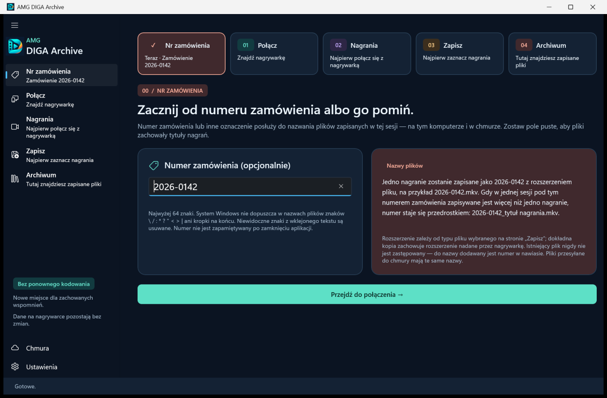
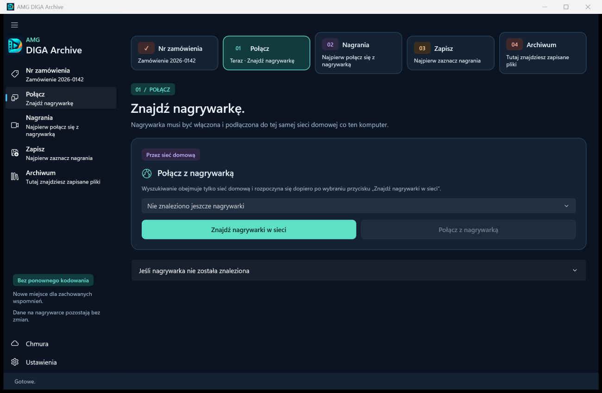
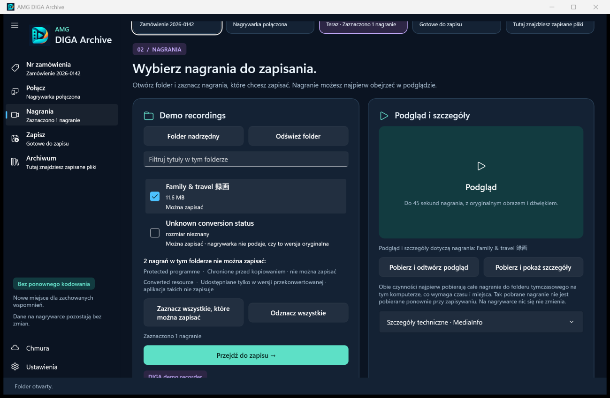
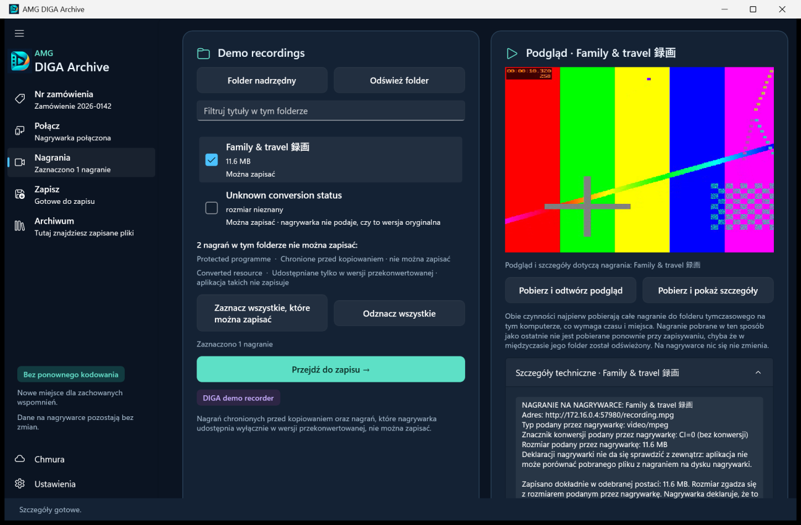
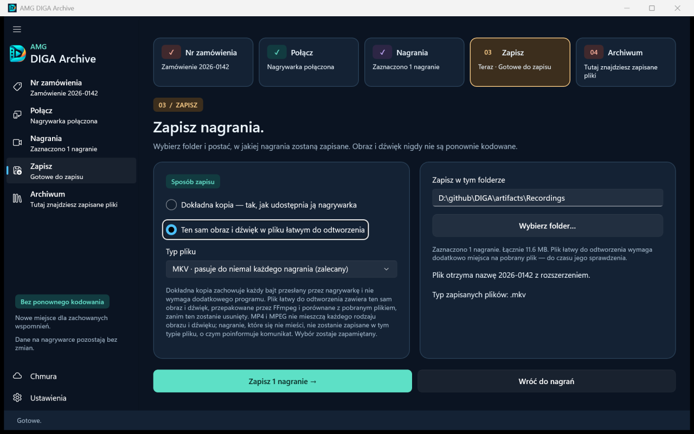
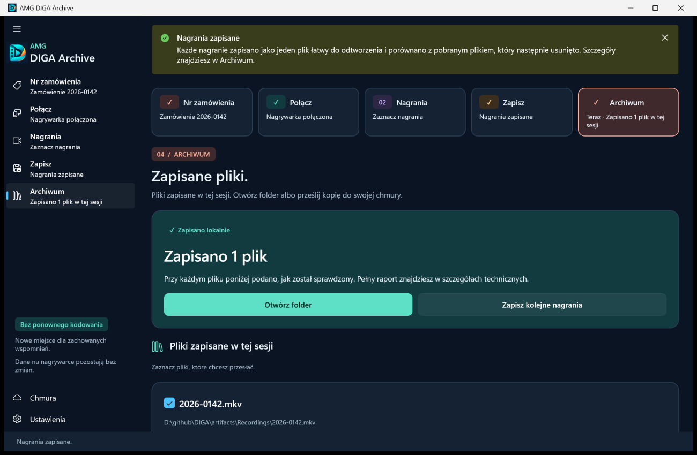
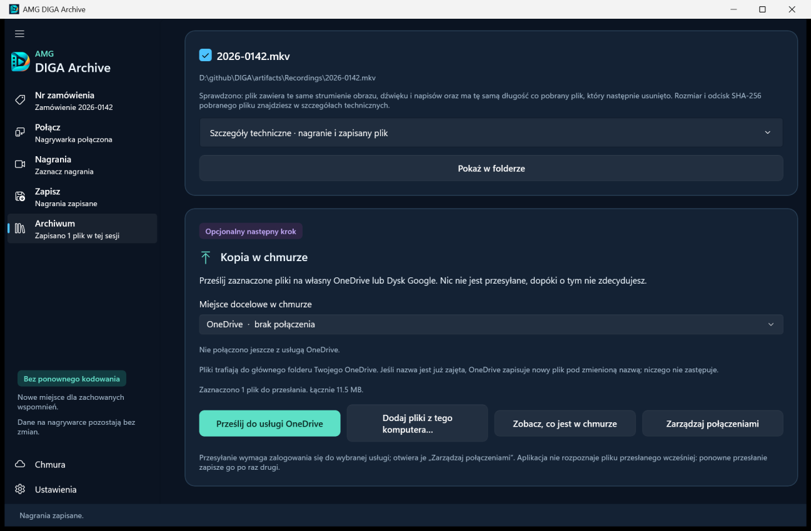
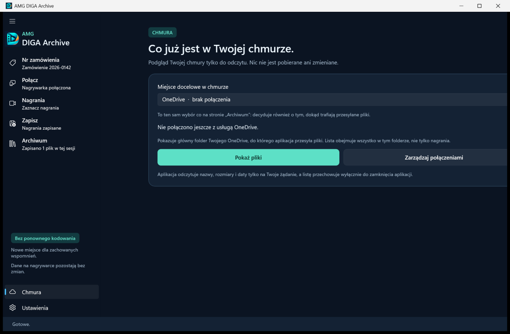
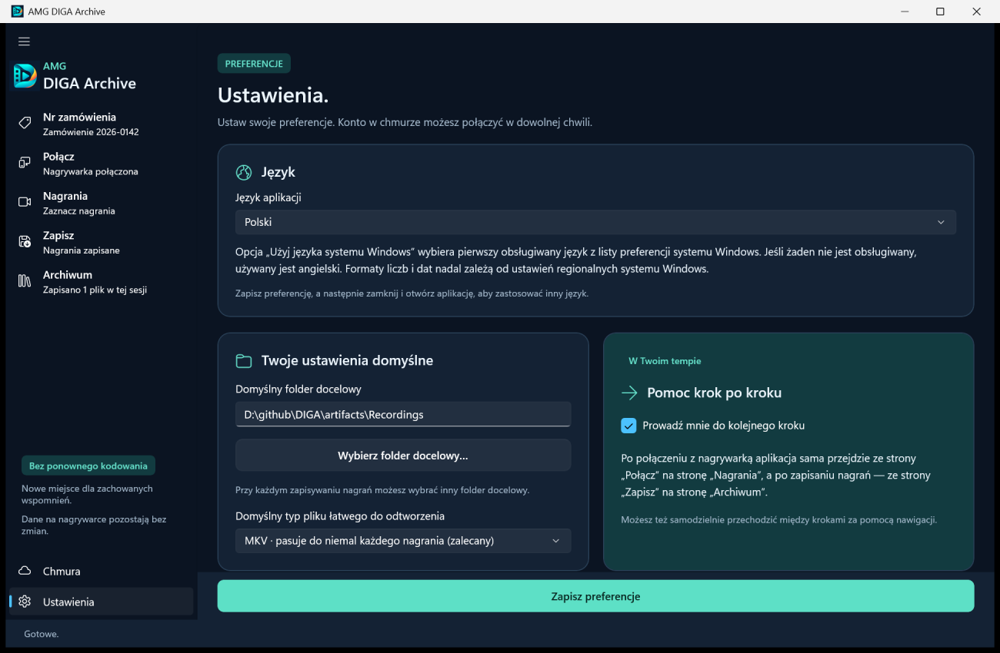
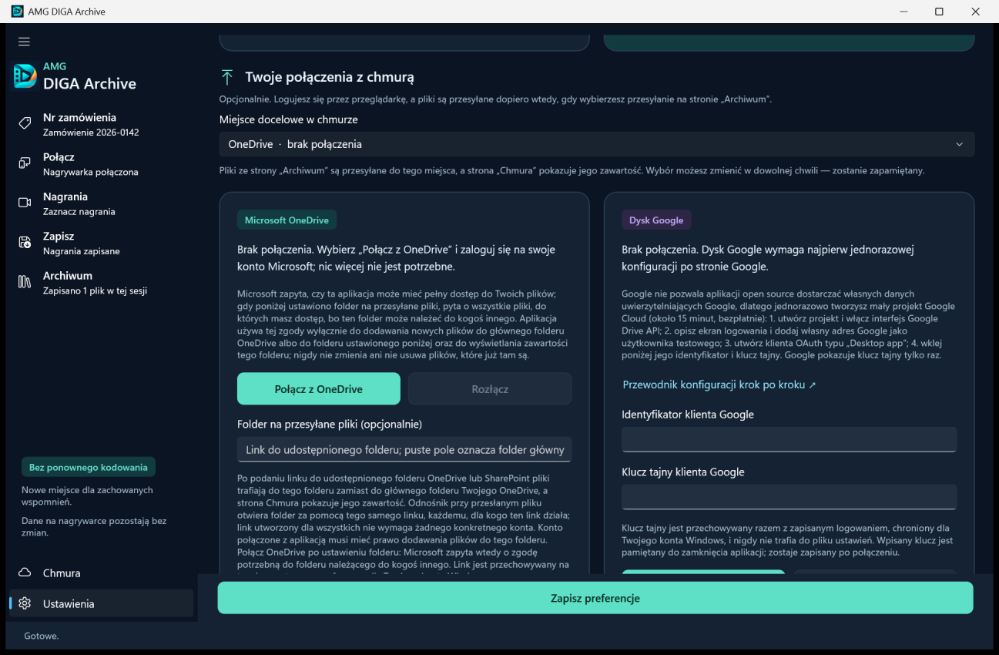

# AMG DIGA Archive: instrukcja użytkownika

*English version: [USER-GUIDE.md](USER-GUIDE.md)*

AMG DIGA Archive to aplikacja dla systemu Windows 11. Zapisuje na komputerze nagrania z nagrywarki Panasonic DIGA, korzystając z sieci domowej, i może przesłać zapisane pliki na Twój własny OneDrive lub Dysk Google. Nigdy niczego nie zapisuje na nagrywarce i nigdy nie zastępuje pliku, który już istnieje.

Instrukcja opisuje wersję 0.6.4 i prowadzi przez okno aplikacji w takiej kolejności, w jakiej je widzisz. Nazwy **pogrubione** pokazuje aplikacja albo jej instalator. Nazwy pokazywane przez sam system Windows są w „cudzysłowie”. Projekt jest niezależny od firmy Panasonic.

## Spis treści

1. [Czego potrzebujesz](#need)
2. [Instalacja](#install)
3. [Pierwsze uruchomienie i język](#first-start)
4. [Krok 0: Nr zamówienia](#order)
5. [Krok 1: Połącz](#connect)
6. [Krok 2: Nagrania](#discover)
7. [Krok 3: Zapisz](#preserve)
8. [Krok 4: Archiwum](#archive)
9. [Strona Chmura](#cloud)
10. [Ustawienia](#settings)
11. [Gdzie aplikacja przechowuje własne dane](#data)
12. [Rozwiązywanie problemów](#troubleshooting)
13. [Odinstalowanie i co po nim zostaje](#uninstall)

<a name="need"></a>
## Czego potrzebujesz

- Komputera z systemem Windows 11 w wersji 64-bitowej (x64). W starszych wersjach systemu Windows instalator odmawia instalacji.
- Nagrywarki Panasonic DIGA, włączonej i podłączonej do tej samej sieci domowej co komputer, z włączonym serwerem sieciowym (DLNA). Jak to zrobić, wyjaśnia dokument [Konfiguracja nagrywarki i rozwiązywanie problemów](RECORDER-SETUP.pl.md).
- Wolnego miejsca na dysku. Nagrania są duże. Strona **Zapisz** pokazuje łączny rozmiar zaznaczonych nagrań, zanim cokolwiek zostanie pobrane.
- Połączenia z internetem, i to tylko do trzech rzeczy: pobrania aplikacji, pobrania programu FFmpeg (opcjonalnie, zobacz [Opcja FFmpeg](#ffmpeg)) i przesyłania do chmury (opcjonalnie). Zapisywanie nagrań z nagrywarki korzysta wyłącznie z sieci domowej.
- Do chmury: konta Microsoft (dla OneDrive) albo konta Google (dla Dysku Google). Dysk Google wymaga najpierw jednorazowej konfiguracji po stronie Google; zobacz [Konfiguracja chmury](CLOUD-SETUP.pl.md).

Aplikacja nie zbiera danych telemetrycznych, nie szuka aktualizacji i nie ma własnego serwera.

<a name="tested"></a>
### Jak dalece aplikacja została sprawdzona

Przeczytaj to, zanim powierzysz aplikacji nagrania, których niczym nie da się zastąpić.

- Testy automatyczne projektu działają na symulowanych nagrywarkach, na symulowanych serwerach Microsoft i Google oraz na prawdziwych programach FFmpeg i MediaInfo.
- Z prawdziwego sprzętu pochodzi jedno zgłoszenie. Właściciel nagrywarki zgłoszonej jako DMR-BS850 potwierdził 2 października 2026 r., że wersja 0.5.2 znalazła nagrywarkę, otworzyła jej foldery i zapisała nagrania zarówno jako dokładne kopie (`.mpg`), jak i jako pliki MKV, oraz że połączenie z OneDrive przez wbudowaną rejestrację i przesyłanie plików zadziałały.
- Połączenie z OneDrive i przesyłanie, o których mówi to zgłoszenie, wykonano przez wcześniejszą wbudowaną rejestrację Microsoft. 5 października 2026 r. aplikacja otrzymała nową wbudowaną rejestrację (identyfikator aplikacji `bfd21bf0-32a9-4520-8bbb-d525e3d34aea`) i wersja 0.6.0 korzysta właśnie z niej. Nikt jeszcze nie zgłosił, że połączył się albo przesłał pliki przez nową rejestrację. Sprawdzono dla niej tylko to, że usługa logowania Microsoft zna ten identyfikator i przyjmuje przekierowanie na adres `http://localhost`, czyli adres, pod którym logowanie wraca do aplikacji. Sprawdzono to bez logowania się.
- Wersje od 0.6.0 do 0.6.4 przeszły całą drogę od początku do końca wyłącznie z emulatorem nagrywarki należącym do projektu, a nie z prawdziwą nagrywarką.
- Projekt nigdy nie uruchomił obsługi Dysku Google na prawdziwych serwerach Google. Konta OneDrive służbowe i szkolne nie były testowane; nie było też testowane przesyłanie do udostępnionego folderu OneDrive lub SharePoint.
- Wydania nie są jeszcze podpisane cyfrowo; zobacz [Ostrzeżenie systemu Windows](#smartscreen).

Poza tym jednym zgłoszeniem nie wiadomo, które modele nagrywarek działają ani które nagrania nagrywarka udostępnia do zapisania. Jeśli wypróbujesz aplikację, zgłoszenie dotyczące nagrywarki na [stronie zgłoszeń projektu](https://github.com/lukasz-gratkowski/diga-archive/issues/new/choose) pomoże kolejnym osobom, niezależnie od tego, czy wszystko zadziałało. Formularz zgłoszenia jest po angielsku.

<a name="install"></a>
## Instalacja

<a name="installer"></a>
### Instalator

1. Otwórz [najnowsze wydanie](https://github.com/lukasz-gratkowski/diga-archive/releases/latest) projektu i pobierz plik `DIGA-0.6.4-win-x64-setup.exe`.
2. Uruchom plik. System Windows najpewniej pokaże najpierw ostrzeżenie; zobacz [Ostrzeżenie systemu Windows](#smartscreen).
3. Wybierz język instalatora: angielski albo polski. To tylko język instalatora. Aplikacja wybiera swój język sama; zobacz [Pierwsze uruchomienie i język](#first-start).
4. Zaakceptuj licencję. Jest to Powszechna Licencja Publiczna GNU (GNU GPL) w wersji 3, wyświetlana po angielsku.
5. Pozostaw proponowany folder `%LOCALAPPDATA%\Programs\DIGA`, chyba że masz powód, by go zmienić. Instalator działa bez uprawnień administratora, więc nie zapisze niczego w folderze, który ich wymaga.
6. Wybierz dodatki:
   - Pole **Utwórz skrót na pulpicie** jest na początku niezaznaczone.
   - Pod napisem **Ten instalator nie zawiera FFmpeg:** opcja zaczynająca się od słów **Pobierz FFmpeg** jest na początku zaznaczona. Do czego służy, wyjaśnia część [Opcja FFmpeg](#ffmpeg).
7. Rozpocznij instalację. Jeśli opcja FFmpeg jest zaznaczona, instalator najpierw pokaże stronę, której tytuł zaczyna się od słów **Pobieranie FFmpeg**, a potem zainstaluje aplikację.
8. Na ostatniej stronie pozostaw zaznaczone pole **Otwórz AMG DIGA Archive**, aby od razu uruchomić aplikację. Później uruchamiasz ją z menu Start: wpisz tam `AMG DIGA Archive`.

Instalator instaluje aplikację tylko dla Twojego konta Windows i nie prosi o uprawnienia administratora. Inne konto Windows na tym samym komputerze wymaga osobnej instalacji.

<a name="smartscreen"></a>
### Ostrzeżenie systemu Windows

Wydania nie są jeszcze podpisane cyfrowo. Podpisywanie, za pomocą usługi Microsoft Azure Artifact Signing, jest przygotowane i zostanie włączone później. O tym, czy dane wydanie jest podpisane, informują uwagi do wydania.

Przy niepodpisanym instalatorze system Windows pokazuje ostrzeżenie filtru SmartScreen: okno z tytułem „System Windows ochronił ten komputer” i informacją „Nieznany wydawca”. Według [dokumentacji firmy Microsoft](https://learn.microsoft.com/en-us/windows/security/operating-system-security/virus-and-threat-protection/microsoft-defender-smartscreen/) (po angielsku) system Windows ostrzega przed pobranym programem, którego jeszcze dobrze nie zna, i bierze też pod uwagę podpis cyfrowy. Nowy, niepodpisany instalator jest takim programem. Aby przejść dalej, wybierz „Więcej informacji”, a potem „Uruchom mimo to”. Także przeglądarka może zapytać, czy na pewno chcesz zachować pobrany plik.

To ostrzeżenie nie mówi, czy plik jest prawdziwy, dlatego najpierw sprawdź go samodzielnie. Dokument [Verifying your download](VERIFYING-DOWNLOADS.md) (po angielsku) pokazuje w kilku wierszach, jak to zrobić: suma kontrolna SHA-256 potwierdza, że masz opublikowany plik, a poświadczenie kompilacji (build attestation) potwierdza, że plik zbudowano ze źródeł tego projektu.

<a name="ffmpeg"></a>
### Opcja FFmpeg

FFmpeg to osobny, bezpłatny program do obróbki wideo. Nie jest częścią aplikacji ani instalatora. Aplikacja używa go do dwóch rzeczy:

- do zapisania nagrania jako pliku łatwego do odtworzenia (MKV, MP4 lub MPEG);
- do przygotowania krótkiego podglądu na stronie **Nagrania**.

Dokładne kopie, szczegóły techniczne nagrania i przesyłanie do chmury działają bez FFmpeg.

Jeśli zostawisz opcję zaznaczoną, instalator pobierze jeden, ściśle określony pakiet FFmpeg z wydań jego dystrybutora, Gyana Doshiego, w serwisie GitHub, a jeśli to się nie uda, z gyan.dev. Dla wersji 0.6.4 jest to FFmpeg 9.0.2; pobierany plik ma około 110 MB. Instalator użyje pobranego pliku tylko wtedy, gdy jego suma kontrolna SHA-256 zgadza się z sumą zapisaną w instalatorze, i zainstaluje wyłącznie dwa programy, `ffmpeg.exe` i `ffprobe.exe`, wraz z tekstami licencji. FFmpeg jest objęty licencją GNU GPL w wersji 3.

- Jeśli pobieranie się nie uda, instalator poda przyczynę i zainstaluje aplikację bez FFmpeg.
- Jeśli anulujesz pobieranie, instalator zapyta, czy zainstalować aplikację bez FFmpeg.
- Jeśli ten sam FFmpeg jest już na komputerze, z wcześniejszej instalacji albo pobrany przez aplikację, nic nie jest pobierane.

FFmpeg możesz dodać w dowolnej chwili później. W aplikacji otwórz **Ustawienia**, potem sekcję **Narzędzia multimedialne · zaawansowane** i użyj przycisku, którego nazwa zaczyna się od słów **Pobierz FFmpeg**. Ten sam przycisk jest widoczny na stronach **Nagrania** i **Zapisz**, dopóki FFmpeg nie jest zainstalowany.

<a name="portable"></a>
### Wersja przenośna (ZIP)

Jeśli wolisz obejść się bez instalatora, pobierz plik `DIGA-0.6.4-win-x64-portable.zip`, rozpakuj go do wybranego folderu i uruchom `Diga.exe`. System Windows może pokazać to samo ostrzeżenie co przy instalatorze.

- Pakiet zawiera tę samą aplikację. Nie zawiera FFmpeg; pobierz go na stronie **Ustawienia**, w sekcji **Narzędzia multimedialne · zaawansowane**.
- „Przenośna” znaczy tylko tyle, że nic nie jest instalowane. Aplikacja nadal przechowuje ustawienia, zapisane logowania, pliki tymczasowe i dziennik błędów w Twoim profilu Windows; zobacz [Gdzie aplikacja przechowuje własne dane](#data).
- Nie ma dezinstalatora. Aby usunąć aplikację, usuń rozpakowany folder, a jeśli chcesz pozbyć się także jej danych, usuń folder `%LOCALAPPDATA%\Diga`.

<a name="update"></a>
### Instalowanie nowszej wersji

Aplikacja nigdy sama nie szuka aktualizacji. Aby sprawdzić, czy jest nowsza wersja, otwórz **Ustawienia**, potem sekcję **O aplikacji AMG DIGA Archive** i wybierz **Sprawdź na stronie wydań, czy jest nowsza wersja**. Zamknij aplikację, pobierz nowszy instalator i uruchom go. Zastąpi on zainstalowaną wersję. Instalator nie rusza Twoich ustawień ani zapisanych logowań do chmury.

Jeśli przechodzisz z wersji 0.5.2, a OneDrive był połączony bez własnego identyfikatora aplikacji, połącz go jeszcze raz:

- Od wersji 0.6.0 aplikacja ma nową wbudowaną rejestrację Microsoft. Rejestracja to wpis w Microsoft, który przedstawia aplikację przy logowaniu; nie jest hasłem. Logowanie jest związane z rejestracją, z którą je wykonano, dlatego logowanie zapisane przez wersję 0.5.2 nie jest używane.
- Po aktualizacji OneDrive jest pokazywany jako niepołączony. Otwórz **Ustawienia** i wybierz **Połącz z OneDrive**.
- Logowanie zapisane dla wcześniejszej rejestracji zostaje na komputerze, nieużywane. Zostanie usunięte przy najbliższym użyciu przycisku **Rozłącz** dla OneDrive albo przy odinstalowaniu. Zgoda udzielona wcześniejszej rejestracji pozostaje w Microsoft, dopóki nie usuniesz jej na stronie swojego konta; adres podaje rozdział [Odinstalowanie i co po nim zostaje](#uninstall).
- Połączenie z OneDrive wykonane z własnym identyfikatorem aplikacji oraz połączenie z Dyskiem Google są zapisane pod własnymi identyfikatorami. Ta zmiana ich nie dotyczy. Wersje starsze niż 0.5.2 nie miały wbudowanej rejestracji, więc połączenie z OneDrive wykonane w którejś z nich jest połączeniem tego rodzaju.

Po aktualizacji aplikacja może też pokazać komunikat **Dostępna aktualizacja FFmpeg**; zobacz [Brak FFmpeg albo inna wersja](#t-ffmpeg).

<a name="silent"></a>
### Instalacja cicha

Ta część jest dla osób, które instalują bez kreatora, na przykład skryptem. Instalator przygotowano w programie Inno Setup i przyjmuje on jego standardowe przełączniki.

```bat
DIGA-0.6.4-win-x64-setup.exe /VERYSILENT /SUPPRESSMSGBOXES /NORESTART /LANG=pl
```

| Przełącznik | Działanie |
|---|---|
| `/SILENT` albo `/VERYSILENT` | Bez kreatora. `/SILENT` pokazuje jeszcze okno postępu; `/VERYSILENT` nie pokazuje niczego. |
| `/SUPPRESSMSGBOXES` | Bez okien komunikatów. Jeśli nie uda się pobrać FFmpeg, instalacja jest kontynuowana bez niego. |
| `/NORESTART` | System Windows nie jest uruchamiany ponownie. |
| `/LANG=en` albo `/LANG=pl` | Język instalatora. |
| `/DIR="D:\Apps\DIGA"` | Inny folder aplikacji. Musi to być folder, w którym możesz zapisywać bez uprawnień administratora. |
| `/TASKS=` | Żaden z dodatków: bez FFmpeg i bez skrótu na pulpicie. |
| `/TASKS=ffmpeg` | FFmpeg, bez skrótu na pulpicie. |
| `/MERGETASKS="!ffmpeg"` | Wybory domyślne, ale bez FFmpeg. |
| `/MERGETASKS="desktopicon"` | Wybory domyślne oraz skrót na pulpicie. |
| `/LOG="C:\Temp\diga-install.log"` | Zapisuje dziennik instalacji. Jeśli pobieranie FFmpeg się nie powiodło, dziennik podaje przyczynę. |

Warto wiedzieć:

- Jeśli tego nie wyłączysz, instalacja cicha pobiera FFmpeg z internetu, tak jak domyślnie robi to kreator.
- Instalacja dotyczy konta, z którego uruchomiono polecenie. Nie ma instalacji dla wszystkich użytkowników.
- Po instalacji cichej aplikacja nie jest uruchamiana.
- Ciche odinstalowanie: `"%LOCALAPPDATA%\Programs\DIGA\unins000.exe" /VERYSILENT /SUPPRESSMSGBOXES /NORESTART`

Automatyczny test instalatora w projekcie uruchamia instalator z przełącznikami `/VERYSILENT`, `/SUPPRESSMSGBOXES`, `/NORESTART`, `/NOICONS`, `/TASKS`, `/DIR`, `/LOG` i `/LANG`, raz bez pobierania FFmpeg i raz z pobieraniem, a dezinstalator z trzema przełącznikami pokazanymi wyżej. Innych kombinacji projekt nie sprawdzał. Opis działania samych przełączników w tabeli pochodzi z dokumentacji programu Inno Setup. Wyjątkiem jest pusty przełącznik `/TASKS=`, którego ta dokumentacja nie opisuje: w takiej postaci używa go test projektu, aby zainstalować aplikację bez FFmpeg.

<a name="first-start"></a>
## Pierwsze uruchomienie i język

Aplikacja działa po angielsku albo po polsku. Przy pierwszym uruchomieniu wybiera pierwszy obsługiwany język z listy preferowanych języków systemu Windows. Jeśli nie ma na niej ani angielskiego, ani polskiego, używa angielskiego. Język wybrany w instalatorze nie ma tu znaczenia.

Aby zmienić język:

1. Otwórz **Ustawienia**. Pierwsza sekcja to **Język**.
2. Z listy **Język aplikacji** wybierz English, Polski albo pierwszą pozycję, na przykład **Użyj języka systemu Windows · Polski**. Ta pozycja podaje język, który wynika z ustawień systemu Windows.
3. Wybierz **Zapisz preferencje** na dole okna.
4. Zamknij aplikację i otwórz ją ponownie. Przypomina o tym komunikat **Język zapisany · otwórz aplikację ponownie**; do tego czasu okno zachowuje dotychczasowy język.

Liczby i daty są zapisywane zgodnie z ustawieniami regionalnymi systemu Windows, niezależnie od języka.

<a name="window"></a>
### Okno aplikacji

- Po lewej stronie jest nawigacja: pięć kroków, czyli **Nr zamówienia**, **Połącz**, **Nagrania**, **Zapisz** i **Archiwum**, a pod nimi **Chmura** i **Ustawienia**. Pod nazwą każdego kroku krótki wiersz mówi, na czym stoisz, na przykład **Opcjonalnie**, **Nagrywarka połączona** albo **Zaznaczono 3 nagrania**. W wąskim oknie nawigacja zwija się do samych ikon.
- Tych samych pięć kroków powtarza się jako rząd przycisków u góry strony każdego kroku, z numerami od 00 do 04. Krok już wykonany ma zamiast numeru znak ✓. Do dowolnego kroku przejdziesz, klikając go.
- Komunikaty o tym, co się właśnie stało, pojawiają się na pasku u góry strony.
- Wiersz na dole okna mówi, co aplikacja robi. W trakcie pracy pojawiają się tam pasek postępu i przycisk **Anuluj**, a na inną stronę przejdziesz dopiero wtedy, gdy praca się skończy albo ją anulujesz.
- Jeśli zamkniesz okno w trakcie pracy, aplikacja zapyta **Zatrzymać i zamknąć?** Wybierz **Kontynuuj pracę**, aby pozwolić jej dokończyć.

Dopóki na stronie **Ustawienia** zaznaczona jest opcja **Prowadź mnie do kolejnego kroku** (na początku jest), aplikacja sama przechodzi dalej w dwóch miejscach: ze strony **Połącz** na stronę **Nagrania**, gdy połączy się z nagrywarką, i ze strony **Zapisz** na stronę **Archiwum**, gdy nagrania zostaną zapisane.

<a name="order"></a>
## Krok 0: Nr zamówienia



Pierwsza strona prosi o numer zamówienia. Jest on opcjonalny. Numer zamówienia albo inne oznaczenie przydaje się, gdy pliki z jednego zlecenia mają nosić tę samą nazwę, na przykład gdy zapisujesz nagrania dla kogoś innego. Jeśli zostawisz pole puste, pliki zachowają tytuły nagrań.

1. Wpisz numer w polu **Numer zamówienia (opcjonalnie)** albo zostaw je puste.
2. Spójrz na kartę **Nazwy plików** obok. Podaje ona, jak pliki zostaną nazwane. Podczas pisania karta i reszta strony pozostają bez zmian; uwzględniają numer mniej więcej sekundę po tym, jak przestaniesz pisać. Numer dłuższy niż 16 znaków jest tam, w pasku kroków i w menu pokazywany skrótowo: początek i koniec z wielokropkiem pośrodku. Pliki dostają cały numer.
3. Wybierz **Przejdź do połączenia** albo naciśnij Enter.

Zasady dotyczące numeru:

- Najwyżej 64 znaki.
- System Windows nie dopuszcza w nazwach plików znaków `\ / : * ? " < > |` ani kropki na końcu. Nie można też użyć nazw, które system Windows zastrzega dla urządzeń, takich jak `CON`, `NUL` czy `COM1`. Dopóki numeru nie da się użyć, strona o tym informuje, a przycisk pozostaje nieaktywny.
- Niewidoczne znaki, które trafiają do pola razem z wklejonym tekstem, są usuwane.
- Numer nie jest pamiętany po zamknięciu aplikacji. W trakcie sesji możesz go zmienić; nowy numer dotyczy plików zapisywanych od tej chwili.

<a name="names"></a>
### Jak nazywane są pliki

| Numer zamówienia | Zapisujesz | Nazwa pliku |
|---|---|---|
| brak | dowolną liczbę nagrań | tytuł nagrania: `Tytuł.mkv` |
| `2026-0158` | jedno nagranie | sam numer: `2026-0158.mkv` |
| `2026-0158` | kilka nagrań | numer, podkreślenie, tytuł: `2026-0158_Tytuł.mkv` |

Szczegóły:

- „Kilka” oznacza różne nagrania zapisane pod jednym numerem zamówienia od uruchomienia aplikacji. Pierwsze nagranie zapisane pod danym numerem dostaje sam numer. Jeśli później zapiszesz pod tym samym numerem kolejne nagranie, nowy plik dostanie numer jako przedrostek; pierwszy plik zachowa nazwę, którą już ma.
- W tytule znaki niedozwolone w systemie Windows są zastępowane znakiem `_`, a spacje i kropki z początku i końca są usuwane. Znaki niewidoczne oraz znaki zmieniające kierunek tekstu są pomijane. Tytuł, z którego nic nie zostaje, zamienia się na `Nagranie` (`Recording`, gdy aplikacja działa po angielsku). Tytuł kończący się rozszerzeniem pliku wideo, na przykład `.ts` albo `.mpg`, traci to zakończenie. Gdy nie ma numeru zamówienia, tytuł będący jedną z nazw zastrzeżonych przez system Windows dla urządzeń, na przykład `CON` albo `NUL`, dostaje na początku `Nagranie_` (`Recording_`, gdy aplikacja działa po angielsku).
- Długie nazwy są skracane: tytuł do 100 znaków, a nazwa z numerem zamówienia do 120.
- Rozszerzenie zależy od sposobu zapisu. Dokładna kopia zachowuje rozszerzenie nadane przez nagrywarkę, na przykład `.ts`, `.m2ts` albo `.mpg`; jeśli nagrywarka nie poda typu wideo znanego aplikacji, plik dostaje rozszerzenie odpowiadające jego zawartości (`.ts`, `.m2ts`, `.mpg`, `.mp4` albo `.mkv`), a `.bin` tylko wtedy, gdy zawartości nie udało się rozpoznać. Plik łatwy do odtworzenia dostaje `.mkv`, `.mp4` albo `.mpg`.
- Istniejący plik nigdy nie jest zastępowany. Jeśli nazwa jest zajęta, dodawany jest numer w nawiasie: `2026-0158 (2).mkv`.
- Pliki przesyłane do chmury mają te same nazwy.

Strona **Zapisz** jeszcze raz, tuż przed zapisaniem, podaje, jak pliki zostaną nazwane.

<a name="connect"></a>
## Krok 1: Połącz



Nagrywarka musi być włączona i podłączona do tej samej sieci domowej co komputer.

1. Wybierz **Znajdź nagrywarki w sieci**. Wyszukiwanie trwa kilka sekund. Obejmuje tylko sieć domową i zaczyna się dopiero na Twoje polecenie.
2. Dalszy ciąg zależy od tego, co odpowie:
   - Na wyszukiwanie odpowiada w Twojej sieci tylko jedno urządzenie i przedstawia się jako DIGA: aplikacja od razu się z nim łączy i otwiera stronę **Nagrania**. Ten skrót działa, dopóki na stronie **Ustawienia** zaznaczona jest opcja **Prowadź mnie do kolejnego kroku**.
   - W pozostałych przypadkach pojawia się komunikat **Znaleziono nagrywarki**, a urządzenia trafiają na listę, każde z nazwą, modelem i adresem sieciowym. Na liście mogą być też inne urządzenia udostępniające wideo w Twojej sieci, na przykład dysk sieciowy. Jeśli któreś urządzenie przedstawia się jako DIGA, lista od razu je wskazuje. Wybierz swoją nagrywarkę, a potem **Połącz z nagrywarką**.
   - Nic nie odpowiada: pojawia się komunikat **Nie znaleziono nagrywarki** i otwiera się sekcja **Jeśli nagrywarka nie została znaleziona**. Zobacz [Nagrywarka nie została znaleziona](#t-recorder).
3. Gdy nagrywarka jest połączona, strona pokazuje wiersz zaczynający się od słowa **Połączono:** i przycisk **Przejdź do nagrań**.

Gdy na liście są już urządzenia, przycisk wyszukiwania nosi nazwę **Szukaj ponownie**. Użyj go na przykład po włączeniu nagrywarki.

Połączenie polega na odczytaniu listy folderów nagrywarki. Na nagrywarce nic się nie zmienia, ani teraz, ani później.

<a name="discover"></a>
## Krok 2: Nagrania



Ta strona pokazuje, co nagrywarka udostępnia. Dopóki żadna nagrywarka nie jest połączona, strona wyświetla napis **Nagrywarka nie jest jeszcze połączona** i prowadzi z powrotem przyciskiem **Połącz z nagrywarką**.

Lewa karta zawiera zawartość nagrywarki. Jej nagłówkiem jest nazwa otwartego folderu; na najwyższym poziomie brzmi on **Nagrania**.

- Nagrywarka przedstawia nagrania w folderach. To, jakie są foldery, zależy od nagrywarki. Folder otwierasz jego przyciskiem, którego nazwa zaczyna się od **Otwórz folder ·**. **Folder nadrzędny** prowadzi z powrotem, a **Odśwież folder** ponownie odczytuje otwarty folder z nagrywarki.
- Każde nagranie ma pole wyboru, tytuł, wiersz z datą i godziną nagrania, czasem trwania i rozmiarem, a pod nim stan.
- Zaznacz nagrania, które chcesz zapisać. Zaznaczenia zostają, gdy otwierasz inny folder, więc możesz zebrać nagrania z kilku folderów. Wiersz pod listą je zlicza, na przykład **Zaznaczono 3 nagrania · 1 nagranie w innym folderze lub poza filtrem**.
- **Zaznacz wszystkie, które można zapisać** zaznacza każde widoczne nagranie, którego nie zapisano od uruchomienia aplikacji. **Odznacz wszystkie** usuwa wszystkie zaznaczenia, we wszystkich folderach.
- **Przejdź do zapisu** prowadzi do następnego kroku z zaznaczonymi nagraniami.

Ponowne połączenie z nagrywarką, tą samą albo inną, usuwa wszystkie zaznaczenia.

<a name="status"></a>
### Co oznacza stan pod tytułem

| Stan | Znaczenie |
|---|---|
| **Można zapisać** | Nagrywarka udostępnia nagranie i deklaruje, że wysyła je w zapisanej postaci, bez konwersji. |
| **Można zapisać · nagrywarka nie podaje, czy to wersja oryginalna** | Nagrywarka udostępnia nagranie, ale nie mówi nic o konwersji. Mimo to można je zapisać. Aplikacja nie powie o nim więcej niż sama nagrywarka. |
| **Zapisane w tej sesji · zaznacz tylko po to, aby zapisać ponownie** | To nagranie zapisano już od uruchomienia aplikacji. Nie jest już zaznaczone, a przycisk **Zaznacz wszystkie, które można zapisać** je pomija. |

Deklaracji nagrywarki nie da się sprawdzić z zewnątrz. Aplikacja nie może porównać tego, co odbiera, z nagraniem na dysku nagrywarki.

<a name="cannot-save"></a>
### Nagrania, których nie można zapisać

Niektóre nagrania nie mają pola wyboru. Są wymienione pod listą, po wierszu takim jak **2 nagrań w tym folderze nie można zapisać:**, każde z przyczyną:

| Podana przyczyna | Dlaczego |
|---|---|
| **Chronione przed kopiowaniem · nie można zapisać** | Nagrywarka oznacza nagranie jako chronione przed kopiowaniem. Aplikacja nie kopiuje chronionych nagrań i nie próbuje obejść zabezpieczenia. |
| **Udostępniane tylko w wersji przekonwertowanej · aplikacja takich nie zapisuje** | Nagrywarka przekonwertowałaby nagranie podczas wysyłania. To już nie jest nagranie w zapisanej postaci, więc aplikacja go nie zapisuje. |
| **Nagrywarka nie udostępnia tego nagrania do pobrania** | Nagrywarka pokazuje tytuł, ale nie podaje adresu, spod którego można pobrać nagranie przez sieć. |

O tym, które nagrania nagrywarka chroni albo konwertuje, decyduje nagrywarka. Aplikacja pokazuje tylko to, co nagrywarka deklaruje. Może się też zdarzyć, że nagranie okaże się chronione dopiero w chwili rozpoczęcia pobierania. Zostanie wtedy zgłoszone jako niezapisane, z podaniem przyczyny. Więcej o tym, co nagrywarka udostępnia, mówi dokument [Konfiguracja nagrywarki i rozwiązywanie problemów](RECORDER-SETUP.pl.md).

<a name="filter"></a>
### Filtr

Wpisz fragment tytułu w polu **Filtruj tytuły w tym folderze**, aby skrócić listę. Filtr dotyczy tylko otwartego folderu, nie rozróżnia wielkich i małych liter i obejmuje zarówno foldery, jak i nagrania. Zaznaczone nagrania pozostają zaznaczone, gdy filtr je ukrywa. Wyczyść pole, aby znów zobaczyć cały folder; otwarcie innego folderu też je czyści.

<a name="preview"></a>
### Podgląd i szczegóły



Prawa karta, **Podgląd i szczegóły**, pozwala przyjrzeć się jednemu nagraniu przed zapisaniem. Dotyczy nagrania zaznaczonego jako ostatnie. Wskazuje je wiersz pod podglądem, zaczynający się od słów **Podgląd i szczegóły dotyczą nagrania:**.

- **Pobierz i odtwórz podgląd** odtwarza do 45 sekund z początku nagrania, z oryginalnym obrazem i dźwiękiem. Wymaga FFmpeg.
- **Pobierz i pokaż szczegóły** pokazuje szczegóły techniczne: to, co nagrywarka deklaruje o nagraniu, rozmiar i odcisk SHA-256 odebranych danych oraz raport o obrazie i dźwięku (format, rozdzielczość, czas trwania, kanały dźwięku i tak dalej). Działa bez FFmpeg.

Obie czynności najpierw pobierają całe nagranie do folderu plików tymczasowych na tym komputerze. Aplikacja zawsze pobiera nagranie w całości, także dla 45-sekundowego podglądu. Trzeba więc poczekać i zadbać o miejsce: nagranie o rozmiarze 8 GB wymaga 8 GB wolnego miejsca na dysku, na którym jest folder plików tymczasowych, oraz 1 GB rezerwy, dopóki ten folder jest na dysku systemowym, czyli tam, gdzie jest domyślnie (zobacz [Folder i wolne miejsce](#folder)). Wiersz na dole okna pokazuje postęp, a przycisk **Anuluj** przerywa pobieranie.

Pobrane dane się nie marnują. Jeśli potem zapiszesz to nagranie, aplikacja użyje kopii, którą już ma, i nie pobierze go ponownie. Są dwa ograniczenia:

- W ten sposób przechowywane jest tylko nagranie pobrane jako ostatnie. Pobranie kolejnego usuwa poprzednie.
- Jeśli odświeżysz folder tego nagrania albo otworzysz go ponownie, przy zapisywaniu nagranie zostanie pobrane od nowa.

Pliki tymczasowe są usuwane przy zamknięciu aplikacji. Wcześniej możesz je usunąć na stronie **Ustawienia**, w sekcji **Pliki tymczasowe**.

O samym podglądzie:

- Nagranie zaznaczone po to, aby je obejrzeć, jest tym samym zaznaczone do zapisania. Odznacz je, jeśli nie chcesz go zapisywać.
- Podgląd pokazuje tylko pierwszą ścieżkę obrazu i pierwszą ścieżkę dźwięku. Zapis zachowuje wszystkie.
- Podgląd odtwarza system Windows. To, czy da się go odtworzyć, zależy od formatów obrazu i dźwięku, które Twój system Windows potrafi odtwarzać. Zapisanie nagrania od nich nie zależy. Zobacz [Podgląd się nie odtwarza](#t-preview).

<a name="preserve"></a>
## Krok 3: Zapisz



Tutaj wybierasz, jak i gdzie zostaną zapisane zaznaczone nagrania, i rozpoczynasz zapisywanie. Obraz i dźwięk nigdy nie są ponownie kodowane, niezależnie od wybranego sposobu. Jeśli nic nie jest zaznaczone, strona wyświetla **Najpierw zaznacz co najmniej jedno nagranie.** i proponuje przycisk **Wybierz nagrania**.

<a name="ways"></a>
### Dwa sposoby zapisu

Pod napisem **Sposób zapisu** są dwie możliwości.

**Dokładna kopia — tak, jak udostępnia ją nagrywarka**

- Plik zawiera każdy bajt wysłany przez nagrywarkę. Nic nie jest przepakowywane.
- Nie jest potrzebny żaden dodatkowy program.
- Plik ma typ nadany przez nagrywarkę, na przykład `.ts`, `.m2ts` albo `.mpg`.
- Od tego sposobu aplikacja zaczyna.

**Ten sam obraz i dźwięk w pliku łatwym do odtworzenia**

- Najpierw pobierane jest nagranie. Potem FFmpeg umieszcza ten sam obraz, dźwięk i napisy, bez zmian, w pliku typu wybranego na liście **Typ pliku**.
- Aplikacja porównuje nowy plik z pobranym. Nowy plik musi zawierać te same strumienie obrazu, dźwięku i napisów i mieć tę samą długość, z dokładnością do dwóch sekund. Dopiero wtedy pobrany plik jest usuwany, tak aby z każdego nagrania został jeden plik.
- Jeśli długości się różnią albo nie da się ich porównać, zostają oba pliki. Jeśli pliku łatwego do odtworzenia w ogóle nie uda się utworzyć, pobrany plik zostaje jako dokładna kopia. Pobrany plik jest usuwany tylko wtedy, gdy nowy plik przeszedł sprawdzenie.
- Dodatkowe dane, które nadawca dołącza do emisji obok obrazu, dźwięku i napisów, nie są kopiowane do pliku łatwego do odtworzenia. Dokładna kopia zachowuje wszystko.
- Ten sposób wymaga FFmpeg. Bez niego strona pokazuje komunikat **FFmpeg nie jest zainstalowany** z przyciskiem pobierania.

Ostatnio użyty sposób jest pamiętany na następny raz.

<a name="file-types"></a>
### Typy plików

Lista **Typ pliku** jest dostępna przy drugim sposobie zapisu.

| Typ pliku | Jaki obraz mieści | Jaki dźwięk mieści |
|---|---|---|
| **MKV · pasuje do niemal każdego nagrania (zalecany)** | MPEG-2, H.264, HEVC (H.265) i kilka innych | MP2, MP3, AAC, AC-3, E-AC-3, DTS i kilka innych |
| **MPEG (.mpg) · dla nagrań MPEG-2** | tylko MPEG-2 | MP2, MP3, AC-3, DTS |
| **MP4 · nie dla każdego nagrania** | H.264, HEVC (H.265), MPEG-4, AV1 | AAC, AC-3, E-AC-3, MP3 |

MP4 i MPEG nie mieszczą każdego rodzaju obrazu i dźwięku:

- MP4 nie mieści obrazu MPEG-2 ani dźwięku MP2.
- MPEG nie mieści obrazu H.264 ani HEVC, ani dźwięku AAC.
- Napisy w postaci, w jakiej są nadawane: plik MKV mieści napisy DVB i aplikacja zachowuje je, gdy zapisuje plik MKV. Sprawdzono to programem FFmpeg na wygenerowanym nagraniu, nie na prawdziwej audycji. MP4 i MPEG ich nie mieszczą. Teletekst nie mieści się w żadnym z trzech typów, dlatego nagranie, w którym aplikacja znajdzie teletekst, zostaje zachowane jako dokładna kopia.

Nie musisz z góry wiedzieć, co zawiera nagranie. Aplikacja zagląda do nagrania po jego pobraniu. Jeśli nagranie nie mieści się w wybranym typie, plik tego typu nie powstaje, pobrany plik zostaje jako dokładna kopia, a komunikat wskazuje część, która się nie mieści, na przykład:

> **W pliku typu MP4 nie można zapisać tej części nagrania: obraz (MPEG2VIDEO). Wybierz MKV, który pasuje do niemal każdego nagrania, albo zapisz dokładną kopię.**

Aby mimo to otrzymać plik łatwy do odtworzenia, zaznacz nagranie ponownie na stronie **Nagrania** i zapisz je z innym typem pliku. Zostanie pobrane jeszcze raz.

Aby dowiedzieć się tego wcześniej, użyj przycisku **Pobierz i pokaż szczegóły** na stronie **Nagrania**. Raport podaje format obrazu i format dźwięku.

Typ, od którego lista zaczyna, ustawiasz na stronie **Ustawienia**, na liście **Domyślny typ pliku łatwego do odtworzenia**.

<a name="folder"></a>
### Folder i wolne miejsce

- Pole **Zapisz w tym folderze** zawiera folder docelowy. Na początku jest to folder domyślny, czyli `DIGA Exports` w folderze „Wideo”, dopóki nie zmienisz go na stronie **Ustawienia**. Wpisz pełną ścieżkę, na przykład `D:\Nagrania`, albo użyj przycisku **Wybierz folder…**. Jeśli folder nie istnieje, zostanie utworzony. Folder wybrany tutaj obowiązuje do zamknięcia aplikacji.
- Wiersz poniżej sumuje zaznaczone nagrania. Zaczyna się na przykład tak: **Zaznaczono 3 nagrania. Łącznie 12,4 GB.** Rozmiary pochodzą z deklaracji nagrywarki. Jeśli nagrywarka nie poda rozmiaru któregoś nagrania, wiersz o tym informuje i prosi o zapewnienie miejsca.
- Zanim cokolwiek zostanie pobrane, aplikacja sprawdza wolne miejsce na dysku. Potrzebuje łącznego rozmiaru zaznaczonych nagrań. Dla plików łatwych do odtworzenia potrzebuje dodatkowo miejsca na największe nagranie po raz drugi, bo pobrany plik leży obok nowego, dopóki nowy nie zostanie sprawdzony. Jeśli miejsca jest za mało, nic nie jest pobierane, a komunikat podaje, ile potrzeba.
- Zawsze pozostaje wolna rezerwa: 1 GB na dysku, z którego działa system Windows, bo zapełniony dysk systemowy uniemożliwia pracę innym programom, oraz 64 MB na każdym innym dysku. Ilość podana w komunikacie obejmuje tę rezerwę.
- Każde nagranie jest sprawdzane jeszcze raz w chwili rozpoczęcia pobierania, według rozmiaru, który nagrywarka wtedy podaje. Nagranie, którego rozmiaru nagrywarka w ogóle nie podaje, jest pilnowane w trakcie pobierania: pobieranie zostaje zatrzymane, gdy wolnego miejsca zostałoby mniej niż rezerwa, a niekompletny plik nie zostaje na dysku.
- Folder podany jako adres sieciowy (`\\serwer\udział`) jest sprawdzany tak jak dysk, o ile system Windows podaje, ile jest w nim miejsca. Gdy tego nie podaje, sprawdzenie jest pomijane, a o zapełnieniu folderu poinformuje dopiero sam zapis.
- Kolejne wiersze podają, jak pliki zostaną nazwane i jaki będą miały typ; ten drugi zaczyna się od słów **Typ zapisanych plików:**. Gdy zapisujesz dokładne kopie, a nagrywarka nie podaje typu nagrania, w tym wierszu widać **znany po pobraniu**: plik dostaje rozszerzenie odpowiadające jego zawartości.

<a name="progress"></a>
### W trakcie zapisywania

Wybierz przycisk na dole strony. Nosi on na przykład nazwę **Zapisz 3 nagrania**. Przycisk **Wróć do nagrań** prowadzi z powrotem na stronę **Nagrania** bez zapisywania.

Nagrania są zapisywane jedno po drugim. Wiersz na dole okna pokazuje:

- które nagranie jest pobierane i ile już pobrano, na przykład **Nagranie 2 z 3: Wiadomości wieczorne · 1,2 GB z 4,4 GB**;
- po kilku sekundach także szybkość i przybliżony czas, jaki pozostał dla tego nagrania;
- dla pliku łatwego do odtworzenia drugi etap, zaczynający się od słów **Zapisywanie pliku:**, w którym FFmpeg zapisuje nowy plik.

Program FFmpeg nie działa bez końca. Jeśli podczas zapisywania pliku łatwego do odtworzenia przez pięć minut nie zrobi żadnego postępu, zostaje zatrzymany, pobrany plik zostaje zachowany jako dokładna kopia, a komunikat zaczyna się od słów **Program FFmpeg przez 5 minut nie zrobił żadnego postępu i został zatrzymany.** FFmpeg kończy też pracę, gdy aplikacja zostanie zamknięta albo ulegnie awarii.

Na czas zapisywania aplikacja prosi system Windows, aby sam nie przechodził w stan uśpienia. Pobierania nie da się wznowić: przerwane nagranie trzeba pobrać od początku.

Gdy wszystko zostanie zapisane, pojawia się komunikat **Nagrania zapisane**, a jeśli prowadzenie jest włączone, aplikacja otwiera stronę **Archiwum**. Zapisane nagrania nie są już zaznaczone.

<a name="failures"></a>
### Gdy nagranie się nie zapisze albo gdy zatrzymasz zapisywanie

Jedno nieudane nagranie nie zatrzymuje pozostałych. Aplikacja przechodzi do następnego, a na końcu informuje, co się stało:

- Komunikat ma tytuł na przykład **Zapisano nagrania: 2 z 3** i wymienia nagrania, których nie zapisano w wybrany sposób, każde z przyczyną. Wymienia najwyżej cztery, a potem podaje, ile było pozostałych.
- Nagranie, z którego nic nie zapisano, pozostaje zaznaczone. Po usunięciu przyczyny wybierz ponownie przycisk zapisywania. Pobierane są tylko zaznaczone nagrania.
- Nagranie, które dotarło, ale nie dało się z niego utworzyć pliku łatwego do odtworzenia, zostaje zachowane jako dokładna kopia. Komunikat dodaje wtedy **Zamiast tego zachowano dokładną kopię; ten plik jest w Archiwum.** W tytule komunikatu takie nagranie jest liczone jako zapisane. Nie jest już zaznaczone: na stronie **Nagrania** ma stan **Zapisane w tej sesji · zaznacz tylko po to, aby zapisać ponownie**. Zaznacz je ponownie, jeśli chcesz je zapisać w innym typie pliku.
- Jeśli dwa nagrania z rzędu nie powiodą się i nic z nich nie dotrze, aplikacja nie próbuje zapisać pozostałych. Najpewniej zniknęła wtedy nagrywarka albo sieć. Komunikat podaje, ilu nagrań nie próbowano zapisać.

W każdej chwili możesz zatrzymać pracę przyciskiem **Anuluj** na dole okna:

- Nagranie, które było właśnie pobierane, nie zostaje zapisane, a jego niekompletny plik jest usuwany.
- Nagrania już zapisane pozostają zapisane i są widoczne na stronie **Archiwum**. Pozostałe są nadal zaznaczone. Jeśli zapisano choć jedno, komunikat **Zatrzymano** podaje, ile.
- Jeśli zatrzymasz pracę w trakcie zapisywania pliku łatwego do odtworzenia, pobrany plik, który jest kompletny, zostaje zachowany jako dokładna kopia. Jest widoczny na stronie **Archiwum**, a nagranie nie jest już zaznaczone.

Jeśli aplikacja zostanie zakończona siłą, przez awarię albo brak zasilania, w folderze docelowym mogą zostać pliki robocze. Ich nazwy zaczynają się od kropki. Przy następnym zapisywaniu do tego folderu aplikacja usunie pliki niekompletne i poinformuje o tym. Kompletne pobrane nagrania pozostawione pod nazwą roboczą (zaczynającą się od `.diga-`) nie są usuwane: każde z nich to całe nagranie w postaci dostarczonej przez nagrywarkę. Zmień nazwę takiego pliku, aby go zachować, albo go usuń.

<a name="archive"></a>
## Krok 4: Archiwum



Strona **Archiwum** pokazuje pliki zapisane od uruchomienia aplikacji. To lista z bieżącej sesji, a nie historia. Po zamknięciu aplikacji lista jest czyszczona. Same pliki zostają tam, gdzie je zapisano.

U góry karta oznaczona **✓  Zapisano lokalnie** podaje, ile plików zapisano. Przycisk **Otwórz folder** otwiera folder ostatniego pliku z listy, a **Zapisz kolejne nagrania** prowadzi z powrotem na stronę **Nagrania**.

Pod nagłówkiem **Pliki zapisane w tej sesji** każdy plik ma kartę, a na niej:

- pole wyboru z nazwą pliku, do wskazania plików, które chcesz przesłać;
- pełną ścieżkę pliku;
- jeden lub dwa wiersze mówiące, jak plik został sprawdzony;
- po przesłaniu wiersz mówiący, dokąd i o której godzinie plik przesłano;
- sekcję **Szczegóły techniczne · nagranie i zapisany plik**, którą można rozwinąć;
- przycisk **Pokaż w folderze**, który otwiera folder z plikiem.

<a name="checks"></a>
### Co oznacza informacja o sprawdzeniu pod każdym plikiem

Przy dokładnej kopii widać na przykład:

> **Zapisano dokładnie w postaci dostarczonej przez nagrywarkę: 4,4 GB. Rozmiar zgadza się z rozmiarem podanym przez nagrywarkę. Odcisk SHA-256 znajdziesz w szczegółach technicznych.**

- Każdy odebrany bajt został zapisany w pliku bez zmian.
- Liczba bajtów zgadza się z rozmiarem zapowiedzianym przez nagrywarkę, więc nie brakuje końcówki. Jeśli nagrywarka nie podała rozmiaru, wiersz mówi **Nagrywarka nie podała rozmiaru, z którym można by go porównać.**
- Odcisk SHA-256 to 64-znakowa wartość obliczona z zawartości pliku w chwili jego odebrania. Jeśli obliczysz ją później ponownie i otrzymasz tę samą wartość, plik od tamtej pory się nie zmienił. W programie PowerShell: `Get-FileHash "D:\Nagrania\Tytuł.ts" -Algorithm SHA256`. Przy porównywaniu wielkość liter nie ma znaczenia.

Przy pliku łatwym do odtworzenia widać:

> **Sprawdzono: plik zawiera te same strumienie obrazu, dźwięku i napisów oraz ma tę samą długość co pobrany plik, który następnie usunięto. Rozmiar i odcisk SHA-256 pobranego pliku znajdziesz w szczegółach technicznych.**

- Nowy plik zawiera tyle samo strumieni obrazu, dźwięku i napisów, tych samych rodzajów, co pobrany plik.
- Jego długość jest równa długości pobranego pliku, z dokładnością do dwóch sekund.
- Odcisk w szczegółach dotyczy pobranego pliku, którego już nie ma. Nie jest to odcisk zapisanego pliku.

Gdy pobrany plik został zachowany, również jest na liście, a jego karta podaje przyczynę:

- **Długość pliku różni się od długości tego pobranego pliku albo nie udało się ich porównać, dlatego zachowano oba pliki.** Na liście są oba pliki.
- **Pliku łatwego do odtworzenia nie udało się ukończyć, dlatego zachowano ten pobrany plik.** W tym przypadku pliku łatwego do odtworzenia nie ma; na liście jest tylko pobrany plik.
- **Plik sprawdzono, ale tego pobranego pliku nie udało się usunąć. Możesz go usunąć samodzielnie.** Na liście są oba pliki.

Gdy na liście są oba pliki, na karcie pliku łatwego do odtworzenia widać **Sprawdzono: plik zawiera te same strumienie obrazu, dźwięku i napisów co pobrany plik. Pobrany plik zachowano jako osobny plik.**

Przy pliku dodanym samodzielnie w celu przesłania widać **Dodano z tego komputera w celu przesłania. Aplikacja nie sprawdzała tego pliku.**

Czego te sprawdzenia nie oznaczają:

- Nie porównują pliku z nagraniem na dysku nagrywarki. Aplikacja widzi tylko to, co nagrywarka wysyła.
- Nie porównują obrazu klatka po klatce i nie odtwarzają pliku. Aby mieć pewność, że plik odtwarza się tak, jak oczekujesz, otwórz go w odtwarzaczu multimedialnym, zanim usuniesz cokolwiek z nagrywarki.

<a name="details"></a>
### Szczegóły techniczne

Sekcja **Szczegóły techniczne · nagranie i zapisany plik** zawiera dwa pola.

- Pierwsze ma w nagłówku tytuł nagrania, na przykład **Nagranie · Wiadomości wieczorne**. Zawiera to, co zadeklarowała nagrywarka (typ, informację, czy uznaje nagranie za przekonwertowane, rozmiar), adres, spod którego nagranie pobrano, oraz raport o pobranym pliku. Przy pliku łatwym do odtworzenia tutaj są rozmiar i odcisk SHA-256 pobranego pliku.
- Drugie ma w nagłówku nazwę pliku, na przykład **Zapisany plik · Wiadomości wieczorne.ts**. Zawiera raport o zapisanym pliku: format, czas trwania, rozmiar i przepływność, a dla każdej ścieżki obrazu i dźwięku format, rozdzielczość, liczbę klatek na sekundę, kanały i język. Przy dokładnej kopii tutaj jest odcisk SHA-256.

Raporty tworzy biblioteka MediaInfoLib, która jest częścią aplikacji. Tekst można zaznaczyć i skopiować.

<a name="upload"></a>
### Przesyłanie do chmury



Przesyłanie jest opcjonalne i nic nie jest przesyłane, dopóki o to nie poprosisz. Karta **Kopia w chmurze** znajduje się na dole strony **Archiwum**.

1. Na liście **Miejsce docelowe w chmurze** wybierz usługę: OneDrive albo Dysk Google. Lista pokazuje też, czy dana usługa jest połączona.
2. Na kartach powyżej zaznacz pliki do przesłania. Pliki dopiero co zapisane są już zaznaczone. Plik wideo zapisany wcześniej możesz dodać przyciskiem **Dodaj pliki z tego komputera…**.
3. Wybierz przycisk przesyłania. Nosi on nazwę **Prześlij do usługi OneDrive** albo **Prześlij do usługi Dysk Google**.

Jeśli usługa nie jest jeszcze połączona, aplikacja przeniesie Cię na stronę **Ustawienia** i wyróżni właściwy przycisk łączenia. Zaloguj się, użyj przycisku **Wróć do Archiwum** i ponownie wybierz przycisk przesyłania. Łączenie opisuje dokument [Konfiguracja chmury](CLOUD-SETUP.pl.md). W skrócie: OneDrive wymaga tylko zalogowania się na konto Microsoft; Dysk Google wymaga najpierw jednorazowej konfiguracji po stronie Google.

Czego się spodziewać:

- Pliki trafiają do głównego folderu Twojego OneDrive albo na najwyższy poziom Mojego dysku na Dysku Google. Jeśli na stronie **Ustawienia** ustawisz udostępniony folder dla OneDrive, trafiają do tego folderu. Nic nie jest tam zastępowane. Jeśli nazwa jest zajęta, OneDrive zapisuje nowy plik pod zmienioną nazwą, a Dysk Google przechowuje drugi plik pod tą samą nazwą.
- Przed rozpoczęciem aplikacja pyta usługę o wolne miejsce i przerywa, jeśli zaznaczone pliki się nie zmieszczą.
- Wiersz na dole okna pokazuje przesyłany plik, ilość wysłanych danych, szybkość i pozostały czas. Jeśli połączenie zostanie przerwane, przesyłanie czeka i samo ponawia próby, do 15 minut bez żadnej odpowiedzi, a potem kontynuuje od miejsca, w którym stanęło. W tym czasie wiersz o tym informuje.
- Przycisk **Anuluj** zatrzymuje przesyłanie. Pliki już przesłane zostają w chmurze. Plik przesyłany w chwili zatrzymania trzeba będzie przesłać od początku.
- Przesłany plik przestaje być zaznaczony i dostaje wiersz taki jak **Przesłano do usługi OneDrive o 14:05**, z odnośnikiem zaczynającym się od słów **Otwórz w usłudze**. Przy ustawionym udostępnionym folderze odnośnik brzmi **Otwórz udostępniony folder** i otwiera ten folder za pomocą ustawionego przez Ciebie linku udostępniania. O tym, kto może go otworzyć, zdecydowano przy udostępnianiu folderu; rodzaje linków wyjaśnia dokument [Konfiguracja chmury](CLOUD-SETUP.pl.md#shared-folder). Pliki, których nie udało się przesłać, pozostają zaznaczone, a komunikat podaje przyczynę dla każdego.
- Aplikacja nie rozpoznaje pliku, który już jest w chmurze. Ponowne przesłanie zapisze go tam drugi raz. W obrębie jednej sesji aplikacja najpierw zapyta **Przesłać ponownie?**

O tym, jak dalece sprawdzono łączenie i przesyłanie, mówi część [Jak dalece aplikacja została sprawdzona](#tested).

<a name="cloud"></a>
## Strona Chmura



Strona **Chmura**, w nawigacji pod pięcioma krokami, pokazuje, co już jest w Twojej chmurze. Tylko pokazuje: nic nie jest pobierane ani zmieniane. Możesz ją otworzyć w każdej chwili, nie tylko po przesłaniu plików.

1. Na liście **Miejsce docelowe w chmurze** wybierz usługę. To ten sam wybór co na stronie **Archiwum**, więc zmiana tutaj zmienia też miejsce, do którego trafiają przesyłane pliki.
2. Wybierz **Pokaż pliki**. Potem przycisk nosi nazwę **Odśwież listę**. Jeśli usługa nie jest jeszcze połączona, aplikacja najpierw przeniesie Cię na stronę **Ustawienia**, aby ją połączyć.

To, co pokazuje lista, zależy od usługi:

- OneDrive: wszystko w głównym folderze Twojego OneDrive, czyli tam, dokąd aplikacja przesyła pliki. Nie tylko nagrania. Przy ustawionym udostępnionym folderze strona pokazuje ten folder.
- Dysk Google: tylko pliki przesłane przez tę aplikację za pomocą Twojego klienta Google. Google nie pozwala jej zobaczyć niczego innego na Twoim Dysku.

Każda pozycja ma nazwę, rozmiar i datę zmiany; lista jest ułożona od najnowszych. Odnośnik **Otwórz w przeglądarce** otwiera pozycję na stronie internetowej usługi. Bardzo długa lista jest odczytywana tylko w części (mniej więcej pierwszy tysiąc pozycji) i strona o tym informuje. Aplikacja odczytuje nazwy, rozmiary i daty tylko na Twoje żądanie, a listę przechowuje wyłącznie do zamknięcia aplikacji.

Przycisk **Zarządzaj połączeniami** otwiera część strony **Ustawienia** dotyczącą chmury.

<a name="settings"></a>
## Ustawienia



Strona **Ustawienia** jest na dole nawigacji. Zmiany na tej stronie zaczynają obowiązywać po wybraniu przycisku **Zapisz preferencje** na dole okna. Dopóki są niezapisane zmiany, przypomina o nich uwaga u góry strony. Niektóre rzeczy zapisują się bez tego przycisku: wybór na liście **Miejsce docelowe w chmurze** jest zapisywany od razu, a połączenie lub rozłączenie konta w chmurze, podobnie jak przycisk **Zapisz i sprawdź narzędzia multimedialne**, zapisuje także resztę strony.

<a name="settings-language"></a>
### Język

Lista **Język aplikacji** ustawia język okna: English, Polski albo język wynikający z ustawień systemu Windows. Zmiana zaczyna obowiązywać po zapisaniu i ponownym otwarciu aplikacji. Zobacz [Pierwsze uruchomienie i język](#first-start).

<a name="settings-defaults"></a>
### Twoje ustawienia domyślne

- **Domyślny folder docelowy** to folder, od którego zaczyna strona **Zapisz**. Użyj przycisku **Wybierz folder docelowy…** albo wpisz pełną ścieżkę. Przy każdym zapisywaniu nadal możesz wybrać inny folder.
- **Domyślny typ pliku łatwego do odtworzenia** to typ, od którego zaczyna lista **Typ pliku** na stronie **Zapisz**. Zobacz [Typy plików](#file-types).

<a name="settings-guidance"></a>
### Pomoc krok po kroku

Opcja **Prowadź mnie do kolejnego kroku** sprawia, że aplikacja sama przechodzi dalej: ze strony **Połącz** na stronę **Nagrania** po połączeniu z nagrywarką i ze strony **Zapisz** na stronę **Archiwum** po zapisaniu nagrań. Odznacz ją, jeśli wolisz samodzielnie przechodzić między krokami.

<a name="settings-cloud"></a>
### Twoje połączenia z chmurą



- Lista **Miejsce docelowe w chmurze** decyduje, dokąd przesyła pliki strona **Archiwum** i co pokazuje strona **Chmura**.
- Karta Microsoft OneDrive ma przyciski **Połącz z OneDrive** i **Rozłącz**. Nic więcej nie jest potrzebne: rejestracja w Microsoft jest wbudowana w aplikację. Sekcja **Własna rejestracja aplikacji w Microsoft** jest dla nielicznych, którzy potrzebują własnej; pokazuje też wbudowany identyfikator aplikacji.
- Pole **Folder na przesyłane pliki (opcjonalnie)** na tej samej karcie przyjmuje link do udostępnionego folderu OneDrive lub SharePoint. Pliki trafiają wtedy do tego folderu zamiast do głównego folderu Twojego OneDrive. Przycisk **Zapisz i sprawdź folder** zapisuje link i pyta OneDrive, do jakiego folderu on prowadzi. Zostaw pole puste, aby pozostać przy folderze głównym. Dokument [Konfiguracja chmury](CLOUD-SETUP.pl.md#shared-folder) wyjaśnia, jak udostępnić folder i które konta mogą z niego korzystać, oraz informuje, że ta część była dotąd uruchamiana tylko z symulowanymi serwerami Microsoft.
- Karta Dysku Google ma pola **Identyfikator klienta Google** i **Klucz tajny klienta Google** oraz przyciski **Połącz z Dyskiem Google** i **Rozłącz**. Dysk Google wymaga przed pierwszym logowaniem jednorazowej konfiguracji po stronie Google, ponieważ warunki Google nie pozwalają aplikacji open source dostarczać własnych danych uwierzytelniających Google. Sekcja **Co może Dysk Google i limit siedmiu dni** wyjaśnia, co aplikacja może robić na Twoim Dysku.
- Przycisk **Zobacz, co jest w chmurze** otwiera stronę **Chmura**.

Logujesz się przez przeglądarkę. Dokument [Konfiguracja chmury](CLOUD-SETUP.pl.md) prowadzi przez łączenie każdej z usług, mówi, co aplikacja może, a czego nie może robić w Twojej chmurze, i wyjaśnia najczęstsze komunikaty o błędach.

Jeśli OneDrive był połączony w wersji 0.5.2 bez własnego identyfikatora aplikacji, zobacz [Instalowanie nowszej wersji](#update): wbudowana rejestracja jest nowa i trzeba połączyć się jeszcze raz.

<a name="settings-temporary"></a>
### Pliki tymczasowe

Ta sekcja jest zwinięta, dopóki jej nie klikniesz.

- **Folder plików tymczasowych** to miejsce, w którym przechowywane są nagrania pobrane na potrzeby podglądu lub szczegółów oraz krótkie fragmenty podglądu. Zapisywanie nagrań nie korzysta z tego folderu. Na początku jest to `%LOCALAPPDATA%\Diga\Cache`, zwykle na dysku systemowym. Jeśli na tym dysku brakuje miejsca, wskaż inny folder przyciskiem **Wybierz folder plików tymczasowych…**. Zmieniony folder zacznie być używany po ponownym uruchomieniu aplikacji.
- **Usuń pliki tymczasowe tej sesji** usuwa je od razu. I tak są usuwane przy zamknięciu aplikacji. Zapisane nagrania pozostają nietknięte.

<a name="settings-tools"></a>
### Narzędzia multimedialne · zaawansowane

Ta sekcja otwiera się sama, gdy FFmpeg nie jest zainstalowany albo nie jest w wersji, dla której przygotowano aplikację.

- Pierwsze wiersze mówią, że FFmpeg nie jest zainstalowany, albo podają, który FFmpeg jest używany i gdzie się znajduje. W tym drugim przypadku wiersz zaczyna się od słów **Używany FFmpeg:**.
- Przycisk o nazwie zaczynającej się od słów **Pobierz FFmpeg** pobiera pakiet FFmpeg, dla którego przygotowano tę wersję aplikacji, sprawdza go z sumą SHA-256 zapisaną w aplikacji i umieszcza `ffmpeg.exe` oraz `ffprobe.exe` w folderze `%LOCALAPPDATA%\Diga\tools`. Gdy ten FFmpeg jest już na miejscu, przycisk proponuje pobranie go ponownie.
- Pola **Własny plik wykonywalny FFmpeg (opcjonalnie)**, **Własny plik wykonywalny FFprobe (opcjonalnie)** i **Własna biblioteka MediaInfo x64 (opcjonalnie)** są dla osób, które chcą, aby aplikacja używała ich własnych kopii. W pozostałych przypadkach zostaw je puste. Szary tekst w pustym polu mówi, co aplikacja znalazła sama; zaczyna się od słów **Znaleziono automatycznie:** albo brzmi **Nie zainstalowano**.
- Przycisk **Zapisz i sprawdź narzędzia multimedialne** zapisuje stronę, uruchamia raz FFmpeg i FFprobe, aby sprawdzić, czy działają, i ładuje bibliotekę MediaInfo. Potwierdza to komunikat **Narzędzia multimedialne są gotowe**.

Biblioteka MediaInfoLib, która tworzy szczegóły techniczne, jest częścią aplikacji i nie wymaga pobierania.

<a name="settings-about"></a>
### O aplikacji AMG DIGA Archive

Ta sekcja jest zwinięta, dopóki jej nie klikniesz. Zawiera:

- wersję aplikacji;
- odnośniki **AMG DIGA Archive · projekt i wydania** oraz **MediaInfo · biblioteka i licencja**;
- odnośnik **Sprawdź na stronie wydań, czy jest nowsza wersja**. Aplikacja nigdy sama nie szuka aktualizacji; do sprawdzenia służy ten odnośnik;
- wersje składników dostarczanych z aplikacją: .NET, Windows App SDK i MediaInfoLib. Aktualizuje je tylko nowa wersja aplikacji;
- informację, gdzie jest dziennik błędów, oraz przyciski **Otwórz folder dziennika** i **Usuń dziennik błędów**. Zobacz [Dziennik błędów](#log);
- licencję: GPL-3.0-or-later.

<a name="data"></a>
## Gdzie aplikacja przechowuje własne dane

Wszystko, co aplikacja przechowuje na własny użytek, znajduje się w jednym folderze Twojego profilu Windows: `%LOCALAPPDATA%\Diga`. Zwykle jest to `C:\Users\Twoja nazwa\AppData\Local\Diga`. Aby go otworzyć, wklej `%LOCALAPPDATA%\Diga` w pasku adresu Eksploratora plików.

| W tym folderze | Co zawiera |
|---|---|
| `settings.json` | Twoje ustawienia: język, foldery, typ pliku, prowadzenie, miejsce docelowe w chmurze, ostatnio użyty sposób zapisu, identyfikator klienta Google i własny identyfikator aplikacji Microsoft (jeśli je wpisano) oraz lokalizacje własnych narzędzi multimedialnych. Nie ma w nim hasła, logowania ani klucza tajnego klienta. |
| `Accounts` | Zapisane logowania do chmury, razem z logowaniem Google także klucz tajny klienta Google, oraz link do udostępnionego folderu na przesyłane pliki, jeśli go ustawiono. System Windows szyfruje je dla Twojego konta Windows. Inne konto ani inny komputer ich nie odczyta. |
| `Cache` | Pliki tymczasowe, o ile na stronie **Ustawienia** nie wskazano innego folderu. Folder jest opróżniany przy zamknięciu aplikacji. |
| `tools` | FFmpeg, jeśli pobrano go z poziomu aplikacji. |
| `logs` | Dziennik błędów. |

Poza tym folderem:

- Sama aplikacja jest w folderze `%LOCALAPPDATA%\Programs\DIGA`, w folderze wybranym podczas instalacji albo tam, gdzie rozpakowano wersję przenośną. FFmpeg pobrany przez instalator znajduje się tam w podfolderze `tools`.
- Zapisane nagrania są w folderze wybranym na stronie **Zapisz**. Aplikacja nie prowadzi ich spisu.
- Numer zamówienia oraz listy na stronach **Archiwum** i **Chmura** istnieją tylko do zamknięcia aplikacji.

Aplikacja nie przechowuje w chmurze niczego poza plikami, które przesyłasz. Nie wysyła żadnych informacji o Tobie ani o Twoich nagraniach, ani do projektu, ani do nikogo innego.

Aby usunąć dane, zamknij aplikację i usuń folder `%LOCALAPPDATA%\Diga` albo tylko wybrane części:

- Usunięcie pliku `settings.json` przywraca wszystkim ustawieniom wartości początkowe.
- Usunięcie folderu `Accounts` usuwa z tego komputera zapisane logowania oraz link do udostępnionego folderu na przesyłane pliki; pliki trafiają wtedy znów do głównego folderu Twojego OneDrive, dopóki nie ustawisz linku ponownie. Nie cofa zgody udzielonej w Microsoft ani w Google; gdzie to zrobić, podaje rozdział [Odinstalowanie i co po nim zostaje](#uninstall). Klucz tajny klienta Google znika razem z logowaniem Google.
- Dziennik błędów można też usunąć przyciskiem **Usuń dziennik błędów** na stronie **Ustawienia**.

Większość tych danych usuwa samo odinstalowanie; zobacz [Odinstalowanie i co po nim zostaje](#uninstall).

<a name="troubleshooting"></a>
## Rozwiązywanie problemów

<a name="t-recorder"></a>
### Nagrywarka nie została znaleziona

Po wyszukiwaniu, które niczego nie znalazło, strona **Połącz** otwiera sekcję **Jeśli nagrywarka nie została znaleziona**. Wymienia ona cztery rzeczy do sprawdzenia:

- **Włącz nagrywarkę. W trybie czuwania nagrywarka nie odpowiada.**
- **W ustawieniach sieciowych nagrywarki włącz serwer sieciowy (DLNA), a potem wyjdź z menu ustawień.**
- **Podłącz nagrywarkę i ten komputer do tego samego routera. Sieć Wi-Fi dla gości albo VPN na komputerze rozdzielają je.**
- **Zatrzymaj inne urządzenia odtwarzające z nagrywarki i poczekaj, aż nagrywarka skończy nagrywanie lub kopiowanie.**

Następnie ponownie wybierz **Znajdź nagrywarki w sieci**.

Jeśli wyszukiwanie nadal niczego nie znajduje, choć nagrywarka jest włączona, sieć domowa może nie przekazywać zapytań między Wi-Fi a kablem. Na ten przypadek w tej samej sekcji jest pole **Adres nagrywarki (opcjonalnie)**. Wpisz adres nagrywarki w swojej sieci w postaci czterech liczb, na przykład `192.168.1.40` (nagrywarka pokazuje go w swoich ustawieniach sieci), i wybierz **Odpytaj ten adres**. Przyjmowany jest tylko adres z sieci domowej. Jeśli nagrywarka odpowie, trafia na listę i zostaje na niej wskazana; wybierz **Połącz z nagrywarką**. Jeśli nie odpowie żadna, pojawia się komunikat **Pod tym adresem nikt nie odpowiedział**. Pytanie po adresie wypróbowano wyłącznie na urządzeniach symulowanych, nie na prawdziwej nagrywarce.

Jeśli sam komputer nie ma połączenia z siecią, wyszukiwanie mówi o tym wprost, komunikatem zaczynającym się od słów **Ten komputer nie jest połączony z żadną siecią, więc nie można znaleźć nagrywarki.**

Dokument [Konfiguracja nagrywarki i rozwiązywanie problemów](RECORDER-SETUP.pl.md) idzie dalej: mówi, gdzie w nagrywarce jest właściwe ustawienie, co sprawdzić w sieci i co zrobić, gdy nagrywarka została znaleziona, ale folder się nie otwiera albo nagrywarka odmawia wysłania nagrania. Ten sam dokument otwiera odnośnik **Konfiguracja nagrywarki i rozwiązywanie problemów** w tej sekcji strony.

Jeśli w folderze widać napis **Folder jest pusty lub nagrywarka nie zwróciła żadnych dostępnych pozycji.**, wybierz **Odśwież folder**, a jeśli nic się nie zmieni, zajrzyj do tego samego dokumentu.

<a name="t-preview"></a>
### Podgląd się nie odtwarza

| Co widzisz | Co to znaczy | Co zrobić |
|---|---|---|
| Komunikat zaczynający się od słów **Podgląd wymaga programu FFmpeg, który nie jest zainstalowany.** | Brakuje FFmpeg. | Użyj przycisku na stronie, którego nazwa zaczyna się od słów **Pobierz FFmpeg**, a potem ponownie poproś o podgląd. |
| Komunikat o zbyt małej ilości wolnego miejsca | Najpierw pobierane jest całe nagranie, a na dysku z folderem plików tymczasowych nie ma na nie miejsca. | Zobacz [Za mało miejsca](#t-space). |
| **Wymagane działanie** z tekstem zaczynającym się od słów **Podgląd tego nagrania jest niedostępny.** | FFmpeg nie zdołał wyciąć fragmentu z tego nagrania. | Nagranie być może nadal da się zapisać jako dokładną kopię. Szczegóły są w [dzienniku błędów](#log). |
| **System Windows nie może odtworzyć tego nagrania** | Fragment został przygotowany, ale system Windows nie potrafi odtworzyć jego formatu obrazu lub dźwięku. | Zobacz niżej. |
| **Podgląd niedostępny** | System Windows nie zdołał uruchomić odtwarzania. Może w nim brakować składników odtwarzania multimediów albo kodeków. | Zobacz niżej. |

Podgląd odtwarza sam system Windows, więc zależy on od formatów, które Twój system potrafi odtwarzać. Zapisywanie od nich nie zależy: nagranie, którego podglądu nie da się odtworzyć, nadal można zapisać, a zapisany plik otworzyć w wybranym odtwarzaczu multimedialnym.

Dwie wskazówki ze stron pomocy firmy Microsoft. Projekt nie sprawdzał, czy którakolwiek z nich sprawi, że dany podgląd się odtworzy.

- [Strona o błędach Odtwarzacza multimedialnego Windows](https://support.microsoft.com/pl-pl/windows/codecs-in-media-player-d5c2cdcd-83a2-4805-abb0-c6888138e456) wymienia dodatkowe pakiety koderów-dekoderów dostępne w Sklepie Microsoft, między innymi „Rozszerzenie wideo MPEG-2” (formaty wideo MPEG-1 i MPEG-2) oraz „Rozszerzenie wideo HEVC” (format HEVC, czyli H.265).
- Strona [Media Feature Pack dla systemu Windows 10 N](https://support.microsoft.com/pl-pl/windows/experience/platform-variants/media-feature-pack-for-windows-n) podaje, że wydania N systemu Windows potrzebują tego pakietu od firmy Microsoft do odtwarzania plików multimedialnych, a w systemie Windows 11 N dodaje się go w ustawieniach systemu, w części „Aplikacje”, a w niej „Funkcje opcjonalne”.

<a name="t-ffmpeg"></a>
### Brak FFmpeg albo inna wersja

| Co widzisz | Co to znaczy | Co zrobić |
|---|---|---|
| **FFmpeg nie jest zainstalowany** na stronie **Nagrania** albo **Zapisz** | Aplikacja nie znalazła FFmpeg. Pliki łatwe do odtworzenia i podgląd są niedostępne. Dokładne kopie są dostępne. | Użyj przycisku w tym komunikacie albo takiego samego przycisku na stronie **Ustawienia**, w sekcji **Narzędzia multimedialne · zaawansowane**. |
| **Dostępna aktualizacja FFmpeg** | FFmpeg umieszczony na tym komputerze przez instalator albo przez aplikację nie jest wersją, dla której przygotowano tę wersję aplikacji. Może się tak zdarzyć po aktualizacji aplikacji. Aplikacja nadal korzysta z FFmpeg, który ma. | Użyj przycisku, aby pobrać właściwą wersję. |
| Komunikat zaczynający się od słów **Nie udało się pobrać FFmpeg.** | Nie udało się połączyć z serwerem pobierania, serwer przestał wysyłać dane albo wysłał plik niezgodny z zapisaną sumą kontrolną. Taki plik jest odrzucany. | Sprawdź połączenie z internetem i spróbuj ponownie później. Jeśli Twoja sieć blokuje pobieranie, zobacz niżej. |
| Na stronie **Ustawienia** wiersz zaczynający się od słów **Używany FFmpeg:**, ze wzmianką o zmiennej PATH | Aplikacja używa FFmpeg znalezionego w folderach ze zmiennej PATH systemu Windows. Nie sprawdza jego wersji. | Nic, jeśli działa. W przeciwnym razie pobierz przyciskiem kopię przeznaczoną dla aplikacji. |

Aplikacja szuka FFmpeg w tej kolejności:

1. pliki wskazane na stronie **Ustawienia** w polach **Własny plik wykonywalny FFmpeg (opcjonalnie)** i **Własny plik wykonywalny FFprobe (opcjonalnie)**;
2. kopia pobrana przez aplikację (`%LOCALAPPDATA%\Diga\tools`) albo przez instalator (podfolder `tools` w folderze aplikacji), z pierwszeństwem dla tej, która jest we właściwej wersji;
3. pliki `ffmpeg.exe` i `ffprobe.exe` leżące razem w jednym z folderów ze zmiennej PATH systemu Windows.

Jeśli Twoja sieć nie pozwala na pobieranie, zdobądź FFmpeg inną drogą, wpisz pełne ścieżki plików `ffmpeg.exe` i `ffprobe.exe` w obu polach i wybierz **Zapisz i sprawdź narzędzia multimedialne**. Aplikacja nie sprawdza wersji Twojej własnej kopii.

<a name="t-space"></a>
### Za mało miejsca

| Co widzisz | Gdzie brakuje miejsca | Co zrobić |
|---|---|---|
| Przy zapisywaniu: **Za mało wolnego miejsca w folderze D:\Nagrania. Ten etap wymaga co najmniej 12,4 GB.** | Na dysku z folderem, w którym zapisujesz. | Zwolnij miejsce, wybierz folder na innym dysku albo zaznacz mniej nagrań. Przy plikach łatwych do odtworzenia największe nagranie przez pewien czas zajmuje miejsce dwukrotnie. |
| Ten sam komunikat ze wskazaniem folderu plików tymczasowych, gdy prosisz o podgląd albo o szczegóły | Na dysku z folderem plików tymczasowych, zwykle na dysku systemowym. | Zwolnij tam miejsce albo wskaż inny folder w polu **Folder plików tymczasowych** na stronie **Ustawienia** i uruchom aplikację ponownie. |
| Przyczyna zaczynająca się od słów **Za mało wolnego miejsca w folderze**, która podaje, ile potrzebuje nagranie, ile musi pozostać wolne i ile jest wolne | Na dysku z folderem, do którego nagranie jest pobierane: z folderem, w którym zapisujesz, albo z folderem plików tymczasowych przy podglądzie i szczegółach. | Jak wyżej. Ilość, która musi pozostać wolna, to rezerwa: 1 GB na dysku systemowym, 64 MB na pozostałych. |
| Przyczyna zaczynająca się od słów **Nagrywarka nie podaje rozmiaru tego nagrania** | Ten sam dysk; pobieranie zostało zatrzymane, zanim rezerwa została naruszona. | Zwolnij miejsce albo wybierz folder na innym dysku i zapisz ponownie. Niekompletny plik nie zostaje na dysku. |
| Komunikat zaczynający się od słów **Na dysku zabrakło miejsca.** | Dysk zapełnił się w trakcie zapisywania pliku, na przykład gdy FFmpeg zapisywał plik łatwy do odtworzenia. | Zwolnij miejsce albo wybierz folder na innym dysku i zapisz ponownie. Niekompletny plik jest usuwany. |
| Przy przesyłaniu: komunikat z nazwą usługi chmurowej i ilością wolnego tam miejsca | W Twojej chmurze. | Zwolnij tam miejsce albo odznacz część plików i prześlij ponownie. |

<a name="t-save"></a>
### Nagranie nie zostało zapisane

Komunikat u góry strony wymienia nagrania, których nie zapisano w wybrany sposób (najwyżej cztery, potem liczbę pozostałych), i podaje przyczynę dla każdego. Nagranie, z którego nic nie zapisano, pozostaje zaznaczone, więc po usunięciu przyczyny wystarczy ponownie wybrać przycisk zapisywania. Nagranie zachowane jako dokładna kopia nie jest już zaznaczone: na stronie **Nagrania** ma stan **Zapisane w tej sesji · zaznacz tylko po to, aby zapisać ponownie** i trzeba je zaznaczyć ponownie, aby zapisać je w innym typie pliku. Najczęstsze przyczyny:

| Podana przyczyna | Co zrobić |
|---|---|
| **Nagrywarka przestała wysyłać dane. Niekompletna kopia została usunięta. Spróbuj ponownie, gdy nagrywarka będzie dostępna.** | Nagrywarka przeszła w tryb czuwania albo zajęła się czymś innym, albo zerwało się połączenie sieciowe. Sprawdź nagrywarkę i zapisz ponownie. |
| **Połączenie z nagrywarką zostało przerwane, zanim dotarło całe nagranie. Niekompletna kopia została usunięta. Sprawdź, czy nagrywarka jest włączona i połączona z siecią, a potem zapisz nagranie ponownie.** | Tak, jak mówi komunikat. W ten sposób kończy się pobieranie, gdy nagrywarka zostanie wyłączona albo zerwie się połączenie Wi-Fi. |
| Nagrywarka nie odpowiedziała na czas albo nie udało się z nią połączyć | Jak wyżej. Przycisk **Odśwież folder** na stronie **Nagrania** pokaże, czy nagrywarka nadal odpowiada. |
| Rozmiar nie zgadza się z rozmiarem podanym przez nagrywarkę albo nagrywarka zwróciła coś, co nie jest nagraniem | Wybierz **Odśwież folder** na stronie **Nagrania**, a potem zapisz ponownie. |
| Odpowiedź nagrywarki wskazuje na zawartość chronioną | Nagranie jest chronione przed kopiowaniem. Nie da się go zapisać. |
| W pliku wybranego typu nie można zapisać części nagrania | Pobrany plik zachowano jako dokładną kopię. Jeśli wybranym typem był MP4 albo MPEG, zaznacz nagranie ponownie na stronie **Nagrania** i zapisz je jako **MKV · pasuje do niemal każdego nagrania (zalecany)**. Jeśli był nim już MKV, w tej wersji pozostaje dokładna kopia. Zobacz [Typy plików](#file-types). |
| Komunikat zaczynający się od słów **Program FFmpeg przez 5 minut nie zrobił żadnego postępu i został zatrzymany.** | Pobrany plik zachowano jako dokładną kopię. Zapisz nagranie ponownie; jeśli z tym samym nagraniem powtórzy się to samo, pozostań przy dokładnej kopii. |
| Komunikat zaczynający się od słów **Program FFmpeg nie zdołał zapisać tego pliku.** | Pobrany plik zachowano jako dokładną kopię. Jeśli wybranym typem był MP4 albo MPEG, zaznacz nagranie ponownie na stronie **Nagrania** i spróbuj typu pliku MKV. Szczegóły są w [dzienniku błędów](#log). |
| System Windows odmówił dostępu do folderu albo folderu lub dysku nie ma | Wybierz inny folder na stronie **Zapisz** albo ponownie podłącz dysk. |
| Kolejnych nagrań nie próbowano zapisać, ponieważ dwa z rzędu się nie powiodły | Zniknęła nagrywarka albo sieć. Usuń przyczynę i zapisz ponownie; nagrania są nadal zaznaczone. |

Jeśli podana przyczyna nie pomaga, zajrzyj do [dziennika błędów](#log) i do dokumentu [Konfiguracja nagrywarki i rozwiązywanie problemów](RECORDER-SETUP.pl.md).

<a name="t-cloud"></a>
### Nie udaje się logowanie do chmury albo przesyłanie

Dokument [Konfiguracja chmury](CLOUD-SETUP.pl.md) wyjaśnia najczęstsze komunikaty o błędach każdej z usług. Tutaj trzy rzeczy, o których warto wiedzieć:

- Gdy zapisane logowanie nie jest już przyjmowane, lista **Miejsce docelowe w chmurze** pokazuje przy usłudze **logowanie wygasło**, a aplikacja przenosi Cię na stronę **Ustawienia**. Wybierz tam ponownie przycisk łączenia z tą usługą. W przypadku Dysku Google najczęstszą przyczyną jest zasada Google: dopóki Twój projekt Google ma stan „Testing”, Google kończy logowanie siedem dni po połączeniu. Dokument [Konfiguracja chmury](CLOUD-SETUP.pl.md) wyjaśnia tę zasadę i mówi, czego trzeba, aby znieść limit.
- Jeśli po aktualizacji z wersji 0.5.2 OneDrive jest pokazywany jako niepołączony, jest to oczekiwane; zobacz [Instalowanie nowszej wersji](#update).
- Pliki, których nie przesłano, pozostają zaznaczone na stronie **Archiwum**.

<a name="t-settings"></a>
### Nie udało się użyć pliku ustawień

Jeśli przy uruchomieniu pojawi się komunikat **Nie udało się użyć pliku ustawień**, plik `settings.json` jest uszkodzony albo zapisała go nowsza wersja aplikacji. Aplikacja odkłada go w tym samym folderze pod nazwą zaczynającą się od `settings.invalid-` i działa z ustawieniami domyślnymi. Zapisane logowania do chmury pozostają nienaruszone. Ustaw swoje preferencje ponownie na stronie **Ustawienia**. Odłożony plik możesz usunąć.

<a name="log"></a>
### Dziennik błędów

Gdy coś pójdzie nie tak, aplikacja zapisuje szczegóły techniczne w dzienniku błędów na tym komputerze.

- Gdzie: `%LOCALAPPDATA%\Diga\logs\errors.log`. Folder otwiera przycisk **Otwórz folder dziennika** na stronie **Ustawienia**, w sekcji **O aplikacji AMG DIGA Archive**. Oba przyciski dziennika są nieaktywne, dopóki folder dziennika nie istnieje.
- Co zawiera: dla każdego błędu datę i godzinę, czynność wykonywaną przez aplikację, techniczny opis błędu, a przy błędzie programu FFmpeg także to, co FFmpeg wypisał. Mogą się w nim znaleźć nazwy folderów, tytuły nagrań i adres nagrywarki.
- Czego nie zawiera: haseł ani danych logowania.
- Rozmiar: dziennik jest niewielki. Gdy przekroczy około pół megabajta, staje się plikiem `errors.previous.log` i zaczyna się nowy. Istnieją tylko te dwa pliki.
- Dziennik nie opuszcza komputera, chyba że samodzielnie go komuś wyślesz. Przycisk **Usuń dziennik błędów** usuwa oba pliki.

Jeśli zgłaszasz problem na [stronie zgłoszeń projektu](https://github.com/lukasz-gratkowski/diga-archive/issues/new/choose), pomocne są wiersze dziennika, które go dotyczą. Najpierw je przeczytaj i usuń wszystko, czym nie chcesz się dzielić, na przykład tytuły lub nazwy.

<a name="uninstall"></a>
## Odinstalowanie i co po nim zostaje

Zamknij aplikację. Następnie otwórz ustawienia systemu Windows, przejdź do części „Aplikacje”, potem „Zainstalowane aplikacje”, znajdź AMG DIGA Archive i wybierz „Odinstaluj”.

Jeśli Dysk Google był połączony, przed odinstalowaniem wybierz w aplikacji **Rozłącz**. Tylko wtedy aplikacja prosi Google o zakończenie logowania.

Dezinstalator usuwa:

- aplikację i jej folder, w tym FFmpeg pobrany przez instalator;
- FFmpeg pobrany przez aplikację (`%LOCALAPPDATA%\Diga\tools`);
- zapisane logowania do chmury (`%LOCALAPPDATA%\Diga\Accounts`), a z nimi klucz tajny klienta Google i link do udostępnionego folderu na przesyłane pliki;
- pliki tymczasowe w folderze domyślnym (`%LOCALAPPDATA%\Diga\Cache`);
- dziennik błędów (`%LOCALAPPDATA%\Diga\logs`) oraz folder dziennika używany przez wersje do 0.5.2 włącznie (`%LOCALAPPDATA%\DigaArchive`).

Co zostaje:

- Zapisane nagrania. Dezinstalator ich nie rusza.
- Plik ustawień `%LOCALAPPDATA%\Diga\settings.json` oraz odłożony plik ustawień, jeśli taki powstał. Późniejsza instalacja ponownie użyje pliku `settings.json`. Aby je usunąć, usuń folder `%LOCALAPPDATA%\Diga`.
- Pliki tymczasowe w folderze wskazanym samodzielnie, jeśli aplikacja została zakończona siłą i nie zdążyła ich usunąć. Ich foldery mają nazwy zaczynające się od `session-`, po którym następują litery i cyfry. Możesz je usunąć.
- Wszystko w Twojej chmurze: przesłane pliki oraz zgoda udzielona aplikacji w Microsoft lub w Google. Dezinstalator nie kontaktuje się z żadną z tych usług. Zgodę cofasz na stronie swojego konta:
  - Microsoft, konto osobiste: <https://account.microsoft.com/privacy/app-access>
  - Microsoft, konto służbowe lub szkolne: <https://myapps.microsoft.com>
  - Google: <https://myaccount.google.com/connections>
- Jeśli OneDrive był połączony w wersji 0.5.2 bez własnego identyfikatora aplikacji: zgoda udzielona wcześniejszej wbudowanej rejestracji. Ona również pozostaje w Microsoft, dopóki jej tam nie usuniesz.
- Projekt Google Cloud utworzony na potrzeby Dysku Google. Pozostaje w Google, dopóki go tam nie usuniesz.

Na nagrywarce nigdy niczego nie zmieniono, więc nie ma tam czego cofać.

Wersja przenośna nie ma dezinstalatora; zobacz [Wersja przenośna (ZIP)](#portable).
